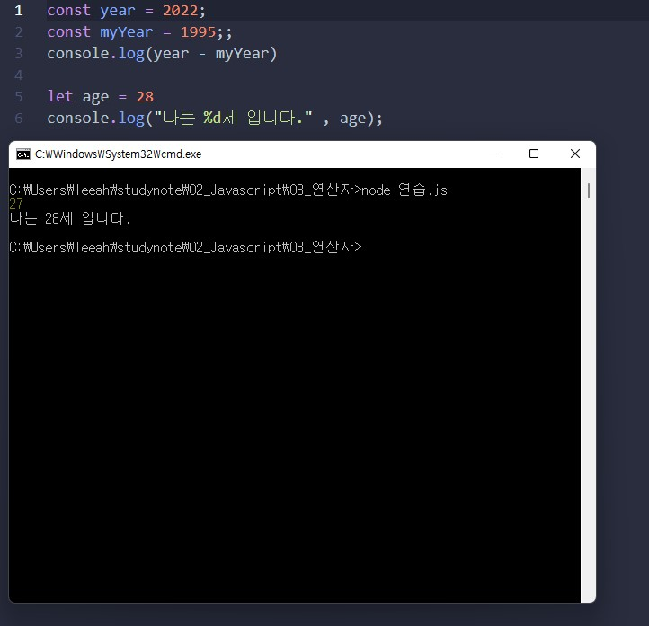
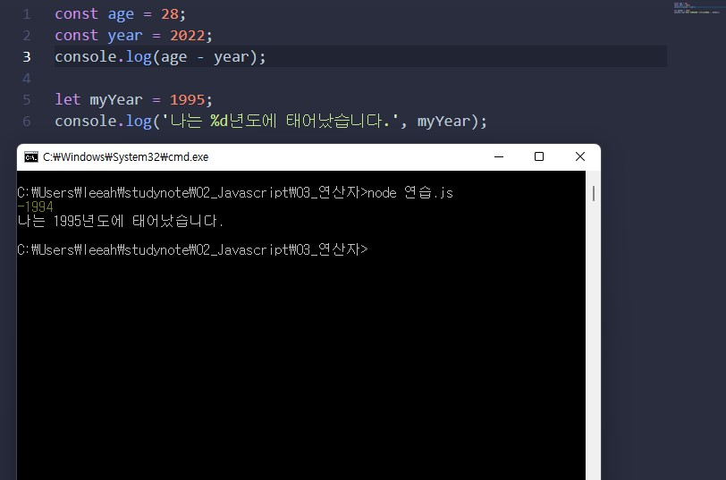
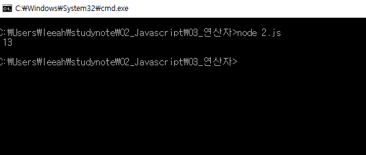

# 이승아 연산자과제

> 2021-01-25

## 문제1

```javascript
const year = 2022;
const myYear = 1995;;
console.log(year - myYear)

let age = 28
console.log("나는 %d세 입니다." , age);

```

실행결과의 스크린 샷




## 문제2

```javascript

const age = 28;
const year = 2022;
console.log(age - year);

let myYear = 1995;
console.log('나는 %d년도에 태어났습니다.', myYear);
```

실행결과의 스크린 샷




## 문제3

```javascript
const numofApple =123;
const type1 = numofApple <= 120 ? "12" : "13";
console.log("",type1);

```

실행결과의 스크린 샷




## 문제4

```javascript

선생님 이 문제는 정말 모르겠습니다... 
```

실행결과의 스크린 샷

