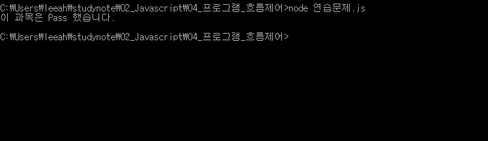
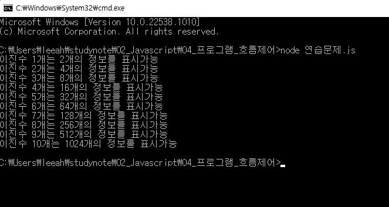
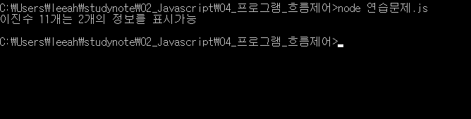

# 이승아 프로그램 흐름제어과제

> 2021-01-26

## 문제1

```javascript
const 수학 = "B";

if(수학 == "A" || 수학 == "B" || 수학 == "C" ){ 
    console.log("이 과목은 Pass 했습니다.");
} else{
    console.log("이 과목은 pass 하지 못했습니다.");
}

```

실행결과의 스크린 샷




## 문제2

```javascript
let bit = 1;
let i = 1;

while (i <= 10){
    bit *= 2;
    console.log("이진수 %d개는 %d개의 정보를 표시가능", i, bit);
    i++;
}

```

실행결과의 스크린 샷




## 문제3

```javascript

let bit =1;

for(i=1; i <= 10; i++);{
    bit*=2;
    console.log("이진수 %d개는 %d개의 정보를 표시가능", i, bit);
}

```

실행결과의 스크린 샷


