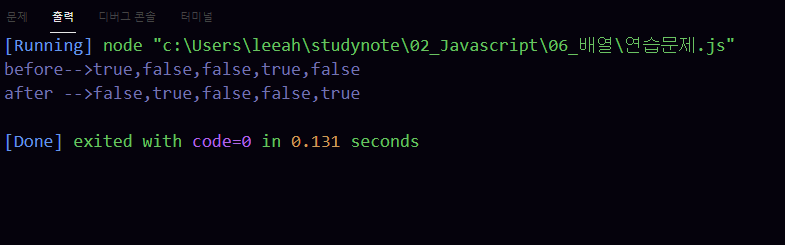
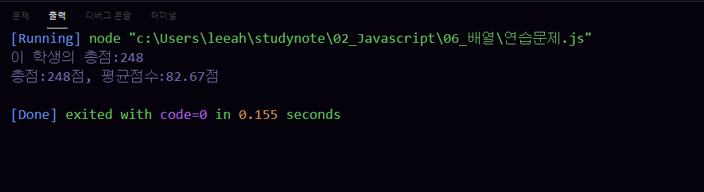
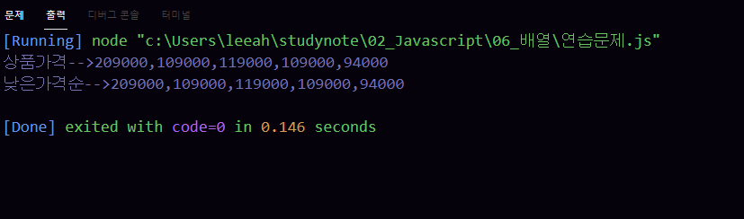
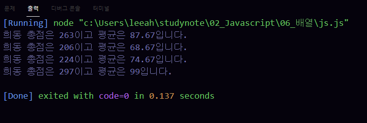
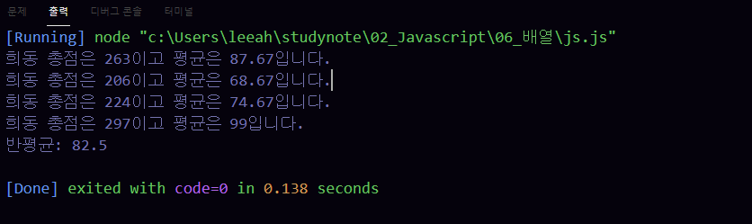

# 이승아 배열
> 2021-02-04


## 문제 1.

for문을 사용하여 0부터 10미만의 정수 중에서 홀수만을 큰수부터 출력하시오.

```javascript

```

실행결과의 스크린 샷




## 문제 2.

for문을 사용하여 0부터 10미만의 정수 중에서 홀수만을 큰수부터 출력하시오.

```javascript

```

실행결과의 스크린 샷




## 문제 3.

for문을 사용하여 0부터 10미만의 정수 중에서 홀수만을 큰수부터 출력하시오.

```javascript

```

실행결과의 스크린 샷


## 문제 4.

for문을 사용하여 0부터 10미만의 정수 중에서 홀수만을 큰수부터 출력하시오.

```javascript

```

실행결과의 스크린 샷


## 문제 5.

for문을 사용하여 0부터 10미만의 정수 중에서 홀수만을 큰수부터 출력하시오.

```javascript

```

실행결과의 스크린 샷

.png)


## 문제 6.

for문을 사용하여 0부터 10미만의 정수 중에서 홀수만을 큰수부터 출력하시오.

```javascript

```

실행결과의 스크린 샷


## 문제 7.

for문을 사용하여 0부터 10미만의 정수 중에서 홀수만을 큰수부터 출력하시오.

```javascript

```

실행결과의 스크린 샷




## 문제 8.

for문을 사용하여 0부터 10미만의 정수 중에서 홀수만을 큰수부터 출력하시오.

```javascript

```

실행결과의 스크린 샷


## 문제 9.

for문을 사용하여 0부터 10미만의 정수 중에서 홀수만을 큰수부터 출력하시오.

```javascript

```

실행결과의 스크린 샷




## 문제 10.

for문을 사용하여 0부터 10미만의 정수 중에서 홀수만을 큰수부터 출력하시오.

```javascript

```

실행결과의 스크린 샷




## 문제 11.

for문을 사용하여 0부터 10미만의 정수 중에서 홀수만을 큰수부터 출력하시오.

```javascript

```

실행결과의 스크린 샷


## 문제 12.

for문을 사용하여 0부터 10미만의 정수 중에서 홀수만을 큰수부터 출력하시오.

```javascript

```

실행결과의 스크린 샷


