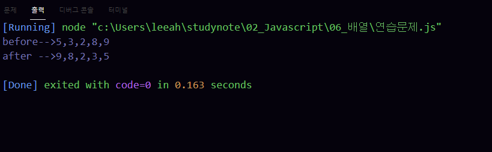

# 이승아 배열
> 2021-02-04 


## 문제 1.


```javascript
var check_list = [true, false, false, true, false];
console.log('before-->' + check_list);

for(var i =0; i < (check_list.length/2); i++){
    var k = check_list.length -i -1 ;
    var tmp = check_list[i];
    check_list[i]=check_list[k];
    check_list[k]= tmp
}
console.log('after -->'+ check_list) 

```

실행결과의 스크린 샷


## 문제 2.


```javascript

var grade = [75, 82, 91];
var sum = 0, avg = 0;

//총점 구하기
for (let i=0; i < grade.length; i++){
    sum += grade[i];
} console.log('이 학생의 총점:%d', sum);

var avg= sum/ grade.length;

// arr의 값을 소수점 둘째 자리까지로 제한한다.
avg =avg.toFixed(2)
console.log('총점:'+ sum + '점, 평균점수:' +avg +"점");


```

실행결과의 스크린 샷


## 문제 3.


```javascript

```

실행결과의 스크린 샷


## 문제 4.


```javascript

```

실행결과의 스크린 샷


## 문제 5.


```javascript

```

실행결과의 스크린 샷

.png)


## 문제 6.


```javascript

```

실행결과의 스크린 샷


## 문제 7.


```javascript

var price = [209000,109000,119000,109000,94000];
console.log('상품가격-->'+ price);

for(var i=0; i<price.length-1; i++){
    for(var j=j+1; j<price.length; j++){
        if(price[i]>price[j]){
            var tmp = price[i];
            price[i] = price[j];
            price[j] = tmp
        }
    }
}
console.log('낮은가격순-->'+price);

```

실행결과의 스크린 샷


## 문제 8.


```javascript

var arr = [5, 3, 2, 8, 9];
console.log('before-->'+arr);
for(var i =0; i<parseInt(arr.length/2); i++){
        var tmp = arr[i];
        arr[i] = arr[arr.length-i-1];
        arr[arr.length-i-1]= tmp;
    }

  console.log('after -->'+arr);

```

실행결과의 스크린 샷




## 문제 9.


```javascript

var student = ['둘리','도우너','또치','희동'];
var grade = [
    [78,89,96],
    [62,77,67],
    [54,90,80],
    [100,99,98]
];

var sum= 0, avg =0;
for (var p = 0; p<student.length; p++){
    var s = student[p]
}
for(var i=0; i<grade.length; i++){
    var personal_sum = 0;
    for(var j=0; j<grade[i].length; j++){
        sum += grade[i][j];
        personal_sum += grade[i][j];
             
    }
    var personal_avg = personal_sum / (grade[i].length);
    personal_avg = personal_avg.toFixed(2);
    console.log("%s 총점은 %d이고 평균은 %d입니다.", s, personal_sum, personal_avg);
}

```

실행결과의 스크린 샷


## 문제 10.


```javascript


var student = ['둘리','도우너','또치','희동'];
var grade = [
    [78,89,96],
    [62,77,67],
    [54,90,80],
    [100,99,98]
];

var sum= 0, avg =0;
for (var p = 0; p<student.length; p++){
    var s = student[p]
}
for(var i=0; i<grade.length; i++){
    var personal_sum = 0;
    for(var j=0; j<grade[i].length; j++){
        sum += grade[i][j];
        personal_sum += grade[i][j];
             
    }
    var personal_avg = personal_sum / (grade[i].length);
    personal_avg = personal_avg.toFixed(2);
    console.log("%s 총점은 %d이고 평균은 %d입니다.", s, personal_sum, personal_avg);
}
console.log("반평균: %d", sum/3/4);

```

실행결과의 스크린 샷


## 문제 11.


```javascript

```

실행결과의 스크린 샷


## 문제 12.


```javascript

```

실행결과의 스크린 샷


