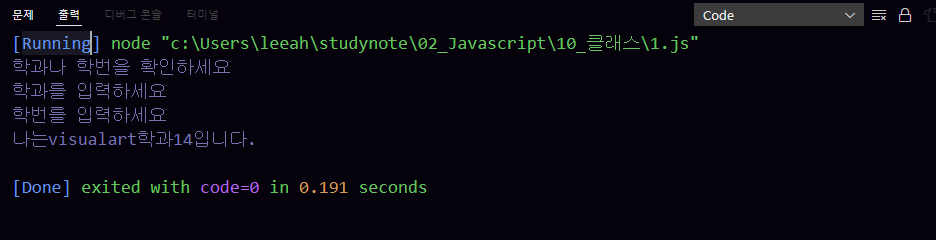
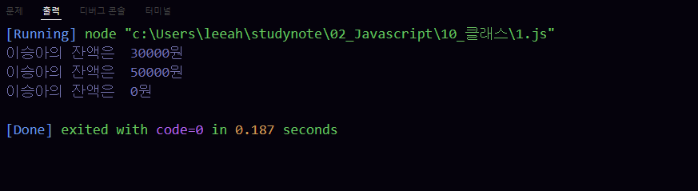

문제 1 - 다음을 만족하는 Student 클래스를 작성하시오.

1) String형의 학과와 정수형의 학번을 프로퍼티로로 선언후 생성자를 통해 주입
2) getter, setter를 정의
3) sayHello() 메서드를 통해 "나는 OOOO학과 OO학번 입니다." 를 출력하는 기능을 구현

```js
class Student {
    constructor(){
        this._department = null;
        this._number = null;
    }
    set department(string){
        if(!string) {
            console.log("학과를 입력하세요");
        }
        this._department = string;
    }

    get department(){
        return this._department;
    }

    set number(value){
        if(!value) {
            console.log("학번를 입력하세요");
        }
        this._number = value;
}

    get number(){
        return this._number;
    }
    sayHello() {
        if (!this.department || !this.number){
            console.log("학과나 학번을 확인하세요");
            return;
        }
        console.log("나는" + this.department + "학과" + this.number + "입니다.");
    }
}

const user = new Student();
user.sayHello();

user.department = "";
user.number = "";

user.department = "visualart";
user.number = 14;
user.sayHello();
```

실행결과의 스크린 샷




문제 - 2. 다음을 만족하는 클래스 Account를 작성하시오.

1) 다음의 2 개의 필드를 선언
    문자열 owner; (이름)
    숫자형 balance; (금액)
2) 위 모든 필드에 대한 getter와 setter의 구현
3) 위 모든 필드를 사용하는 가능한 모든 생성자의 구현
3) 메소드 deposit()의 헤드는 다음과 같으며 인자인 금액을 저축하는 메소드
    deposit(amount)
4) 메소드 withdraw()의 헤드는 다음과 같으며 인자인 금액을 인출(리턴)하는 메소드
    withdraw(long amount)
    인출 상한 금액은 잔액까지로 하며, 이 경우 이러한 상황을 출력

    
```js
    class Account{
        constructor(owner, balance){
            this._owner = owner;
            this._balance = balance; 
        }
        
        get owner(){
            return this._owner;
        }

        set owner(string){
           this._owner = string;
        }

        get balance(){
            return this._balance;
        }

        set balance(value){
            this._balance = value;
        }
 
         deposit(amount){
             this.balance += amount;
         }

         withdraw(long_amount){
            if(this.balance<long_amount){
             console.log("금액이 부족함으로 결제가 되지 못했습니다");
             return;
         }
         this.balance -= long_amount;
         return long_amount;
        }
    }

    const acc = new Account("이승아", 30000);

    console.log("%s의 잔액은  %d원", acc.owner, acc.balance);
    
    acc.deposit(20000);
    console.log("%s의 잔액은  %d원", acc.owner, acc.balance);

    acc.withdraw(50000);
    console.log("%s의 잔액은  %d원", acc.owner, acc.balance);
    
```

실행결과의 스크린 샷


