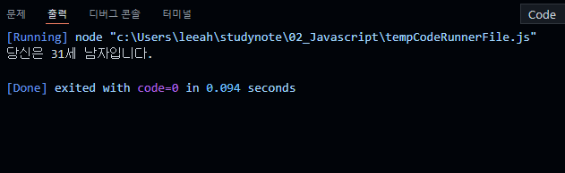
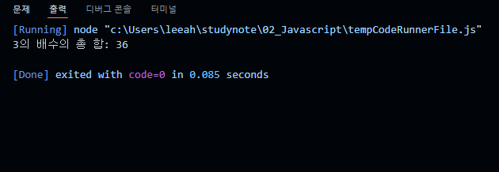
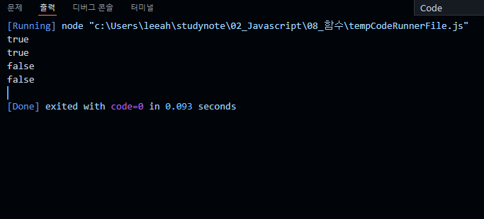
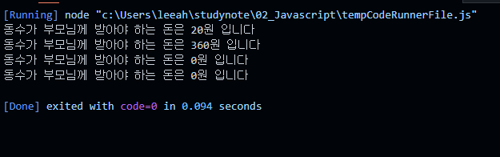
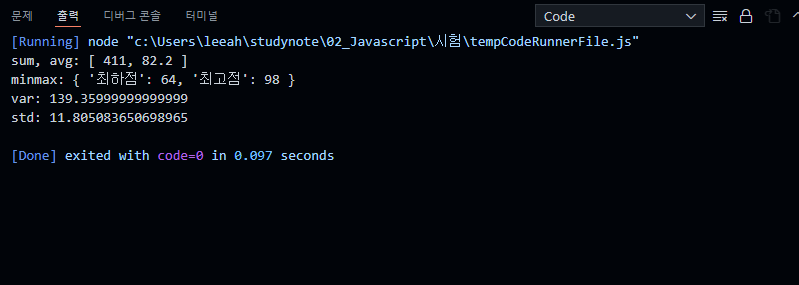

# 이승아 Javascript 시험
> 2021-02-22 


## 문제 1.

주민번호의 앞 부분과 뒷 부분의 첫 번째 글자 아래와 같이 변수에 저장하시오. (15분/5점)
ssn = “9203211”
그 값을 통해 아래와 같은 출력 결과를 만드시오.
당신은 30세 남자입니다.


```js
let ssn = "9203211"
ssn +="" 
const date = new Date();
const now_year = date.getFullYear();

let yy = parseInt(ssn.substring(0,2));
let mm = parseInt(ssn.substring(2,4));
let dd = parseInt(ssn.substring(4,6));
let gen = parseInt(ssn.substring(6,7))

yy = (gen<2) ? yy+1900 : yy+2000;

const age = now_year - yy +1;

const gender = (gen==1 ||gen==3) ? "남자" : "여자";


console.log('당신은 %d세 %s입니다.', age, gender);

```

실행결과의 스크린 샷




## 문제 2.
100~200 사이의 임의의 숫자를 number 라는 변수에 저장하고, 1부터 number까지의 수 중에서 3의
배수에 대한 총 합을 구하시오. (범위에는 number가 포함됩니다.) (15분/5점)

```js
const number = 111;
const x = 3;

let sum = 0;

for(let i=1; i<number; i++){
    if(i % x == 0 ){
        sum ++
    }
}

console.log("%d의 배수의 총 합: %d", x, sum);


```

실행결과의 스크린 샷




## 문제 3.
양의 정수 x가 하샤드 수이려면 x의 자릿수의 합으로 x가 나누어져야 한다. 예를 들어 18의 자릿수
합은 1+8=9이고, 18은 9로 나누어 떨어지므로 18은 하샤드 수이다. 자연수 x를 입력받아 x가 하샤드
수인지 아닌지 검사하는 함수, solution을 완성하여 아래의 테스트 코드에 대한 출력 결과를 만드시오.

console.log(solution(10));
console.log(solution(12));
console.log(solution(11));
console.log(solution(13));

```js

function solution(n){
   let sum =0;
   let x = String(n).split("");
   for (let i =0; i<x.length; i++){
       sum += Number(arr[i]);
   } 
   return (n % sum ==0) ? true :false; 
}

console.log(solution(10));
console.log(solution(12));
console.log(solution(11));
console.log(solution(13));

```

실행결과의 스크린 샷




## 문제 4.
동수는 제과점에 과자를 사러 가는데 현재 가진 돈이 모자랄 경우 부모님께 모자란 돈을 받으려고한다. 
과자 한 개의 가격이 K, 사려고 하는 과자의 개수가 N, 현재 가진 돈의 액수를 M이라 할 때
여러분은 동수가 부모님께 받아야 하는 모자란 돈을 계산하려고 한다.

예를 들어,
과자 한 개의 가격이 30원, 사려고 하는 과자의 개수가 4개, 현재 동수가 가진 돈이 100원이라 할 때,
동수가 부모님께 받아야 하는 돈은 20원이다.

과자 한 개의 가격이 250원, 사려고 하는 과자의 개수가 2개, 현재 동수가 가진 돈이 140원이라 할때, 
동수가 부모님께 받아야 하는 돈은 360원이다.

과자 한 개의 가격이 20원, 사려고 하는 과자의 개수가 6개, 현재 동수가 가진 돈이 120원이라 할 때
동수가 부모님께 받아야 하는 돈은 0원이다.

과자 한 개의 가격이 20원, 사려고 하는 과자의 개수가 10개, 현재 동수가 가진 돈이 320원이라 할 때
동수가 부모님께 받아야 하는 돈은 역시 0원이다.

과자 한 개의 가격, 사려고 하는 과자의 개수와 동수가 현재 가진 돈의 액수가 주어질 때 동수가
부모님께 받아야 하는 돈의 액수를 리턴하는 함수 solution을 작성하고 리턴값을 출력하시오.


테스트코드
// K=30, N=4, M=100인 경우
solution(30, 4, 100);
// K=250, N=2, M=140인 경우
solution(250, 2, 140);
// K=20, N=6, M=120인 경우
solution(20, 6, 120);
// K=20, N=10, M=320인 경우
solution(20, 10, 320);

```js

function solution(k, n, m){
    
    if( k*n>m){
        return k*n-m;
    } else { 
        return 0;
    }
}

console.log("동수가 부모님께 받아야 하는 돈은 %d원 입니다",solution(30, 4, 100))
console.log("동수가 부모님께 받아야 하는 돈은 %d원 입니다",solution(250, 2, 140))
console.log("동수가 부모님께 받아야 하는 돈은 %d원 입니다",solution(20, 6, 120))
console.log("동수가 부모님께 받아야 하는 돈은 %d원 입니다",solution(20, 10, 320))

```

실행결과의 스크린 샷




## 문제 5.
어느 학급의 중간고사 평균 성적이 아래의 표와 같았다.
민수 철영 나영 수철 영민
82 76 91 98 64
학생의 성적에 대해 아래의 요구사항을 충족하는 Student 클래스를 작성하고 각 메서드의 실행결과를 제시시오.

요구사항
1. 생성자에서 원소가 0개인 빈 배열 grade를 생성합니다.
2. setter에 학생 한명의 점수를 주입하면 grade의 원소로 추가됩니다. getter는 제공되지않습니다.
3. 주입된 점수의 총점과 평균을 배열로 리턴하는 getSumAvg() 함수를 제공합니다.
4. 주입된 점수 중에서 최하점과 최고점을 JSON으로 리턴하는 getMinMax() 함수를 제공합니다.
5. 주입된 점수에 대한 분산을 리턴하는 getVar() 함수를 제공합니다.
6. 주입된 점수에 대한 표준편차를 리턴하는 getStd() 함수를 제공합니다.
Javascript에서 제곱근은 Math.sqrt(input)을 사용하여 리턴받을 수 있다.
```js
class Student{
    constructor(){
        this._grade = [];
    }
   
    setGrade(score){
        this._grade.push(score);
    }
    getSumAvg (){
        let sum=0;
        let avg=0;
        for(let i = 0; i<this._grade.length; i++){
            sum+=this._grade[i];
        }
        avg += sum/this._grade.length;
        return [sum,avg];
    }
    getMinMax(){
        let max = -100;
        let min = 100;
        for (let i = 0; i < this._grade.length; i++) {
          if (this._grade[i] < min) min = this._grade[i];
          if (this._grade[i] > max) max = this._grade[i];
        }
        return { 최하점: min, 최고점: max };
    }
    getVar(){
        const avg = this.getSumAvg()[1];
    let sum = 0;
    for (let i = 0; i < this._grade.length; i++) {
      sum += Math.pow(this._grade[i] - avg, 2);
    }
    return sum / this._grade.length;
    }
    getStd(){
        return Math.sqrt(this.getVar());
    }

}
const std = new Student();
const 민수 = 82;
const 철영 = 76;
const 나영 = 91;
const 수철 = 98;
const 영민 = 64;
std.setGrade(민수);
std.setGrade(철영);
std.setGrade(나영);
std.setGrade(수철);
std.setGrade(영민);

console.log("sum, avg:", std.getSumAvg());
console.log("minmax:", std.getMinMax());
console.log("var:", std.getVar());
console.log("std:", std.getStd());

```

실행결과의 스크린 샷


