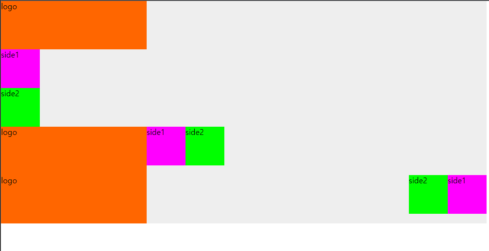
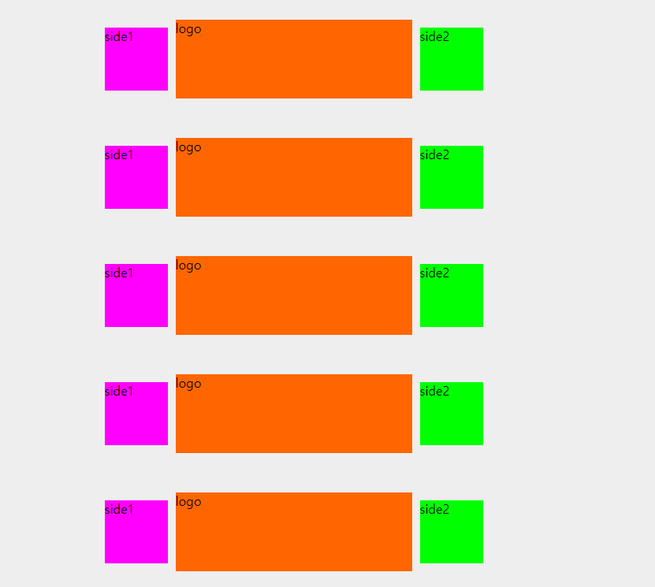

HTML요소배치
- 이승아
>2022-03-07

```html
<!DOCTYPE html>
<html lang="en">
<head>
    <meta charset="UTF-8">
    <meta http-equiv="X-UA-Compatible" content="IE=edge">
    <meta name="viewport" content="width=device-width, initial-scale=1.0">
    <title>HTML 요소 배치</title>
    <link rel="stylesheet" href="common.css" type="text/css">
    <style>
        .container{
            width: 1000px;
            background-color: #eee;
            margin: 0;
        }
        .logo{
            width: 300px;
            height: 100px;
            background-color: #f60;
        }
        .side1{
            width: 80px;
            height: 80px;
            background-color: #f0f;
        }
        .side2{
            width: 80px;
            height: 80px;
            background-color: #0f0;
        }
    </style>
</head>
<body>
    <div class="container">
        <div class="logo">logo</div>
        <div class="side1">side1</div>
        <div class="side2">side2</div>
    </div>
    <div class="container clearfix">
        <div class="logo pull-left">logo</div>
        <div class="side1 pull-left">side1</div>
        <div class="side2 pull-left">side2</div>
    </div>
    <div class="container clearfix">
        <div class="logo pull-left">logo</div>
        <div class="side1 pull-right">side1</div>
        <div class="side2 pull-right">side2</div>
    </div>
    <div class="container clearfix">
        <div class="logo">logo</div>
        <div class="side1 pull-left">side1</div>
        <div class="side2 pull-right">side2</div>
    </div>
    <div class="container">
        <div class="logo">logo</div>
        <div class="side1">side1</div>
        <div class="side2">side2</div>
    </div>

</body>
</html>
```
```css
*{padding:0; margin:0;}
.text-center{text-align: center;}
.text-right{text-align: right;}
.text-left{text-align: left;}
.inline{display: inline;}
.inline-block{display: inline;}
.pull-left{float:left}
.pull-right{float: right;}
.clearfix:after{content: ''; display: block; clear:both; float:none;}

.logo{
    width: 300px;
    height: 100px;
    background-color: #f60;
    /*(추가) 절대좌표 방식*/
    position: absolute;
    /*(추가) box의 좌측 상당 꼭지점을 부모 중앙에 맞춤 */
    left: 50%;
    top: 50%;
    /*(추가) */
    margin-left: -150px;
    margin-top: -50px;
}

.container{
    width: 1000px;
    background-color: #eee;
    margin: auto;
    /*(추가) .logo의 좌표 기준점 설정*/
    position: relative;
    height: 150px;
}

.logo{
    width: 300px;
    height: 100px;
    background-color: #f60;
    position: absolute;
    left: 50%;
    top: 50%;
    margin-left: -150px;
    margin-top: -50px;
}

.side1{
    width: 80px;
    height: 80px;
    background-color: #f0f;
    /*(추가)*/
    position: absolute;
    left: 50%;
    top: 50%;
    margin-left: -240px;
    margin-top: -40px;
}

.side2{
    width: 80px;
    height: 80px;
    background-color: #0f0;
    /*(추가)*/
    position: absolute;
    left: 50%;
    top: 50%;
    margin-left: 160px;
    margin-top: -40px;
}
```

실행결과의 스크린 샷



실행결과의 스크린 샷

