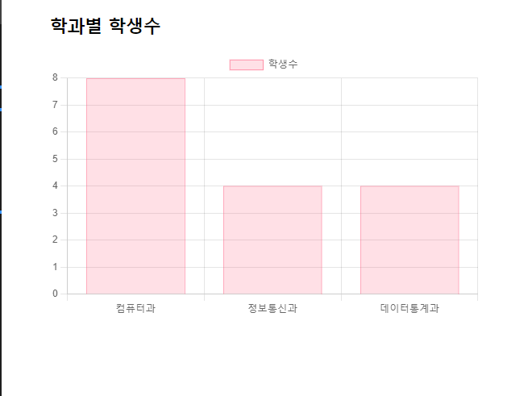
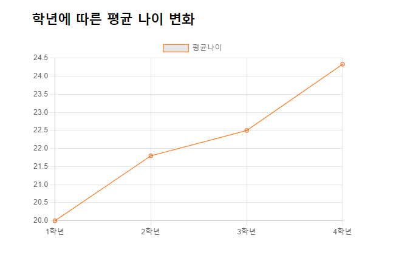

# 이승아 그래프과제

> 2022-04-01


```html
<!DOCTYPE html>
<html lang="en">
<head>
    <meta charset="UTF-8">
    <meta http-equiv="X-UA-Compatible" content="IE=edge">
    <meta name="viewport" content="width=device-width, initial-scale=1.0">
    <title>Document</title>
    <style>
        .subplot{
            float: left;
            width: 33.3%;
            padding: 0 50px;
            box-sizing: border-box;
            font-size: 14px;
        }

        .subplot-item{
            width: auto;
            height: 320px;
        }
    </style>
</head>
<body>
    <div class="subplot">
        <h2>학과별 학생수</h2>
        <div class="subplot-item">
            <canvas id="mychart1"></canvas>
        </div>
    </div>
    <div class="subplot">
        <h2>학년에 따른 평균 나이 변화</h2>
        <div class="subplot-item">
            <canvas id="mychart2"></canvas>
        </div>
    </div>
    <div class="subplot">
        <h2>학년별 평균키와 평균 몸무게</h2>
        <div class="subplot-item">
            <canvas id="mychart3"></canvas>
        </div>
    </div>


    <!-- 차트 데이터 불러오기 -->
    <script src="http://cdnjs.cloudflare.com/ajax/libs/Chart.js/3.7.1/chart.min.js"></script>  
   
    <!--학생 자료 불러오기-->
    <script src="./dataset.js"></script>  

    <script>
        /* 배열을 파라미터로 받아 평균을 리턴하는 함수  */
        function getAvg(data){
            let sum= 0;

            data.forEach((v,i) => {
                sum += v;   
            });
            return sum / data.length;
        }
    </script>

    <script>
        /* 1) 학과별 학생 수 */
        const subject = [];

        student.forEach((v, i)=>{
            //i번째 학생에 대한 학과번호 추출

            subject[i]=student[i].deptno;

        });
            const department = subject.filter((v,i,arr)=> arr.indexOf(v)===i);
            const studentCount = subject.reduce((acc, cur)=>{
                    acc[cur]= (acc[cur]||0) + 1;
                    return acc;
                }, {});


        /* 선생님 풀이 */
        // d = v.deptno;
        // department 배열에 학과번화 값이 있는지 확인
        // p = department.indexOf(d);

        //     // 학과번호가 없다면?
        //     if(p == -1 ){
        //         //새로운 학과로 추가
        //         department.push(d);
        //         // 이 학과의 학생 수 1로 설정
        //         studentCount.push(1);
        //     }else{
        //         // p번째 학과에 대응되는 학생 수 1 증가
        //         studentCount[p]++;
        //     }
        // });
        console.log(department);
        console.log(studentCount);

        new Chart(mychart1,{
            type: 'bar',
            data: {
                labels: department,
                datasets: [
                    {
                        label: '학생수',
                        data: studentCount,
                        borderWidth: 0.5,
                        borderColor:['rgba(255, 99, 132, 1)'],
                        backgroundColor: ['rgba(255, 99, 132, 0.2)'],
                    },
                ],
            },
            options: {
                maintainAspectRatio: false,
                indexAxis: 'x',
            },
        });
    </script>

    <script>
        /* 2) 학년별 평균 나이 구하기 */
        const ageInfo ={};

        //현재 년도
        const nowYear = new Date().getFullYear();

        student.forEach((v,i)=>{
            const key = v.grade + '학년';
            // 생년월일에서 왼쪽 4글자 추출하여 숫자로 변환
            const birthYear = parseInt(v.birthdate.substring(0,4));
            // 년도를 나이로 환산
            const age = nowYear - birthYear +1;
            // json에i번째 학년에 대한 key가 없다면?
            if(ageInfo[key]===undefined){
                ageInfo[key]=[age];
            }else{
                ageInfo[key].push(age)
            }
        });
        console.log(ageInfo);

        const level = [];
        const age = [];
        for(let key in ageInfo){
            level.push(key);
            age.push(getAvg(ageInfo[key]));
        }

        for(let i = 0; i < level.length -1; i++){
            for(let j = i+1; j<level.length; j++){
                const x = parseInt(level[i]);
                const y = parseInt(level[j]);

                if(x>y){
                    let tmp = level[i];
                    level[i] = level[j];
                    level[j] = tmp;

                    tmp = age[i];
                    age[i] = age[j];
                    age[j] = tmp;
                }
            }
        }
        console.log(level);
        console.log(age);

        new Chart(mychart2,{
            type: 'line',
            data: {
                labels: level,
                datasets: [
                    {
                        label: '평균나이',
                        data: age,
                        borderWidth: 1,
                        borderColor: '#f60',
                    }
                ],
            },
            options: {
                maintainAspectRatio: false,
            },
        });
    </script>

    <script>
        /* 3) 학년별 평균키와 평균 몸무게 */
        const bodyInfo={};

        student.forEach((v,i)=>{
            const key = v.grade + '학년';
            // json에 i번째 학년에 대한 key가 없다면?
            if (bodyInfo[key]=== undefined) {
                bodyInfo[key] = { height: [v.height], weight: [v.weight]};
            } else {
                bodyInfo[key].height.push(v.height);
                bodyInfo[key].weight.push(v.weight);
            }
        });

        console.log(bodyInfo);

        const grade = [];
        const height = [];
        const weight = [];

        for(let key in bodyInfo){
            grade.push(key);
            height.push(getAvg(bodyInfo[key].height));
            weight.push(getAvg(bodyInfo[key].weight));
        }

        for (let i =0; i<grade.length-1; i++){
            for(let j = i; j<grade.length; j++) {
                if(parseInt(grade[i])> parseInt(grade[j])){
                    let tmp =grade[i];
                    grade[i] = grade[j];
                    grade[j] = tmp;

                    tmp = height[i];
                    height[i] = height[j];
                    height[j] = tmp;

                    tmp =weight[i];
                    weight[i] = weight[j];
                    weight[j] = tmp;
                }
            }
        }

        console.log(grade);
        console.log(height);
        console.log(weight);

        new Chart(mychart3,{
            type: 'bar',
            data:{
                labels: grade,
                datasets: [
                    {
                        label: '키',
                        data: height,
                        borderWidth: 0.5,
                        borderColor: 'rgba(54, 162, 235, 1)',
                        backgroundColor: 'rgba(54, 162,235,0.2)',
                    },
                    {
                        label:'몸무게',
                        data: weight,
                        borderWidth: 0.5,
                        borderColor: 'rgba(54, 162, 235, 0.2)',
                    },
                ],
            },
            options:{
                maintainAspectRatio:false,
            },
        });

    </script>
</body>
</html>

<!-- 
filter
reduce -->

```

실행결과의 스크린 샷



