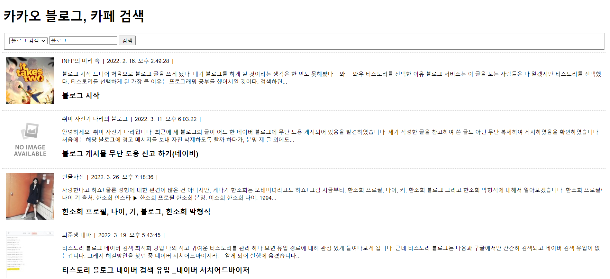
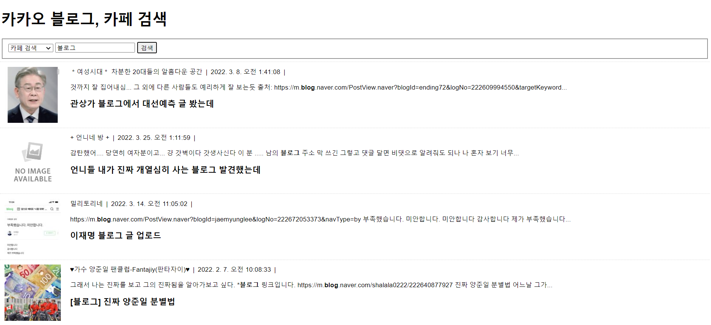

# 이승아 Kakao 블로그, 카페 검색

> 2022-04-05

```js
  /* KAKAO REST KEY */
  const KAKAO_REST_KEY = "cd848075b9839c768c713e6ca8cd056a";

  /* 페이지 번호 */
  let currentPage = 1;

  /** 검색어*/
  let queryKeyword = null;

  /** 블로그, 카페 검색*/
  let search = null;

  /* 마지막 페이지인지 검사 */
  let isEnd = false;

  /* 검색폼의 submit 이벤트 - 신규검색 */
  document.querySelector('#searchForm').addEventListener('submit', (e)=>{
      e.preventDefault();
  
      // 입력된 검색어를 가져온다.
      const queryField = document.querySelector('#query');
      queryKeyword = queryField.value.trim();
  
      // 블로그, 카페 검색어를 가져온다.
      const select = document.getElementById('source');
      search= select.options[select.selectedIndex].value;

      // 검색어가 입련되지 않은 경우에 대한 예외처리
      if(!queryKeyword){
          alert('검색어를 입력하세요.');
          queryField.focus();
          return;
      }

      //신규검색
      currentPage =1;
      get_image_search();
  });

  /* 스크롤 이벤트 - 추가검색 */
  window.addEventListener('scroll', (e)=>{
      // 마지막 페이지이거나 이미 로딩바가 화면에 표시되고 있다면, 처리중단
      if(isEnd || document.querySelector('#loading').classList.contains('active')){
          return;
      }

      // 스크롤바의 Y좌표
      const scrollTop = window.scrollY;
      //웹 브라우저의 창 높이
      const windowHeight = window.screen.availHeight;
      //HTML 문서의 높이
      const documentHeight = document.body.scrollHeight;

      // 스크롤바의 변동 효과를 고려해서 scrollTop + windowHeight가 실제 화면 크기보다 커질 수 있다.
      if(scrollTop + windowHeight >= documentHeight){
          //2페이지 이후는 추가 검색
          currentPage++;
          get_image_search();
      }
  });

  /* Ajax요청 후 결과를 화면에 HTML로 출력하는 함수 */
  async function get_image_search(){
  // 로딩바 객체
  const loading = document.querySelector('#loading');

  // 로딩바 화면에 표시하기
  loading.classList.add('active');

  // 검색결과가 표시될 영역
  const list = document.querySelector('#list');

  // 1페이지에 대한 요청일 경우 기존에 표시되고 있던 검색결과가 있다면 삭제한다.
  if (currentPage == 1){
      Array.from(list.getElementsByTagName('li')).forEach((v,i)=>{
          list.removeChild(v);
      });
  }
  // 검색결과를 저장할 빈 변수
  let json = null;    

  try{
      json = await axios.get(`https://dapi.kakao.com/v2/search/${search}`,{
          params:{
              query: queryKeyword,
              page: currentPage, 
          },
          headers: {
              Authorization: `KakaoAK ${KAKAO_REST_KEY}`,
          },
      });

  } catch(e){
      console.error(err);
      alert('요청을 처리하는데 실패했습니다.');
      return;
  }finally{
      // 로딩바 닫기
      loading.classList.remove('active');
  }

      if(json !=null) {
          const {data}  = json;

          // 다음 페이지를 요청할 수 있는지를 판단하기 위한 값.
          isEnd = data.meta.is_end;

            data.documents.map((v,i)=>{

            // li 태그 생성하기 
            const li = document.createElement('li');

            // a태그 생성하기
            const a = document.createElement('a');
            a.setAttribute('href', v.url);
            a.setAttribute('target', '_blank');
            a.setAttribute('title', v.display_sitename);

            // 이미지 태그 생성하기
            const img = document.createElement('img');
            if (v.thumbnail) {
            img.setAttribute('src', v.thumbnail);
            } else {
            img.setAttribute('src', 'img/noimage.jpg');
            }

            // 글제목 생성하기
            const h2 = document.createElement('h2');
            h2.innerHTML = v.title;

            // 본문 태그 생성하기
            const p =document.createElement('p');
            p.innerHTML = v.contents;

            // 블로그, 카페 태그 생성하기
            const spanInfo = document.createElement('span');
            spanInfo.classList.add("info");
            spanInfo.innerHTML = v[`${search}name`];

            // 작성일시 태그 생성하기
            const spanDate = document.createElement('span');
            spanDate.classList.add("info");
            spanDate.innerHTML = new Date(v.datetime).toLocaleString();

            a.appendChild(img);
            a.appendChild(spanInfo);
            a.appendChild(spanDate);
            a.appendChild(p);
            a.appendChild(h2);


            li.appendChild(a);
            list.appendChild(li);
          });
      }
 }
```

실행결과의 스크린 샷


