# 이승아 CRUD

> 2022-04-08

## 문제1.교수테이블


교수테이블 스크린 샷
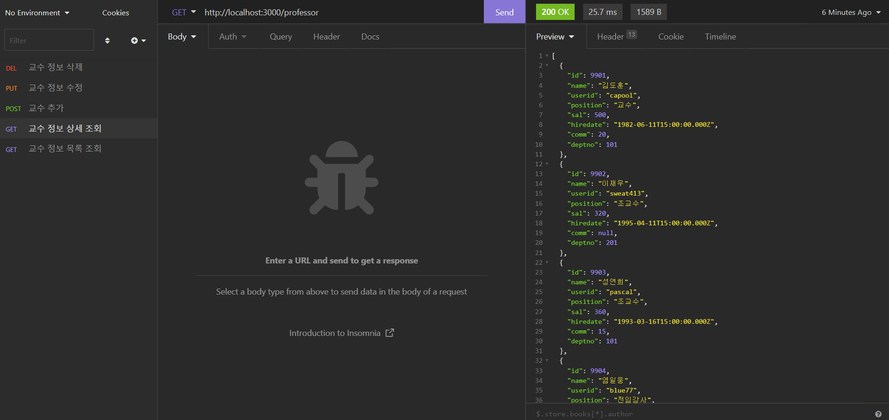


#### index.html
```html
<!DOCTYPE html>
<html lang="en">
<head>
    <meta charset="UTF-8">
    <meta http-equiv="X-UA-Compatible" content="IE=edge">
    <meta name="viewport" content="width=device-width, initial-scale=1.0">
    <title>교수 테이블</title>
    <link rel="stylesheet" href="assets/css/style.css"/>
</head>
<body>
    <div class="container">
        <!-- header -->
        <div data-include="inc/header.html"></div>

        <!-- body -->
        <section>
            <p>
                <a href="add.html">새 학과 추가</a>
            </p>
            <table class="table">
                <colgroup>
                    <col width="11%"/>
                    <col width="11%"/>
                    <col width="11%"/>
                    <col width="11%"/>
                    <col width="11%"/>
                    <col width="11%"/>
                    <col width="11%"/>
                    <col width="11%"/>
                    <col width="11%"/>
                </colgroup>
                <thead>
                    <tr>
                        <th class="text-center">교수번호</th>
                        <th class="text-center">이름</th>
                        <th class="text-center">아이디</th>
                        <th class="text-center">직급</th>
                        <th class="text-center">급여</th>
                        <th class="text-center">입사일</th>
                        <th class="text-center">보직수당</th>
                        <th class="text-center">부서번호</th>
                        <th class="text-center">-</th>
                    </tr>
                </thead>
                <tbody id="listBody"></tbody>
            </table>
        </section>

        <!-- footer -->
        <div data-include="inc/footer.html"></div>
    </div>
    <script src="https://cdn.jsdelivr.net/npm/axios/dist/axios.min.js"></script>
    <script src="assets/js/include.js"></script>
    <script>
        // 페이지가 실행되면서 자동으로 동작해야 하므로 즉시 실행 함수 형태로 구현.
        (async()=>{
            // ajax 결과가 저장될 json
            let json = null;

            // ajax 요청
            try{
                json = await axios.get('http://localhost:3000/professor');
            }catch(e){
                console.error(e);
                    alert('요청을 처리하는데 실패했습니다.');
                    return;
                }
                // ajax 결과가 존재한다면?
                if(json != null){
                    const listBody = document.querySelector("#listBody");
                    const {data}=json;

                    data.forEach((v,i) => {
                        const tr = document.createElement("tr");
                       
                        // 교수번호를 출력한 후 첫 번째 칸을 tr에 추가
                        const td1 = document.createElement("td");
                        td1.innerHTML = v.id;
                        tr.appendChild(td1);

                        // 두 번째 칸을 생성 후 tr에 추가
                        const td2 = document.createElement("td");
                        tr.appendChild(td2);

                        // 상세보기를 위한 링크로 구현된 학과 이름을 두 번째 칸에 추가
                        // -> 어떤 학과를 열람할 것인가를 의미하는 id 값을 GET 파라미터로 전당함.
                        // 대체로 id하는 이름의 변수는 그 대상을 식별하기 위한 고유한 값을 의미 (=일련번호)
                        const a1 = document.createElement("a");
                        a1.setAttribute('href', `view.html?id=${"v.id"}`);
                        a1.innerHTML = v.name;
                        td2.appendChild(a1);


                        // 교수 아이디를 포함하는 세 번째 칸을 tr에 추가
                        const td3 = document.createElement("td");
                        td3.innerHTML = v.userid;
                        tr.appendChild(td3);


                        // 교수 직급을 포함하는 네 번째 칸을 tr에 추가
                        const td4 = document.createElement("td");
                        td4.innerHTML = v.position;
                        tr.appendChild(td4);

                         // 교수 급여를 포함하는 다섯 번째 칸을 tr에 추가
                         const td5 = document.createElement("td");
                        td5.innerHTML = v.sal;
                        tr.appendChild(td5);

                         // 교수 입사일을 포함하는 여섯 번째 칸을 tr에 추가
                         const td6 = document.createElement("td");
                        td6.innerHTML = v.hiredate;
                        tr.appendChild(td6);

                         // 교수 보직수당을 포함하는 일곱 번째 칸을 tr에 추가
                         const td7 = document.createElement("td");
                        td7.innerHTML = v.comm;
                        tr.appendChild(td7);

                         // 부서번호를 포함하는 여덟 번째 칸을 tr에 추가
                         const td8 = document.createElement("td");
                        td8.innerHTML = v.deptno;
                        tr.appendChild(td8);

                        //아홉 번째 칸을 tr에 추가
                        const td9 = document.createElement('td');
                        tr.appendChild(td9);
                        

                        // 어떤 항목을 수정할 것인지를 GET 파라미터로 담은 링크를 아홉 번째 칸에 추가
                        const a2 = document.createElement("a");
                        a2.setAttribute('href', `edit.html?id=${v.id}`);
                        a2.innerHTML= '수정';
                        td9.appendChild(a2);

                        // 어떤 항목을 삭제할 것인지를 dataset으로 저장하고 있는 링크를 아홉 번째 칸에 추가
                        const a3 = document.createElement("a");
                        a3.setAttribute('href', `#`);
                        a3.dataset.id = v.id;
                        a3.dataset.name = v.name;
                        a3.innerHTML = '삭제';
                        a3.classList.add('btn-delete');
                        td9.appendChild(a3);

                        // 구성된 tr을 tbody에 추가
                        listBody.appendChild(tr);

                        // 삭제된 버튼에 대한 클릭 이벤트 구현
                        a3.addEventListener('click', async e =>{
                            e.preventDefault();
                            const current = e.currentTarget;
                            const id = current.dataset.id;
                            const name = current.dataset.name;

                            if(!confirm(`정말 ${name}(을)를 삭제하시겠습니까?`)){
                                return;
                            }
                            let json = null;

                            try{
                                json = axios.delete(`http://localhost:3000/professor/${id}`);
                            }catch(e){
                                console.error(e);
                                alert('요청을 처리하는데 실패했습니다.');
                                return;
                            }
                            if(json != null){
                                // 클릭된 링크를 기준으로 가장 가까운 tr 태그를 상위 요소 중에서 찾아 제거함.
                                current.closest('tr').remove();
                            }
                        });

                    });
                }
            })();
    </script>
</body>
</html>
```


#### view.html
```html
<!DOCTYPE html>
<html lang="en">
<head>
    <meta charset="UTF-8">
    <meta http-equiv="X-UA-Compatible" content="IE=edge">
    <meta name="viewport" content="width=device-width, initial-scale=1.0">
    <title>교수 테이블</title>
    <link rel="stylesheet" href="assets/css/style.css"/>
</head>
<body>
    <div class="container">
        <!-- header -->
        <div data-include="inc/header.html"></div>

        <!-- body -->
        <section>
            <dl>
                <dt>교수번호</dt>
                <dd class="id"></dd>
                <dt>이름</dt>
                <dd class="name"></dd>
                <dt>아이디</dt>
                <dd class="userid"></dd>
                <dt>직급</dt>
                <dd class="position"></dd>
                <dt>급여</dt>
                <dd class="sal"></dd>
                <dt>입사일</dt>
                <dd class="hiredate"></dd>
                <dt>보직수당</dt>
                <dd class="comm"></dd>
                <dt>부서번호</dt>
                <dd class="deptno"></dd>
            </dl>
            <a href="index.html">목록보기</a>
            <a href="#" class="btn-edit">수정하기</a>
            <a href="#" class="btn-delete">삭제하기</a>
        </section>

        <!-- footer -->
        <div data-include="inc/footer.html"></div>
    </div>
    <script src="https://cdn.jsdelivr.net/npm/axios/dist/axios.min.js"></script>
    <script src="assets/js/include.js"></script>
    <script>
        // 페이지가 실행되면서 자동으로 동작해야 하므로 즉시 실행 함수 형태로 구현.
        (async()=>{
            /* GET 파라미터 받기 */
            // window.location.location.search : "?id=101"  
            console.log(`search값 => ${window.location.search}`);
            // querystring 값이 key-value형태로 객체가 분리됨
            const params = new URLSearchParams(window.location.search);
            // 객체에서 key사용하여 값을 추출 --> 101
            const id = params.get('id');
            console.log('id');

            // 파라미터가 정상적이지 않으므로 메세지 출력, 전 페이지 이동 처리 후 수행 중단(return)
            if(!id){
                alert('학과번호가 없습니다.');
                history.back();
                return;
            }
            /* Ajax요청 */
            let json = null;

            try{
                json = await axios.get(`http://localhost:3000/professor/${id}`);
            }catch(e){
                console.error(e);
                alert('학과번화가 없습니다.');
                history.back();
                return;
            }
            if (json != null){
                const {data} = json;
                document.querySelector('.id').innerHTML = data.id;
                document.querySelector('.name').innerHTML = data.name;
                document.querySelector('.userid').innerHTML = data.userid;
                document.querySelector('.position').innerHTML = data.position;
                document.querySelector('.sal').innerHTML = data.sal;
                document.querySelector('.hiredate').innerHTML = data.hiredate;
                document.querySelector('.comm').innerHTML = data.comm;
                document.querySelector('.deptno').innerHTML = data.deptno;

                // 가져온 데이터의 일련번호를 사용하여 어떤 대상을 수정할지에 대한 링크 URL 구성
                document.querySelector('.btn-edit').setAttribute('href', 'edit.html?id='+data.id);
                
                // 가져온 데이터의 일련번호를 사용하여 어떤 대상을 삭제할지에 대한 dataset구성
                const btnDelete = document.querySelector('.btn-delete');
                btnDelete.dataset.id = data.id;
                btnDelete.dataset.name = data.name;
                btnDelete.dataset.userid = data.userid;
                btnDelete.dataset.position = data.position;
                btnDelete.dataset.sal = data.sal;
                btnDelete.dataset.hiredate = data.hiredate;
                btnDelete.dataset.comm = data.comm;
                btnDelete.dataset.deptno = data.deptno;
            }
        })();

        /* 삭제 버튼에 대한 클릭 이벤트 */
        document.querySelector('.btn-delete').addEventListener('click', (e)=>{
            e.preventDefault();

            const current = e.currentTarget;
            const id = current.dataset.id;
            const name = current.dataset.name;

            if(!confirm (`정말${name}(을)를 삭제하시겠습니까?`)){
                return;
            }
            let json = null;
            
            try{
                json = axios.delete(`http://localhost:3000/professor/${id}`);
            }catch(e){
                console.error(e);
                alert('요청을 처리하는데 실패했습니다.');
                return;
            }
            if(json != null){
                window.location = 'index.html';
            }
        });
    </script>
</body>
</html>
```


#### edit.html
```html
<!DOCTYPE html>
<html lang="en">
<head>
    <meta charset="UTF-8">
    <meta http-equiv="X-UA-Compatible" content="IE=edge">
    <meta name="viewport" content="width=device-width, initial-scale=1.0">
    <title>교수 테이블</title>
    <link rel="stylesheet" href="assets/css/style.css"/>
</head>
<body>
    <div class="container">
        <!-- header -->
        <div data-include="inc/header.html"></div>

        <!-- body -->
        <section>
            <form name="form" id="professor-form">
                  <!-- 수정할 대상에 대한 일련번호  값을 포함해야 하므로 hidden 필드로 처리한다 -->
                  <input type="hidden" name="id" id="id"/>
                   
                <div class="form-group">
                    <label for="name">이름<span class="text-danger">*</span></label>
                    <div>
                        <input type="text" name="name" id="name"/>
                    </div>
                </div>
                <div class="form-group">
                    <label for="userid">아이디<span class="text-danger">*</span></label>
                    <div>
                        <input type="text" name="userid" id="userid"/>
                    </div>
                </div>
                <div class="form-group">
                    <label for="position">직급<span class="text-danger">*</span></label>
                    <div>
                        <input type="text" name="position" id="position"/>
                    </div>
                </div>
                <div class="form-group">
                    <label for="sal">급여<span class="text-danger">*</span></label>
                    <div>
                        <input type="text" name="sal" id="sal"/>
                    </div>
                </div>
                <div class="form-group">
                    <label for="hiredate">입사일<span class="text-danger">*</span></label>
                    <div>
                        <input type="text" name="hiredate" id="hiredate"/>
                    </div>
                </div>
                <div class="form-group">
                    <label for="comm">보직수당<span class="text-danger">*</span></label>
                    <div>
                        <input type="text" name="comm" id="comm"/>
                    </div>
                </div>
                <div class="form-group">
                    <label for="deptno">부서번호<span class="text-danger">*</span></label>
                    <div>
                        <input type="text" name="deptno" id="deptno"/>
                    </div>
                </div>
                <hr/>
                <div class="text-center">
                    <button type="submit">수정하기</button>
                    <button type="reset">다시작성</button>
                </div>
            </form>
        </section>

        <!-- footer -->
        <div data-include="inc/footer.html"></div>
    </div>
    <script src="https://cdn.jsdelivr.net/npm/axios/dist/axios.min.js"></script>
    <script src="assets/js/include.js"></script>
    <script>
        // 페이지가 실행되면서 자동으로 동작해야 하므로 즉시 실행 함수 형태로 구현.
        (async()=>{
            /* GET 파라미터 받기 */
            const params = new URLSearchParams(window.location.search);
            const id = params.get('id');
            console.log(id);

            // 파라미터가 정상적이지 않으므로 메세지 출력, 전페이지 이동 처리 후 수행 중단(return)
            if(!id){
                alert('학과 번호가 없습니다.');
                history.back();
                return;
            }

            /* Ajax요청 */
            // 기존에 저장되어 있는 내용 <form> 안에 셋팅하기 위해 Ajax로 데이터를 가져온다.
            let json = null;

            try{
                json= await axios.get(`http://localhost:3000/professor/${id}`);
            }catch(e){
                console.error(e);
                alert('요청을 처리하는데 실패했습니다.');
                return;
            }
            // 가져온 데이터가 있다면 <input> 태그의 value 속성으로 가져온 값을 적용한다.
            // 일련번호와 같이 시스템이 관리하는 값은 hidden 요소로 포함시킨다.
            if(json != null){
                const {data} = json;
                document.querySelector("#id").value = data.id;
                document.querySelector("#name").value = data.name;
                document.querySelector("#userid").value = data.userid;
                document.querySelector("#position").value = data.position;
                document.querySelector("#sal").value = data.sal;
                document.querySelector("#hiredate").value = data.hiredate;
                document.querySelector("#comm").value = data.comm;
                document.querySelector("#deptno").value = data.deptno;
            }
        })();

        /* 수정 버튼의 submit 이벤트 */
        document.querySelector('#professor-form').addEventListener('submit', async (e)=>{
            e.preventDefault();

            // 입력값 받아오기
            const id = document.querySelector('#id').value;
            const name = document.querySelector('#name').value;
            const userid = document.querySelector('#userid').value;
            const position = document.querySelector('#position').value;
            const sal = document.querySelector('#sal').value;
            const hiredate = new Date(document.querySelector('#hiredate').value).toLocaleDateString();
            const comm = document.querySelector('#comm').value;
            const deptno = document.querySelector('#deptno').value;

            // 입력값에 대한 유효성 검사 진행... (이 예제에서는 생략)
            let json = null;

            try{
                json = await axios.put(`http://localhost:3000/professor/${id}`,{
                    id : id,
                    name : name,
                    userid: userid,
                    position : position,
                    sal: sal,
                    hiredate : hiredate,
                    comm: comm,
                    deptno : deptno,
                });
            }catch(e){
                console.error(e);
                alert('요청을 처리하는데 실패했습니다.');
                return;
            }
            if(json != null){
                window.location.href = `view.html?id=${id}`;
            }
        });
    </script>
</body>
</html>
```


#### add.html
```html
<!DOCTYPE html>
<html lang="en">
<head>
    <meta charset="UTF-8">
    <meta http-equiv="X-UA-Compatible" content="IE=edge">
    <meta name="viewport" content="width=device-width, initial-scale=1.0">
    <title>교수 테이블</title>
    <link rel="stylesheet" href="assets/css/style.css"/>
</head>
<body>
    <div class="container">
        <!-- header -->
        <div data-include="inc/header.html"></div>

        <!-- body -->
        <section>
            <form name="form" id="professor-form">
                <div class="form-group">
                    <label for="id">교수번호<span class="text-danger">*</span></label>
                    <div>
                        <input type="text" name="id" id="id"/>
                    </div>
                </div>
                <div class="form-group">
                    <label for="name">이름<span class="text-danger">*</span></label>
                    <div>
                        <input type="text" name="name" id="name"/>
                    </div>
                </div>
                <div class="form-group">
                    <label for="userid">아이디<span class="text-danger">*</span></label>
                    <div>
                        <input type="text" name="userid" id="userid"/>
                    </div>
                </div>
                <div class="form-group">
                    <label for="position">직급<span class="text-danger">*</span></label>
                    <div>
                        <input type="text" name="position" id="position"/>
                    </div>
                </div>
                <div class="form-group">
                    <label for="sal">급여<span class="text-danger">*</span></label>
                    <div>
                        <input type="text" name="sal" id="sal"/>
                    </div>
                </div>
                <div class="form-group">
                    <label for="hiredate">입사일<span class="text-danger">*</span></label>
                    <div>
                        <input type="text" name="hiredate" id="hiredate"/>
                    </div>
                </div>
                <div class="form-group">
                    <label for="comm">보직수당<span class="text-danger">*</span></label>
                    <div>
                        <input type="text" name="comm" id="comm"/>
                    </div>
                </div>
                <div class="form-group">
                    <label for="deptno">부서번호<span class="text-danger">*</span></label>
                    <div>
                        <input type="text" name="deptno" id="deptno"/>
                    </div>
                </div>
                <hr/>
                <div class="text-center">
                    <button type="submit">저장하기</button>
                    <button type="reset">다시작성</button>
                </div>
            </form>
        </section>

        <!-- footer -->
        <div data-include="inc/footer.html"></div>
    </div>
    <script src="https://cdn.jsdelivr.net/npm/axios/dist/axios.min.js"></script>
    <script src="assets/js/include.js"></script>
    <script>
        document.querySelector('#professor-form').addEventListener('submit', async(e)=>{
            e.preventDefault();

            // 입력값 받아오기
            const id = document.querySelector('#id').value;
            const name = document.querySelector('#name').value;
            const userid = document.querySelector('#userid').value;
            const position = document.querySelector('#position').value;
            const sal = document.querySelector('#sal').value;
            const hiredate = document.querySelector('#hiredate').value;
            const comm = document.querySelector('#comm').value;
            const deptno = document.querySelector('#deptno').value;

            // 입력값에 대한 유효성 검사 진행... (이 예제에서는 생략)

            let json = null;

            (async function(){
            try{
                // 대부분의 backend가 일련번호는 자체적으로 생성하기 때문에 create에 해당하는 데이터 추가 처리에서는 백엔드에게
                //일련번호를 제외한 변수만 전달한다.
                json = await axios.post('http://localhost:3000/professor', {
                    id : id,
                    name : name,
                    userid: userid,
                    position : position,
                    sal: sal,
                    hiredate : hiredate,
                    comm: comm,
                    deptno : deptno,

                });
            }catch(e){
                console.error(e);
                alert('요청을 처리하는데 실패했습니다.');
                return;
            }
            if(json != null){
                const {data} = json;
                console.log(data);
                // 백엔드에서 데이터 저장에 대한 응답으로 보낸 JSON에는 생성된 신규 항목에 대한 일련번호가 포함되어 있다.
                // 이 값을 활용하여 상세 페이지로 이동해야한다.
                // 이 때, 어떤 대상을 열람할 것인지에 대한 GET파라미터를 구성한다.
                window.location = 'view.html?id=' + data.id;
            }
            })();
        });
    </script>
</body>
</html>
```


실행결과의 스크린 샷

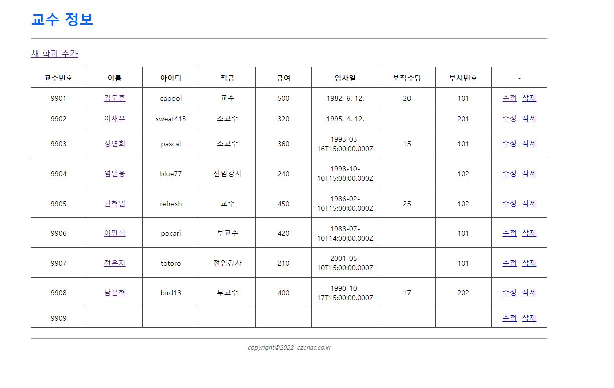
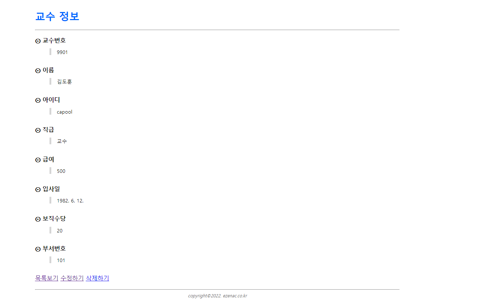
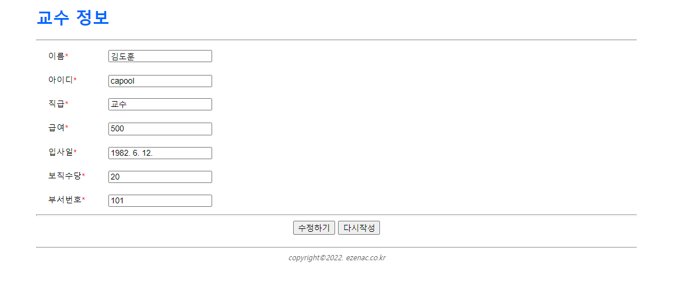
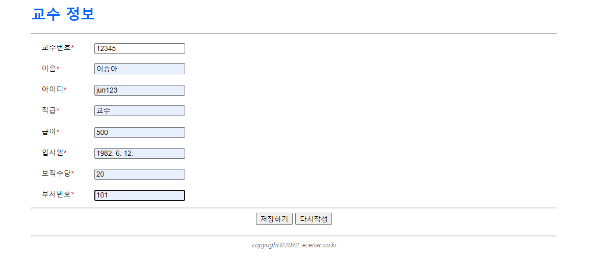
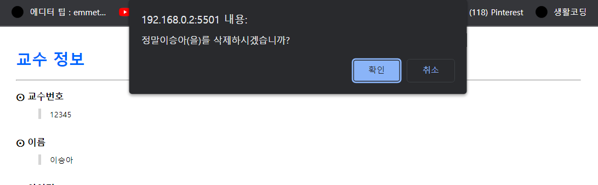


## 문제2.학생테이블

학생 테이블 스크린 샷

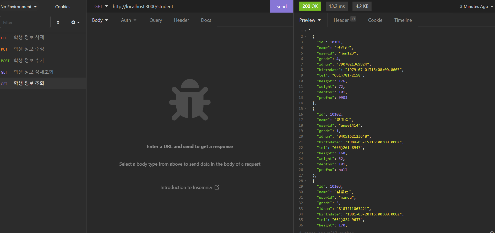


#### index.html
```html
<!DOCTYPE html>
<html lang="en">
<head>
    <meta charset="UTF-8">
    <meta http-equiv="X-UA-Compatible" content="IE=edge">
    <meta name="viewport" content="width=device-width, initial-scale=1.0">
    <title>학생 정보 관리</title>
    <link rel="stylesheet" href="assets/css/style.css"/>
</head>
<body>
    <div class="container">
        <!-- header -->
        <div data-include="inc/header.html"></div>

        <!-- body -->
        <section>
            <p>
                <a href="add.html">새 학과 추가</a>
            </p>
            <table class="table">
                <colgroup>
                    <col width="8.3%"/>
                    <col width="9%"/>
                    <col width="8.3%"/>
                    <col width="6%"/>
                    <col width="8.3%"/>
                    <col width="8.3%"/>
                    <col width="12%"/>
                    <col width="5%"/>
                    <col width="7%"/>
                    <col width="9%"/>
                    <col width="9%"/>
                    <col width="8.3%"/>
                </colgroup>
                <thead>
                    <tr>
                        <th class="text-center">학생번호</th>
                        <th class="text-center">이름</th>
                        <th class="text-center">아이디</th>
                        <th class="text-center">학년</th>
                        <th class="text-center">주민번호</th>
                        <th class="text-center">생년월일</th>
                        <th class="text-center">전화번호</th>
                        <th class="text-center">키</th>
                        <th class="text-center">몸무게</th>
                        <th class="text-center">학과번호</th>
                        <th class="text-center">담당교수 일련번호</th>
                        <th class="text-center">-</th>
                    </tr>
                </thead>
                <tbody id="listBody"></tbody>
            </table>
        </section>

        <!-- footer -->
        <div data-include="inc/footer.html"></div>
    </div>
    <script src="https://cdn.jsdelivr.net/npm/axios/dist/axios.min.js"></script>
    <script src="assets/js/include.js"></script>
    <script>
        // 페이지가 실행되면서 자동으로 동작해야 하므로 즉시 실행 함수 형태로 구현.
        (async()=>{
            // ajax 결과가 저장될 json
            let json = null;

            // ajax 요청
            try{
                json = await axios.get('http://localhost:3000/student');
            }catch(e){
                console.error(e);
                    alert('요청을 처리하는데 실패했습니다.');
                    return;
                }
                // ajax 결과가 존재한다면?
                if(json != null){
                    const listBody = document.querySelector("#listBody");
                    const {data}=json;

                    data.forEach((v,i) => {
                        const tr = document.createElement("tr");
                       
                        // 학생번호를 출력한 후 첫 번째 칸을 tr에 추가
                        const td1 = document.createElement("td");
                        td1.innerHTML = v.id;
                        tr.appendChild(td1);

                        // 두 번째 칸을 생성 후 tr에 추가
                        const td2 = document.createElement("td");
                        tr.appendChild(td2);

                        // 상세보기를 위한 링크로 구현된 학과 이름을 두 번째 칸에 추가
                        // -> 어떤 학과를 열람할 것인가를 의미하는 id 값을 GET 파라미터로 전당함.
                        // 대체로 id하는 이름의 변수는 그 대상을 식별하기 위한 고유한 값을 의미 (=일련번호)
                        const a1 = document.createElement("a");
                        a1.setAttribute('href', `view.html?id=${"v.id"}`);
                        a1.innerHTML = v.name;
                        td2.appendChild(a1);

                        // 아이디를 포함하는 세 번째 칸을 tr에 추가
                        const td3 = document.createElement("td");
                        td3.innerHTML = v.userid;
                        tr.appendChild(td3);

                        // 학년을 포함하는 네 번째 칸을 tr에 추가
                        const td4 = document.createElement("td");
                        td4.innerHTML = v.grade;
                        tr.appendChild(td4);

                         // 주민번호를 포함하는 다섯 번째 칸을 tr에 추가
                         const td5 = document.createElement("td");
                        td5.innerHTML = v.idnum;
                        tr.appendChild(td5);

                         // 생년월일을 포함하는 여섯 번째 칸을 tr에 추가
                         const td6 = document.createElement("td");
                        td6.innerHTML = v.birthdate;
                        tr.appendChild(td6);

                         // 전화번호을 포함하는 일곱 번째 칸을 tr에 추가
                         const td7 = document.createElement("td");
                        td7.innerHTML = v.tel;
                        tr.appendChild(td7);

                         // 키를 포함하는 여덟 번째 칸을 tr에 추가
                         const td8 = document.createElement("td");
                        td8.innerHTML = v.height;
                        tr.appendChild(td8);

                        // 키를 포함하는 여덟 번째 칸을 tr에 추가
                        const td9 = document.createElement("td");
                        td9.innerHTML = v.weight;
                        tr.appendChild(td9);


                         // 학과번호를 포함하는 열번째 칸을 tr에 추가
                         const td10 = document.createElement("td");
                        td10.innerHTML = v.deptno;
                        tr.appendChild(td10);

                         // 담당교수의 일련번호를 포함하는 열한 번째 칸을 tr에 추가
                         const td11 = document.createElement("td");
                        td11.innerHTML = v.profno;
                        tr.appendChild(td11);

                        //열두번째 번째 칸을 tr에 추가
                        const td12 = document.createElement('td');
                        tr.appendChild(td12);
                        

                        // 어떤 항목을 수정할 것인지를 GET 파라미터로 담은 링크를 열두 번째 칸에 추가
                        const a2 = document.createElement("a");
                        a2.setAttribute('href', `edit.html?id=${v.id}`);
                        a2.innerHTML= '수정';
                        td12.appendChild(a2);

                        // 어떤 항목을 삭제할 것인지를 dataset으로 저장하고 있는 링크를 열두 번째 칸에 추가
                        const a3 = document.createElement("a");
                        a3.setAttribute('href', `#`);
                        a3.dataset.id = v.id;
                        a3.dataset.name = v.name;
                        a3.innerHTML = '삭제';
                        a3.classList.add('btn-delete');
                        td12.appendChild(a3);

                        // 구성된 tr을 tbody에 추가
                        listBody.appendChild(tr);

                        // 삭제된 버튼에 대한 클릭 이벤트 구현
                        a3.addEventListener('click', async e =>{
                            e.preventDefault();
                            const current = e.currentTarget;
                            const id = current.dataset.id;
                            const name = current.dataset.name;

                            if(!confirm(`정말 ${name}(을)를 삭제하시겠습니까?`)){
                                return;
                            }
                            let json = null;

                            try{
                                json = axios.delete(`http://localhost:3000/student/${id}`);
                            }catch(e){
                                console.error(e);
                                alert('요청을 처리하는데 실패했습니다.');
                                return;
                            }
                            if(json != null){
                                // 클릭된 링크를 기준으로 가장 가까운 tr 태그를 상위 요소 중에서 찾아 제거함.
                                current.closest('tr').remove();
                            }
                        });

                    });
                }
            })();
    </script>
</body>
</html>
```


#### view.html
```html
<!DOCTYPE html>
<html lang="en">
<head>
    <meta charset="UTF-8">
    <meta http-equiv="X-UA-Compatible" content="IE=edge">
    <meta name="viewport" content="width=device-width, initial-scale=1.0">
    <title>학생 정보 관리</title>
    <link rel="stylesheet" href="assets/css/style.css"/>
</head>
<body>
    <div class="container">
        <!-- header -->
        <div data-include="inc/header.html"></div>

        <!-- body -->
        <section>
            <dl>
                <dt>학생번호</dt>
                <dd class="id"></dd>
                <dt>이름</dt>
                <dd class="name"></dd>
                <dt>아이디</dt>
                <dd class="userid"></dd>
                <dt>학년</dt>
                <dd class="grade"></dd>
                <dt>주민번호</dt>
                <dd class="idnum"></dd>
                <dt>생년월일</dt>
                <dd class="birthdate"></dd>
                <dt>전화번호</dt>
                <dd class="tel"></dd>
                <dt>키</dt>
                <dd class="height"></dd>
                <dt>몸무게</dt>
                <dd class="weight"></dd>
                <dt>학과번호</dt>
                <dd class="deptno"></dd>
                <dt>담당교수 일련번호</dt>
                <dd class="profno"></dd>
                
            </dl>
            <a href="index.html">목록보기</a>
            <a href="#" class="btn-edit">수정하기</a>
            <a href="#" class="btn-delete">삭제하기</a>
        </section>

        <!-- footer -->
        <div data-include="inc/footer.html"></div>
    </div>
    <script src="https://cdn.jsdelivr.net/npm/axios/dist/axios.min.js"></script>
    <script src="assets/js/include.js"></script>
    <script>
        // 페이지가 실행되면서 자동으로 동작해야 하므로 즉시 실행 함수 형태로 구현.
        (async()=>{
            /* GET 파라미터 받기 */
            // window.location.location.search : "?id=101"  
            console.log(`search값 => ${window.location.search}`);
            // querystring 값이 key-value형태로 객체가 분리됨
            const params = new URLSearchParams(window.location.search);
            // 객체에서 key사용하여 값을 추출 --> 101
            const id = params.get('id');
            console.log('id');

            // 파라미터가 정상적이지 않으므로 메세지 출력, 전 페이지 이동 처리 후 수행 중단(return)
            if(!id){
                alert('학과번호가 없습니다.');
                history.back();
                return;
            }
            /* Ajax요청 */
            let json = null;

            try{
                json = await axios.get(`http://localhost:3000/student/${id}`);
            }catch(e){
                console.error(e);
                alert('학과번화가 없습니다.');
                history.back();
                return;
            }
            if (json != null){
                const {data} = json;
                document.querySelector('.id').innerHTML = data.id;
                document.querySelector('.name').innerHTML = data.name;
                document.querySelector('.userid').innerHTML = data.userid;
                document.querySelector('.grade').innerHTML = data.grade;
                document.querySelector('.idnum').innerHTML = data.idnum;
                document.querySelector(".birthdate").innerHTML=new Date(data.birthdate).toLocaleDateString();
                document.querySelector('.tel').innerHTML = data.tel;
                document.querySelector('.height').innerHTML = data.height;
                document.querySelector('.weight').innerHTML = data.weight;
                document.querySelector('.deptno').innerHTML = data.deptno;
                document.querySelector('.profno').innerHTML = data.profno;

                // 가져온 데이터의 일련번호를 사용하여 어떤 대상을 수정할지에 대한 링크 URL 구성
                document.querySelector('.btn-edit').setAttribute('href', 'edit.html?id='+data.id);
                
                // 가져온 데이터의 일련번호를 사용하여 어떤 대상을 삭제할지에 대한 dataset구성
                const btnDelete = document.querySelector('.btn-delete');
                btnDelete.dataset.id = data.id;
                btnDelete.dataset.name = data.name;
                btnDelete.dataset.userid = data.userid;
                btnDelete.dataset.grade = data.grade;
                btnDelete.dataset.idnum = data.idnum;
                btnDelete.dataset.birthdate = data.birthdate;
                btnDelete.dataset.tel = data.tel;
                btnDelete.dataset.height = data.height;
                btnDelete.dataset.weight = data.weight;
                btnDelete.dataset.deptno = data.deptno;
                btnDelete.dataset.profno = data.profno;
            }
        })();

        /* 삭제 버튼에 대한 클릭 이벤트 */
        document.querySelector('.btn-delete').addEventListener('click', (e)=>{
            e.preventDefault();

            const current = e.currentTarget;
            const id = current.dataset.id;
            const name = current.dataset.name;

            if(!confirm (`정말${name}(을)를 삭제하시겠습니까?`)){
                return;
            }
            let json = null;
            
            try{
                json = axios.delete(`http://localhost:3000/student/${id}`);
            }catch(e){
                console.error(e);
                alert('요청을 처리하는데 실패했습니다.');
                return;
            }
            if(json != null){
                window.location = 'index.html';
            }
        });
    </script>
</body>
</html>
```


#### edit.html
```html
<!DOCTYPE html>
<html lang="en">
<head>
    <meta charset="UTF-8">
    <meta http-equiv="X-UA-Compatible" content="IE=edge">
    <meta name="viewport" content="width=device-width, initial-scale=1.0">
    <title>학생 정보 관리</title>
    <link rel="stylesheet" href="assets/css/style.css"/>
</head>
<body>
    <div class="container">
        <!-- header -->
        <div data-include="inc/header.html"></div>

        <!-- body -->
        <section>
            <form name="form" id="student-form">
                  <!-- 수정할 대상에 대한 일련번호  값을 포함해야 하므로 hidden 필드로 처리한다 -->
                  <input type="hidden" name="id" id="id"/>
                   
                <div class="form-group">
                    <label for="name">이름<span class="text-danger">*</span></label>
                    <div>
                        <input type="text" name="name" id="name"/>
                    </div>
                </div>
                <div class="form-group">
                    <label for="userid">아이디<span class="text-danger">*</span></label>
                    <div>
                        <input type="text" name="userid" id="userid"/>
                    </div>
                </div>
                <div class="form-group">
                    <label for="grade">학년<span class="text-danger">*</span></label>
                    <div>
                        <input type="text" name="grade" id="grade"/>
                    </div>
                </div>
                <div class="form-group">
                    <label for="idnum">주민번호<span class="text-danger">*</span></label>
                    <div>
                        <input type="text" name="idnum" id="idnum"/>
                    </div>
                </div>
                <div class="form-group">
                    <label for="birthdate">생년월일<span class="text-danger">*</span></label>
                    <div>
                        <input type="date" name="birthdate" id="birthdate" value="${birthdate}" />
                    </div>
                </div>
                <div class="form-group">
                    <label for="tel">전화번호<span class="text-danger">*</span></label>
                    <div>
                        <input type="text" name="tel" id="tel"/>
                    </div>
                </div>
                <div class="form-group">
                    <label for="height">키<span class="text-danger">*</span></label>
                    <div>
                        <input type="text" name="height" id="height"/>
                    </div>
                </div>
                <div class="form-group">
                    <label for="weight">몸무게<span class="text-danger">*</span></label>
                    <div>
                        <input type="text" name="weight" id="weight"/>
                    </div>
                </div>
                <div class="form-group">
                    <label for="deptno">학과번호<span class="text-danger">*</span></label>
                    <div>
                        <input type="text" name="deptno" id="deptno"/>
                    </div>
                </div>
                <div class="form-group">
                    <label for="profno">담당교수 일련번호<span class="text-danger">*</span></label>
                    <div>
                        <input type="text" name="profno" id="profno"/>
                    </div>
                </div>
                <hr/>
                <div class="text-center">
                    <button type="submit">수정하기</button>
                    <button type="reset">다시작성</button>
                </div>
            </form>
        </section>

        <!-- footer -->
        <div data-include="inc/footer.html"></div>
    </div>
    <script src="https://cdn.jsdelivr.net/npm/axios/dist/axios.min.js"></script>
    <script src="assets/js/include.js"></script>
    <script>
        // 페이지가 실행되면서 자동으로 동작해야 하므로 즉시 실행 함수 형태로 구현.
        (async()=>{
            /* GET 파라미터 받기 */
            const params = new URLSearchParams(window.location.search);
            const id = params.get('id');
            console.log(id);

            // 파라미터가 정상적이지 않으므로 메세지 출력, 전페이지 이동 처리 후 수행 중단(return)
            if(!id){
                alert('학과 번호가 없습니다.');
                history.back();
                return;
            }

            /* Ajax요청 */
            // 기존에 저장되어 있는 내용 <form> 안에 셋팅하기 위해 Ajax로 데이터를 가져온다.
            let json = null;

            try{
                json= await axios.get(`http://localhost:3000/student/${id}`);
            }catch(e){
                console.error(e);
                alert('요청을 처리하는데 실패했습니다.');
                return;
            }
            // 가져온 데이터가 있다면 <input> 태그의 value 속성으로 가져온 값을 적용한다.
            // 일련번호와 같이 시스템이 관리하는 값은 hidden 요소로 포함시킨다.
            if(json != null){
                const {data} = json;
                document.querySelector("#id").value = data.id;
                document.querySelector("#name").value = data.name;
                document.querySelector("#userid").value = data.userid;
                document.querySelector("#grade").value = data.grade;
                document.querySelector("#idnum").value = data.idnum;
                document.querySelector("#birthdate").value = (data.birthdate).substring(0,10);
                document.querySelector("#tel").value = data.tel;
                document.querySelector("#height").value = data.height;
                document.querySelector("#weight").value = data.weight;
                document.querySelector("#deptno").value = data.deptno;
                document.querySelector("#profno").value = data.profno;
            }
        })();

        /* 수정 버튼의 submit 이벤트 */
        document.querySelector('#student-form').addEventListener('submit', async (e)=>{
            e.preventDefault();

            // 입력값 받아오기
            const id = document.querySelector('#id').value;
            const name = document.querySelector('#name').value;
            const userid = document.querySelector('#userid').value;
            const grade = document.querySelector('#grade').value;
            const idnum = document.querySelector('#idnum').value;
            const birthdate = new Date(document.querySelector('#birthdate').value).toDateString();
            const tel = document.querySelector('#tel').value;
            const height = document.querySelector('#height').value;
            const weight = document.querySelector('#weight').value;
            const deptno = document.querySelector('#deptno').value;
            const profno = document.querySelector('#profno').value;

            // 입력값에 대한 유효성 검사 진행... (이 예제에서는 생략)
            let json = null;

            try{
                json = await axios.put(`http://localhost:3000/student/${id}`,{
                    id : id,
                    name : name,
                    userid: userid,
                    grade : grade,
                    idnum: idnum,
                    birthdate : birthdate,
                    tel: tel,
                    height : height,
                    weight: weight,
                    deptno : deptno,
                    profno: profno,
                });
            }catch(e){
                console.error(e);
                alert('요청을 처리하는데 실패했습니다.');
                return;
            }
            if(json != null){
                window.location.href = `view.html?id=${id}`;
            }
        });
    </script>
</body>
</html>
```


#### add.html
```html
<!DOCTYPE html>
<html lang="en">
<head>
    <meta charset="UTF-8">
    <meta http-equiv="X-UA-Compatible" content="IE=edge">
    <meta name="viewport" content="width=device-width, initial-scale=1.0">
    <title>학생 정보 관리</title>
    <link rel="stylesheet" href="assets/css/style.css"/>
</head>
<body>
    <div class="container">
        <!-- header -->
        <div data-include="inc/header.html"></div>

        <!-- body -->
        <section>
            <form name="form" id="student-form">
                <div class="form-group">
                    <label for="id">학생번호<span class="text-danger">*</span></label>
                    <div>
                        <input type="text" name="id" id="id"/>
                    </div>
                </div>
                <div class="form-group">
                    <label for="name">이름<span class="text-danger">*</span></label>
                    <div>
                        <input type="text" name="name" id="name"/>
                    </div>
                </div>
                <div class="form-group">
                    <label for="userid">아이디<span class="text-danger">*</span></label>
                    <div>
                        <input type="text" name="userid" id="userid"/>
                    </div>
                </div>
                <div class="form-group">
                    <label for="grade">학년<span class="text-danger">*</span></label>
                    <div>
                        <input type="text" name="grade" id="grade"/>
                    </div>
                </div>
                <div class="form-group">
                    <label for="idnum">주민번호<span class="text-danger">*</span></label>
                    <div>
                        <input type="text" name="idnum" id="idnum"/>
                    </div>
                </div>
                <div class="form-group">
                    <label for="birthdate">생년월일<span class="text-danger">*</span></label>
                    <div>
                        <input type="date" name="birthdate" id="birthdate" />
                    </div>
                </div>
                <div class="form-group">
                    <label for="tel">전화번호<span class="text-danger">*</span></label>
                    <div>
                        <input type="text" name="tel" id="tel"/>
                    </div>
                </div>
                <div class="form-group">
                    <label for="height">키<span class="text-danger">*</span></label>
                    <div>
                        <input type="text" name="height" id="height"/>
                    </div>
                </div>
                <div class="form-group">
                    <label for="weight">몸무게<span class="text-danger">*</span></label>
                    <div>
                        <input type="text" name="weight" id="weight"/>
                    </div>
                </div>
                <div class="form-group">
                    <label for="deptno">학과번호<span class="text-danger">*</span></label>
                    <div>
                        <input type="text" name="deptno" id="deptno"/>
                    </div>
                </div>
                <div class="form-group">
                    <label for="profno">담당교수 일련번호<span class="text-danger">*</span></label>
                    <div>
                        <input type="text" name="profno" id="profno"/>
                    </div>
                </div>
                <hr/>
                <div class="text-center">
                    <button type="submit">저장하기</button>
                    <button type="reset">다시작성</button>
                </div>
            </form>
        </section>

        <!-- footer -->
        <div data-include="inc/footer.html"></div>
    </div>
    <script src="https://cdn.jsdelivr.net/npm/axios/dist/axios.min.js"></script>
    <script src="assets/js/include.js"></script>
    <script>
        document.querySelector('#student-form').addEventListener('submit', async(e)=>{
            e.preventDefault();

            // 입력값 받아오기
            const id = document.querySelector('#id').value;
            const name = document.querySelector('#name').value;
            const userid = document.querySelector('#userid').value;
            const grade = document.querySelector('#grade').value;
            const idnum = document.querySelector('#idnum').value;
            const birthdate = new Date(document.querySelector('#birthdate').value).toDateString();
            const tel = document.querySelector('#tel').value;
            const height = document.querySelector('#height').value;
            const weight = document.querySelector('#weight').value;
            const deptno = document.querySelector('#deptno').value;
            const profno = document.querySelector('#profno').value;

            // 입력값에 대한 유효성 검사 진행... (이 예제에서는 생략)

            let json = null;

            (async function(){
            try{
                // 대부분의 backend가 일련번호는 자체적으로 생성하기 때문에 create에 해당하는 데이터 추가 처리에서는 백엔드에게
                //일련번호를 제외한 변수만 전달한다.
                json = await axios.post('http://localhost:3000/student', {
                    id : id,
                    name : name,
                    userid: userid,
                    grade : grade,
                    idnum: idnum,
                    birthdate : birthdate,
                    tel: tel,
                    height : height,
                    weight: weight,
                    deptno : deptno,
                    profno: profno,

                });
            }catch(e){
                console.error(e);
                alert('요청을 처리하는데 실패했습니다.');
                return;
            }
            if(json != null){
                const {data} = json;
                console.log(data);
                // 백엔드에서 데이터 저장에 대한 응답으로 보낸 JSON에는 생성된 신규 항목에 대한 일련번호가 포함되어 있다.
                // 이 값을 활용하여 상세 페이지로 이동해야한다.
                // 이 때, 어떤 대상을 열람할 것인지에 대한 GET파라미터를 구성한다.
                window.location = 'view.html?id=' + data.id;
            }
            })();
        });
    </script>
</body>
</html>
```


실행결과의 스크린 샷

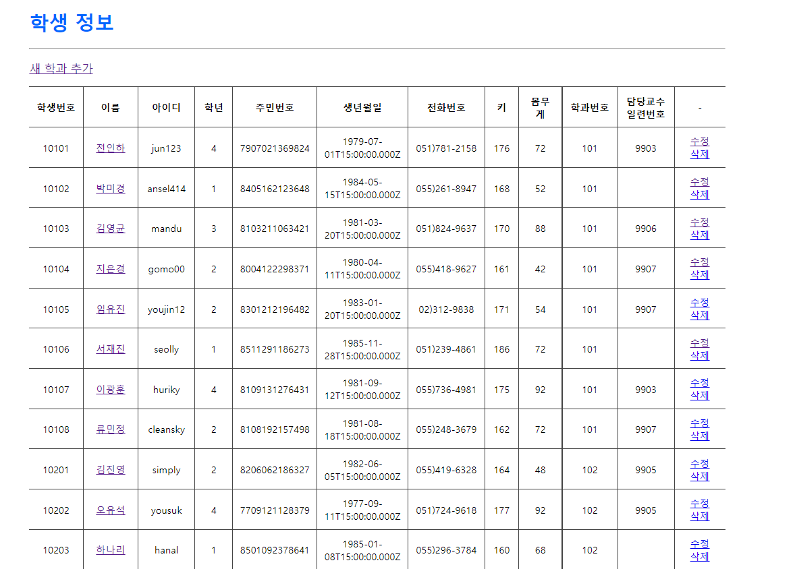
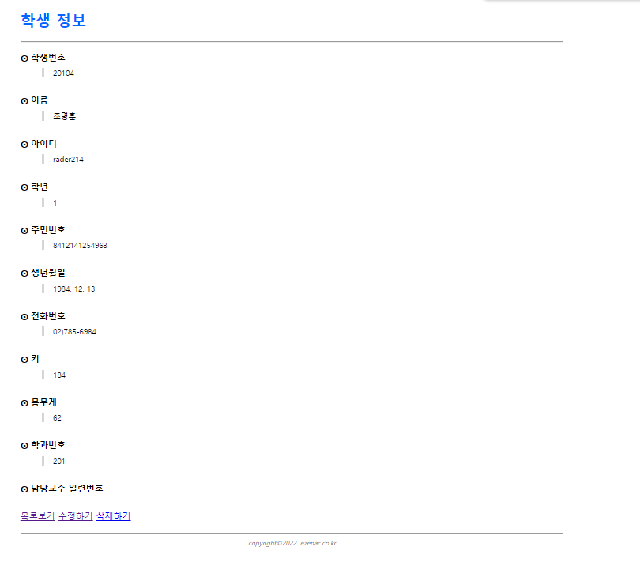
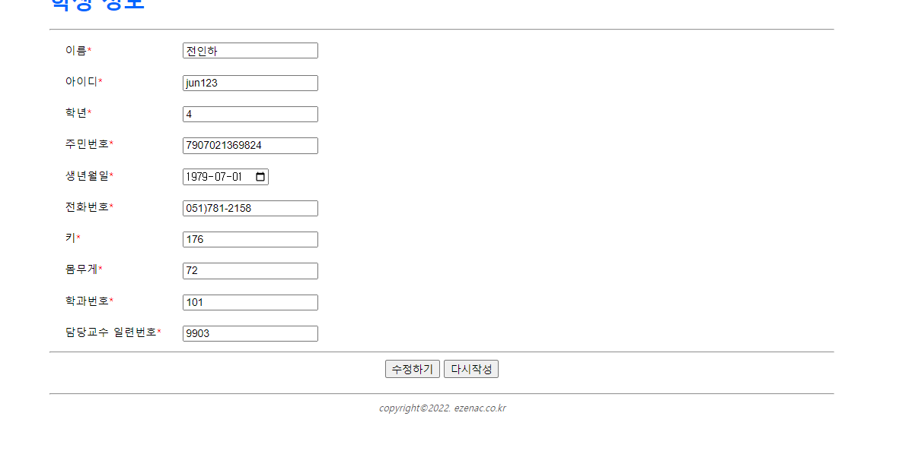
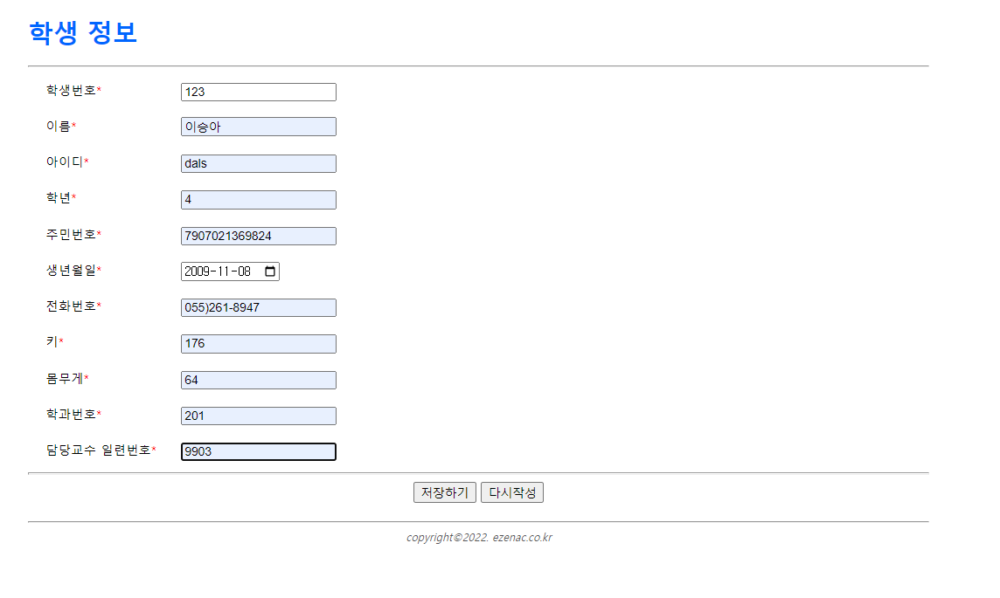
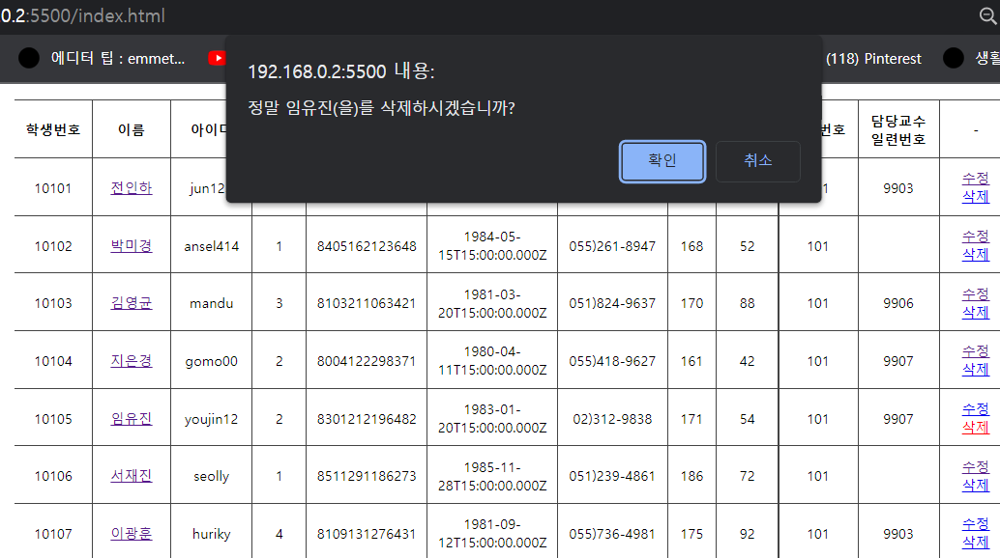
