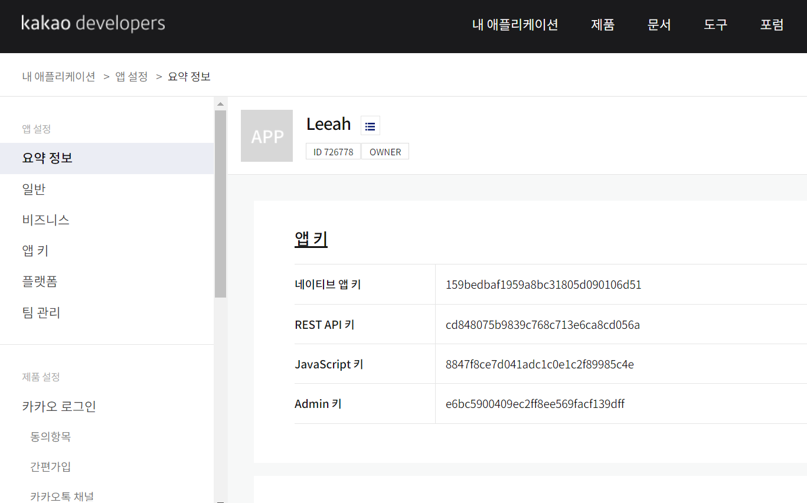
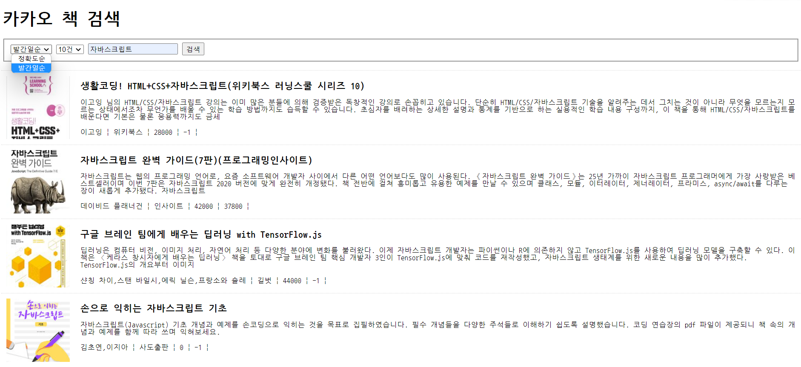
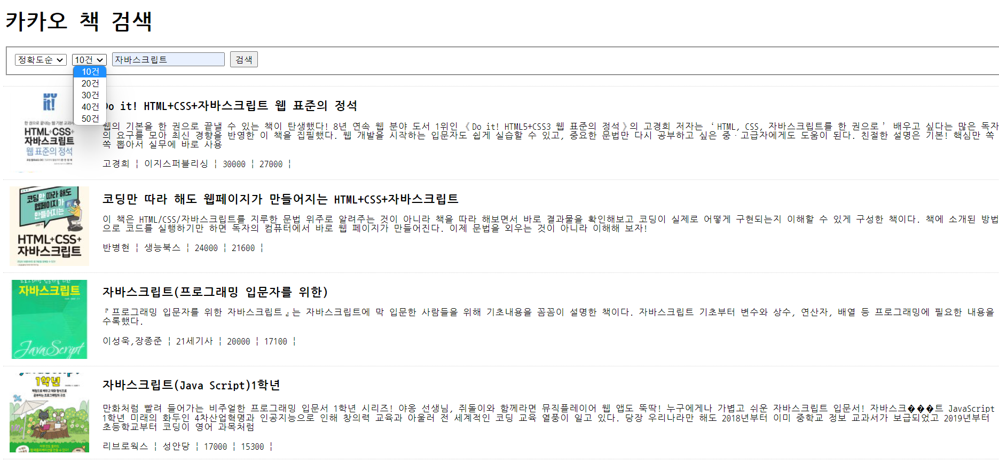
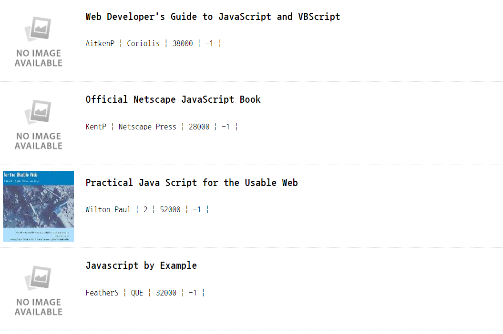
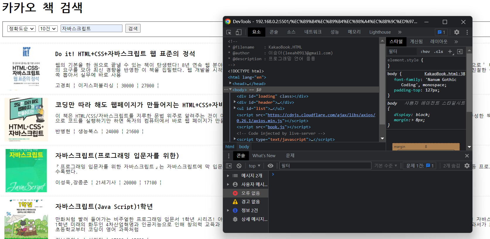

# 프로그래밍언어응용*시험*이승아

> 2022-04-96

### 문제
#### 취업을 위한 포트폴리오를 준비중인 당신은 카카오 OpenAPI를 활용하여 책 검색 기능을 구현한 프론트엔드 웹페이지를 구현하고자 한다. 각 문항에서 요구하는 요구사항을 충족하는 세미프로젝트를 진행하고 이에 대한 작업 결과 보고서를 제출하시오.

```html
<!--
* @filename    : KakaoBook.HTML
* @author      : 이승아(leeah0913@gmail.com)
* @description : 프로그래밍 언어 응용
-->

<!DOCTYPE html>
<html lang="en">
  <head>
    <meta charset="UTF-8" />
    <meta http-equiv="X-UA-Compatible" content="IE=edge" />
    <meta name="viewport" content="width=device-width, initial-scale=1.0" />
    <link rel="short icon" href="#" />
    <link
      href="https://fonts.googleapis.com/css2?family=Nanum+Gothic+Coding:wght@400;700&display=swap"
      rel="stylesheet"
    />
    <title>Document</title>
    <style>
      #loading {
        width: 100px;
        height: 100px;
        background-image: url(img/loading.gif);
        background-size: cover;
        background-repeat: no-repeat;
        background-position: center center;
        display: block;
        position: fixed;
        left: 50%;
        top: 50%;
        margin-left: -50px;
        margin-top: -50px;
        z-index: 99999;
        display: none;
      }

      #loading.active {
        display: block;
      }

      body {
        font-family: 'Nanum Gothic Coding', monospace;
        padding-top: 127px;
      }

      #header {
        position: fixed;
        top: 0;
        left: 0;
        width: 100%;
        background-color: #fff;
        z-index: 1000;
        padding: 0px 10px 5px 10px;
        box-sizing: border-box;
      }

      #searchForm select {
        text-align: center;
      }

      #list {
        list-style: none;
        padding: 0;
        margin: 0;
      }

      #list li {
        border-bottom: 1px dotted #d5d5d5;
      }

      #list li:first-child {
        border-top: 1px dotted #d5d5d5;
      }

      #list a {
        display: block;
        width: auto;
        min-height: 120px;
        padding: 10px;
        position: relative;
        color: black;
        text-decoration: none;
      }

      #list a {
        padding-left: 150px;
      }

      #list a img {
        display: block;
        width: 120px;
        height: 120px;
        object-fit: cover;
        position: absolute;
        left: 10px;
        top: 10px;
      }

      #list a h2 {
        font-size: 18px;
        margin-top: 10px;
        overflow: hidden;
        text-overflow: ellipsis;
        display: -webkit-box;
        -webkit-line-clamp: 1; /* 라인수 */
        -webkit-box-orient: vertical;
        word-wrap: break-word;
      }

      #list a span,
      #list a p {
        font-size: 14px;
      }

      #list a p {
        overflow: hidden;
        text-overflow: ellipsis;
        display: -webkit-box;
        -webkit-line-clamp: 3; /* 라인수 */
        -webkit-box-orient: vertical;
        word-wrap: break-word;
      }

      #list span:after {
        content: '|';
        margin-left: 7px;
        margin-right: 7px;
      }
    </style>
  </head>
  <body>
    <div id="loading"></div>

    <div id="header">
      <h1>카카오 책 검색</h1>

      <form id="searchForm">
        <fieldset>
          <select name="sort" id="sort">
            <option value="accuracy" selected>정확도순</option>
            <option value="latest">발간일순</option>
          </select>
          <select name="total_count" id="total_count">
            <option value="10" selected>10건</option>
            <option value="20">20건</option>
            <option value="30">30건</option>
            <option value="40">40건</option>
            <option value="50">50건</option>
          </select>
          <input type="search" id="query" placeholder="Search" />
          <button type="submit">검색</button>
        </fieldset>
      </form>
    </div>

    <ul id="list">
      <!-- <li>
            <a href="https://search.daum.net/search?w=bookpage&bookId=1467038&q=%EB%AF%B8%EC%9B%80%EB%B0%9B%EC%9D%84+%EC%9A%A9%EA%B8%B0" target="_blank" class="use-thumbnail">
                
                <h2>글 제목</h2>
                <p>본문내용...</p>
                <span class="info">도서저자</span>
                <span class="info">출판사</span>
                <span class="price">도서정가</span>
                <span class="price">도서판매가</span>
            </a>
        </li> -->
    </ul>

    <script src="https://cdnjs.cloudflare.com/ajax/libs/axios/0.26.1/axios.min.js"></script>
    <script src="book.js"></script>
  </body>
</html>
```

```js
/**
 * @filename    : book.js
 * @author      : 이승아(leeah0913@gmail.com)
 * @description : 프로그래밍 언어 응용
 */

/* KAKAO REST KEY */
const KAKAO_REST_KEY = 'cd848075b9839c768c713e6ca8cd056a'

/* 페이지 번호 */
let currentPage = 1

/** 검색어*/
let queryKeyword = null

/** 결과 문서 정렬 방식*/
let sort = null

/** 문서 수 */
let page = null

/* 마지막 페이지인지 검사 */
let isEnd = false

/* 검색폼의 submit 이벤트 - 신규검색 */
document.querySelector('#searchForm').addEventListener('submit', (e) => {
  e.preventDefault()

  // 입력된 검색어를 가져온다.
  const queryField = document.querySelector('#query')
  queryKeyword = queryField.value.trim()

  // 결과 문서 정렬을 가져온다.
  const sortField = document.getElementById('sort')
  sort = sortField.options[sortField.selectedIndex].value

  // 선택한 문서 수을 가져온다.
  const select = document.getElementById('total_count')
  search = select.options[select.selectedIndex].value

  // 검색어가 입련되지 않은 경우에 대한 예외처리
  if (!queryKeyword) {
    alert('검색어를 입력하세요.')
    queryField.focus()
    return
  }

  //신규검색
  currentPage = 1
  get_book_search()
})

/* 스크롤 이벤트 - 추가검색 */
window.addEventListener('scroll', (e) => {
  // 마지막 페이지이거나 이미 로딩바가 화면에 표시되고 있다면, 처리중단
  if (
    isEnd ||
    document.querySelector('#loading').classList.contains('active')
  ) {
    return
  }

  // 스크롤바의 Y좌표
  const scrollTop = window.scrollY
  //웹 브라우저의 창 높이
  const windowHeight = window.screen.availHeight
  //HTML 문서의 높이
  const documentHeight = document.body.scrollHeight

  // 스크롤바의 변동 효과를 고려해서 scrollTop + windowHeight가 실제 화면 크기보다 커질 수 있다.
  if (scrollTop + windowHeight >= documentHeight) {
    //2페이지 이후는 추가 검색
    currentPage++
    get_book_search()
  }
})

/* Ajax요청 후 결과를 화면에 HTML로 출력하는 함수 */
async function get_book_search() {
  // 로딩바 객체
  const loading = document.querySelector('#loading')

  // 로딩바 화면에 표시하기
  loading.classList.add('active')

  // 검색결과가 표시될 영역
  const list = document.querySelector('#list')

  // 1페이지에 대한 요청일 경우 기존에 표시되고 있던 검색결과가 있다면 삭제한다.
  if (currentPage == 1) {
    Array.from(list.getElementsByTagName('li')).forEach((v, i) => {
      list.removeChild(v)
    })
  }
  // 검색결과를 저장할 빈 변수
  let json = null
  console.log(json)
  try {
    json = await axios.get(`https://dapi.kakao.com/v3/search/book`, {
      params: {
        query: queryKeyword,
        page: currentPage,
        sort: sort,
      },
      headers: {
        Authorization: `KakaoAK ${KAKAO_REST_KEY}`,
      },
    })
  } catch (e) {
    console.error(err)
    alert('요청을 처리하는데 실패했습니다.')
    return
  } finally {
    // 로딩바 닫기
    loading.classList.remove('active')
  }

  if (json != null) {
    const { data } = json

    // 다음 페이지를 요청할 수 있는지를 판단하기 위한 값.
    isEnd = data.meta.is_end

    data.documents.map((v, i) => {
      // li 태그 생성하기
      const li = document.createElement('li')
      list.appendChild(li)

      // a태그 생성하기
      const a = document.createElement('a')
      a.setAttribute('href', v.url)
      a.setAttribute('target', '_blank')
      a.setAttribute('title', v.title)
      li.appendChild(a)

      // 이미지 태그 생성하기
      const img = document.createElement('img')
      if (v.thumbnail) {
        img.setAttribute('src', v.thumbnail)
      } else {
        img.setAttribute('src', 'img/noimage.jpg')
      }
      a.appendChild(img)

      // 글제목 생성하기
      const h2 = document.createElement('h2')
      h2.innerHTML = v.title
      a.appendChild(h2)

      // 본문 태그 생성하기
      const p = document.createElement('p')
      p.innerHTML = v.contents
      a.appendChild(p)

      // 저자 생성하기
      const spanWriter = document.createElement('span')
      spanWriter.classList.add('info')
      spanWriter.innerHTML = v.authors
      a.appendChild(spanWriter)

      // 출판사 생성하기
      const spanCompany = document.createElement('span')
      spanCompany.classList.add('info')
      spanCompany.innerHTML = v.publisher
      a.appendChild(spanCompany)

      // 도서정가 생성하기
      const spanPrice = document.createElement('span')
      spanPrice.classList.add('price')
      spanPrice.innerHTML = v.price
      a.appendChild(spanPrice)

      // 도서 판매가 생성하기
      const spanSale = document.createElement('span')
      spanSale.classList.add('price')
      spanSale.innerHTML = v.sale_price
      a.appendChild(spanSale)
    })
  }
}
```

실행결과의 스크린 샷









