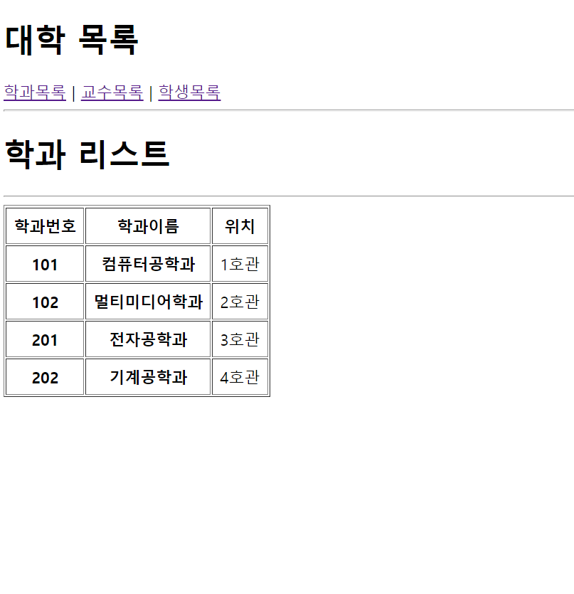
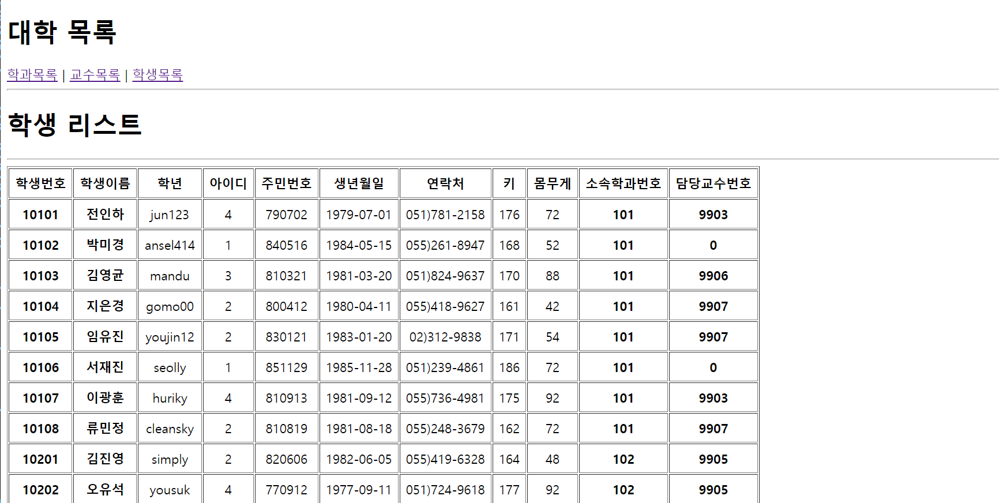

# 이승아 React 컴포넌트 예제
> 2022-04-26


## 문제 

#### index.js코드

```js
import React from 'react';
import ReactDOM from 'react-dom/client';
import App from './App';
import { BrowserRouter } from 'react-router-dom';
const root = ReactDOM.createRoot(document.getElementById('root'));
root.render(
<React.StrictMode>
<BrowserRouter>
<App />
</BrowserRouter>
</React.StrictMode>
);

```

#### App.js코드
```js
import React from "react";
import {Link, Routes, Route} from "react-router-dom"
import Student from "./pages/Student"
import Department from "./pages/Department";
import Professor from './pages/Professor'

const App = () => {
  return (
        <div>
            <h1>대학 목록</h1>
            <nav>
                <Link to="/department">학과목록</Link>&nbsp;|&nbsp;
                <Link to="/professor">교수목록</Link>&nbsp;|&nbsp;
                <Link to="/student">학생목록</Link>
            </nav>
            <hr />
            <Routes>
                <Route path="/department" element={<Department/>} />
                <Route path="/professor" element={<Professor/>} />
                <Route path="/student" element={<Student/>} />
            </Routes>
        </div>
  );
};
export default App;
```

실행결과의 스크린 샷


#### DepartmentItem.js코드

```js
import React from "react";
import PropTypes from 'prop-types';

const DepartmentItem = ({id, dname, loc}) => {
    return (
        <tr align="center">
            <td><strong>{id}</strong></td>
            <td><strong>{dname}</strong></td>
            <td>{loc}</td>
        </tr>);
    };
    DepartmentItem.propTypes = {
        id: PropTypes.number.isRequired,
        dname: PropTypes.string.isRequired
    };
    DepartmentItem.defaultProps = {
        loc: 0
    };
export default DepartmentItem;
```
#### Department.js코드

```js
import React from "react";
import DepartmentItem from "../components/DepartmentItem";
import MySchool from "../MySchool"


const department = () => {
    return (
    <div>
    <h1>학과 리스트</h1>
    <hr />
            <table border="1" cellPadding="7">
                    <thead>
                        <tr align="center">
                            <th>학과번호</th>
                            <th>학과이름</th>
                            <th>위치</th>
                        </tr>
                    </thead>
                    <tbody>
                            {MySchool['department'].map((v, i) => {
                            return (<DepartmentItem
                            key={i}
                            id={v.id}
                            dname={v.dname}
                            loc={v.loc} />)
                            })}
                      </tbody>
                </table>
    </div>
    );
    };
    export default department;
```


실행결과의 스크린 샷




#### ProfessorItem.js코드

```js
import React from "react";
import PropTypes from 'prop-types';

const ProfessorItem = ({id, name, userid, position, sal, hiredate, comm, deptno}) => {
    return (
        <tr align="center">
            <td><strong>{id}</strong></td>
            <td><strong>{name}</strong></td>
            <td>{userid}</td>
            <td>{position}</td>
            <td>{sal}</td>
            <td>{hiredate}</td>
            <td>{comm}</td>
            <td><strong>{deptno}</strong></td>
        </tr>);
    };
    ProfessorItem.propTypes = {
    id: PropTypes.number.isRequired,
    name: PropTypes.string.isRequired,
    deptno: PropTypes.number.isRequired
    };
    ProfessorItem.defaultProps = {
    userid: 0,
    position: 0,
    sal: 0,
    hiredate: 0,
    comm: 0
    };
    export default ProfessorItem;
```
#### Professor.js코드

```js
import React from "react";
import ProfessorItem from "../components/ProfessorItem";
import MySchool from "../MySchool"

const professor = () => {
    return (
    <div>
    <h1>교수 리스트</h1>
    <hr />
        <table border="1" cellPadding="7">
            <thead>
                    <tr align="center">
                            <th>교수번호</th>
                            <th>교수이름</th>
                            <th>아이디</th>
                            <th>직급</th>
                            <th>급여</th>
                            <th>입사일</th>
                            <th>보직수당</th>
                            <th>소속학과번호</th>
                    </tr>
            </thead>
            <tbody>
                {MySchool['professor'].map((v, i) => {
                return (<ProfessorItem
                        key={i}
                        id={v.id}
                        name={v.name}
                        userid={v.userid}
                        position={v.position}
                        sal={v.sal}
                        hiredate={v.hiredate.substring(0,10)}
                        comm={v.comm}
                        deptno={v.deptno} />)
                })}
            </tbody>
        </table>
    </div>
    );
    };
    export default professor;
```

실행결과의 스크린 샷




#### StudentItem.js코드
```js
import React from 'react';
import PropTypes from 'prop-types';

const StudentItem = ({id, name, userid, grade, idnum, birthdate, tel, height, weight, deptno, profno}) => {
    return (
        <tr align="center">
            <td><strong>{id}</strong></td>
            <td><strong>{name}</strong></td>
            <td>{userid}</td>
            <td>{grade}</td>
            <td>{idnum}</td>
            <td>{birthdate}</td>
            <td>{tel}</td>
            <td>{height}</td>
            <td>{weight}</td>
            <td><strong>{deptno}</strong></td>
            <td><strong>{profno}</strong></td>
        </tr>);
    };
    StudentItem.propTypes = {
    id: PropTypes.number.isRequired,
    name: PropTypes.string.isRequired,
    deptno: PropTypes.number.isRequired,

    };
    StudentItem.defaultProps = {
    userid: 0,
    grade: 0,
    idnum: 0,
    birthdate: 0,
    tel: 0,
    height: 0,
    weight: 0,
    profno:0 
    };
    export default StudentItem;
```

#### Student.js코드

```js
import React from "react";
import StudentItem from "../components/StudentItem";
import MySchool from "../MySchool"

const student = () => {
    return (
    <div>
        <h1>학생 리스트</h1>
        <hr />
            <table border="1" cellPadding="7">
                        <thead>
                            <tr align="center">
                                <th>학생번호</th>
                                <th>학생이름</th>
                                <th>학년</th>
                                <th>아이디</th>
                                <th>주민번호</th>
                                <th>생년월일</th>
                                <th>연락처</th>
                                <th>키</th>
                                <th>몸무게</th>
                                <th>소속학과번호</th>
                                <th>담당교수번호</th>
                            </tr>
                </thead>
                <tbody>
                    {MySchool['student'].map((v, i) => {
                    return (<StudentItem
                            key={i}
                            id={v.id}
                            name={v.name}
                            grade={v.grade}
                            userid={v.userid}
                            idnum={v.idnum.substring(0,6)}
                            birthdate={v.birthdate.substring(0,10)}
                            tel={v.tel}
                            height={v.height}
                            weight={v.weight}
                            deptno={v.deptno}
                            profno={v.profno} />)
                    })}
                </tbody>
        </table>
    </div>
    );
    };
export default student;
```


실행결과의 스크린 샷


