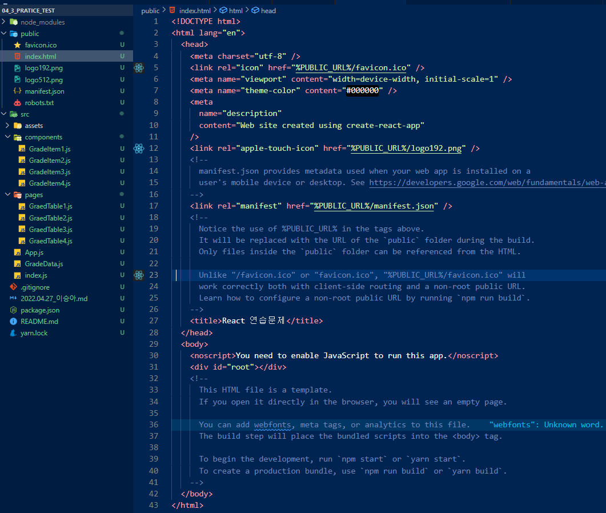
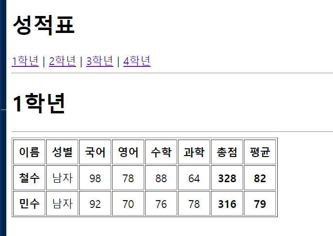
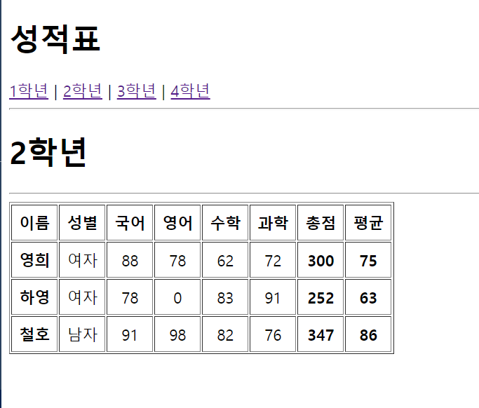
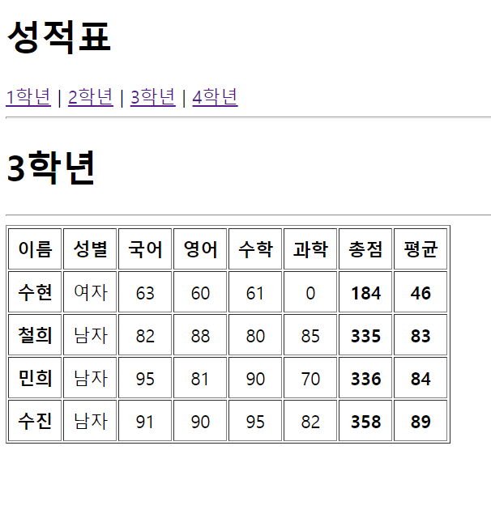
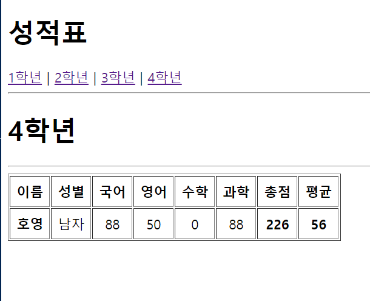

# 이승아 React 컴포넌트 예제
> 2022-04-27


## 문제 

#### index.js코드

```js
import React from 'react';
import ReactDOM from 'react-dom/client';
import App from './App';
import { BrowserRouter } from 'react-router-dom';

const root = ReactDOM.createRoot(document.getElementById('root'));
root.render(
  <React.StrictMode>
  <BrowserRouter>
    <App />
  </BrowserRouter>
  </React.StrictMode>
);

```

#### App.js코드
```js
import React from "react";
import {Link, Routes, Route} from "react-router-dom"

import Grade1 from "./pages/GraedTable1";
import Grade2 from "./pages/GraedTable2";
import Grade3 from "./pages/GraedTable3";
import Grade4 from "./pages/GraedTable4";


const App = () => {
  return (
  <div>
    <h1>성적표</h1>
      <nav>
          <Link to="/grade_table/1">1학년</Link>&nbsp;|&nbsp;
          <Link to="/grade_table/2">2학년</Link>&nbsp;|&nbsp;
          <Link to="/grade_table/3">3학년</Link>&nbsp;|&nbsp;
          <Link to="/grade_table/4">4학년</Link>
      </nav>
    <hr />
      <Routes>
          <Route path="/grade_table/1" element={<Grade1/>} />
          <Route path="/grade_table/2" element={<Grade2/>} />
          <Route path="/grade_table/3" element={<Grade3/>} />
          <Route path="/grade_table/4" element={<Grade4/>} />
      </Routes>
    </div>
);
}

export default App;
```

<br/> <b>메인 타이틀은 변경하였으나, 나머지 페이지별 링크 변경하는 법을 
아직 찾지 잘 모르겠어서 이렇게만 보내드립니다...</b>

실행결과의 스크린 샷




#### GradeTable1.js코드

```js
import React from "react";
import GradeData from "../GradeData";
import GradeItem from "../components/GradeItem1";

const Grade1 = (props) => {
return (
    <div>
        <h1>1학년</h1>
        <hr />
        <table border="1" cellPadding="7">
            <thead>
                    <tr align="center">
                    <th>이름</th>
                    <th>성별</th>
                    <th>국어</th>
                    <th>영어</th>
                    <th>수학</th>
                    <th>과학</th>
                    <th>총점</th>
                    <th>평균</th>
                </tr>
            </thead>
            <tbody>
            {GradeData['1학년'].map((v, i) => {
                return (<GradeItem
                key={i}
                name={v.이름}
                gender={v.성별}
                kor={v.국어}
                eng={v.영어}
                math={v.수학}
                sinc={v.과학} />)
            })}
            </tbody>
        </table>
    </div>
);
}
export default Grade1;
```

#### GradeItem1.js코드

```js
import React from 'react';
import PropTypes from 'prop-types';

const GradeItem1 = ({name, gender, kor, eng, math, sinc}) => {
const sum = parseInt(kor + eng + math + sinc);
const avg = parseInt(sum / 4);
    return (
        <tr align="center">
            <td><strong>{name}</strong></td>
            <td>{gender}</td>
            <td>{kor}</td>
            <td>{eng}</td>
            <td>{math}</td>
            <td>{sinc}</td>
            <td><strong>{sum}</strong></td>
            <td><strong>{avg}</strong></td>
        </tr>);
        };
        GradeItem1.propTypes = {
            name: PropTypes.string.isRequired,
            gender: PropTypes.string.isRequired,
            kor:PropTypes.number.isRequired,
            eng:PropTypes.number.isRequired,
            math:PropTypes.number.isRequired,
            sinc:PropTypes.number.isRequired
        };
        GradeItem1.defaultProps = {
            kor: 0,
            eng: 0,
            math: 0,
            sinc: 0
};
export default GradeItem1;
```




#### GradeTable2.js코드

```js
import React from "react";
import GradeData from "../GradeData";
import GradeItem from "../components/GradeItem2";

const Grade2 = (props) => {
return (
    <div>
        <h1>2학년</h1>
        <hr />
        <table border="1" cellPadding="7">
            <thead>
                    <tr align="center">
                    <th>이름</th>
                    <th>성별</th>
                    <th>국어</th>
                    <th>영어</th>
                    <th>수학</th>
                    <th>과학</th>
                    <th>총점</th>
                    <th>평균</th>
                </tr>
            </thead>
            <tbody>
            {GradeData['2학년'].map((v, i) => {
                return (<GradeItem
                key={i}
                name={v.이름}
                gender={v.성별}
                kor={v.국어}
                eng={v.영어}
                math={v.수학}
                sinc={v.과학} />)
            })}
            </tbody>
        </table>
    </div>
);
}
export default Grade2;
```

#### GradeItem2.js코드

```js
import React from 'react';
import PropTypes from 'prop-types';

const GradeItem2 = ({name, gender, kor, eng, math, sinc}) => {
const sum = parseInt(kor + eng + math + sinc);
const avg = parseInt(sum / 4);
    return (
        <tr align="center">
            <td><strong>{name}</strong></td>
            <td>{gender}</td>
            <td>{kor}</td>
            <td>{eng}</td>
            <td>{math}</td>
            <td>{sinc}</td>
            <td><strong>{sum}</strong></td>
            <td><strong>{avg}</strong></td>
        </tr>);
        };
        GradeItem2.propTypes = {
            name: PropTypes.string.isRequired,
            gender: PropTypes.string.isRequired,
            kor:PropTypes.number.isRequired,
            eng:PropTypes.number.isRequired,
            math:PropTypes.number.isRequired,
            sinc:PropTypes.number.isRequired
        };
        GradeItem2.defaultProps = {
            kor: 0,
            eng: 0,
            math: 0,
            sinc: 0
};
export default GradeItem2;
```




#### GradeTable3.js코드

```js
import React from "react";
import GradeData from "../GradeData";
import GradeItem from "../components/GradeItem3";

const Grade3 = (props) => {
return (
    <div>
        <h1>3학년</h1>
        <hr />
        <table border="1" cellPadding="7">
            <thead>
                    <tr align="center">
                    <th>이름</th>
                    <th>성별</th>
                    <th>국어</th>
                    <th>영어</th>
                    <th>수학</th>
                    <th>과학</th>
                    <th>총점</th>
                    <th>평균</th>
                </tr>
            </thead>
            <tbody>
            {GradeData['3학년'].map((v, i) => {
                return (<GradeItem
                key={i}
                name={v.이름}
                gender={v.성별}
                kor={v.국어}
                eng={v.영어}
                math={v.수학}
                sinc={v.과학} />)
            })}
            </tbody>
        </table>
    </div>
);
}
export default Grade3;
```

#### GradeItem3.js코드

```js
import React from 'react';
import PropTypes from 'prop-types';

const GradeItem3 = ({name, grade, gender, kor, eng, math, sinc}) => {
const sum = parseInt(kor + eng + math + sinc);
const avg = parseInt(sum / 4);
    return (
        <tr align="center">
            <td><strong>{name}</strong></td>
            <td>{gender}</td>
            <td>{kor}</td>
            <td>{eng}</td>
            <td>{math}</td>
            <td>{sinc}</td>
            <td><strong>{sum}</strong></td>
            <td><strong>{avg}</strong></td>
        </tr>);
        };
        GradeItem3.propTypes = {
            name: PropTypes.string.isRequired,
            gender: PropTypes.string.isRequired,
            kor:PropTypes.number.isRequired,
            eng:PropTypes.number.isRequired,
            math:PropTypes.number.isRequired,
            sinc:PropTypes.number.isRequired
        };
        GradeItem3.defaultProps = {
            kor: 0,
            eng: 0,
            math: 0,
            sinc: 0
};
export default GradeItem3;
```




#### GradeTable4.js코드

```js
import React from "react";
import GradeData from "../GradeData";
import GradeItem from "../components/GradeItem4";

const Grade4 = (props) => {
return (
    <div>
        <h1>4학년</h1>
        <hr />
        <table border="1" cellPadding="7">
            <thead>
                    <tr align="center">
                    <th>이름</th>
                    <th>성별</th>
                    <th>국어</th>
                    <th>영어</th>
                    <th>수학</th>
                    <th>과학</th>
                    <th>총점</th>
                    <th>평균</th>
                </tr>
            </thead>
            <tbody>
            {GradeData['4학년'].map((v, i) => {
                return (<GradeItem
                key={i}
                name={v.이름}
                gender={v.성별}
                kor={v.국어}
                eng={v.영어}
                math={v.수학}
                sinc={v.과학} />)
            })}
            </tbody>
        </table>
    </div>
);
}
export default Grade4;
```

#### GradeItem4.js코드

```js
import React from 'react';
import PropTypes from 'prop-types';

const GradeItem4 = ({name, gender, kor, eng, math, sinc}) => {
const sum = parseInt(kor + eng + math + sinc);
const avg = parseInt(sum / 4);
    return (
        <tr align="center">
            <td><strong>{name}</strong></td>
            <td>{gender}</td>
            <td>{kor}</td>
            <td>{eng}</td>
            <td>{math}</td>
            <td>{sinc}</td>
            <td><strong>{sum}</strong></td>
            <td><strong>{avg}</strong></td>
        </tr>);
        };
        GradeItem4.propTypes = {
            name: PropTypes.string.isRequired,
            gender: PropTypes.string.isRequired,
            kor:PropTypes.number.isRequired,
            eng:PropTypes.number.isRequired,
            math:PropTypes.number.isRequired,
            sinc:PropTypes.number.isRequired
        };
        GradeItem4.defaultProps = {
            kor: 0,
            eng: 0,
            math: 0,
            sinc: 0
};
export default GradeItem4;
```



