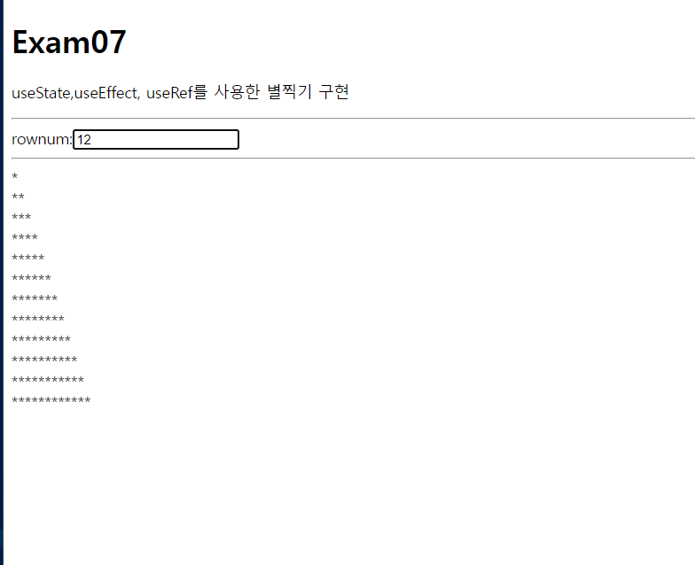

# 이승아 리액트 연습문제 
>2022.05.03

### 구현결과


### 소스코드 
```js
import React, { useEffect, useRef } from "react";

const App = () => {
  const [rowNum, setRowNum] = React.useState("");
  const Result = useRef();


  useEffect(()=>{
    Result.current.innerHTML = ""

    for(let i=0; i<rowNum; i++){
      let star ="";

      for(let j =0; j<=i; j++){
        star += "*";
      }
      Result.current.innerHTML += star;
      Result.current.innerHTML += "<br/>";
    }
  },[rowNum]);

  return (
    <div>
      <h1>Exam07</h1>
      <p>
        useState,useEffect, useRef를 사용한 별찍기 구현
      </p>
      <hr/>
        <label htmlFor="rowNum">rownum:</label>
        <input 
        type="text" 
        ref={Result} 
        id="rowNum" 
        onChange={(e)=>{
          setRowNum(e.currentTarget.value);
        }}
        />
      <hr/>
      <div ref={Result}></div>
    </div>
  );
};

export default App;
```
