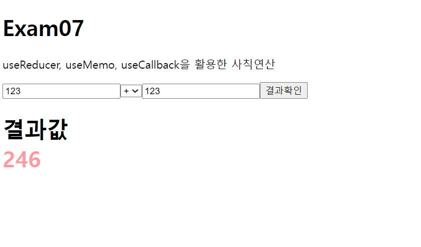
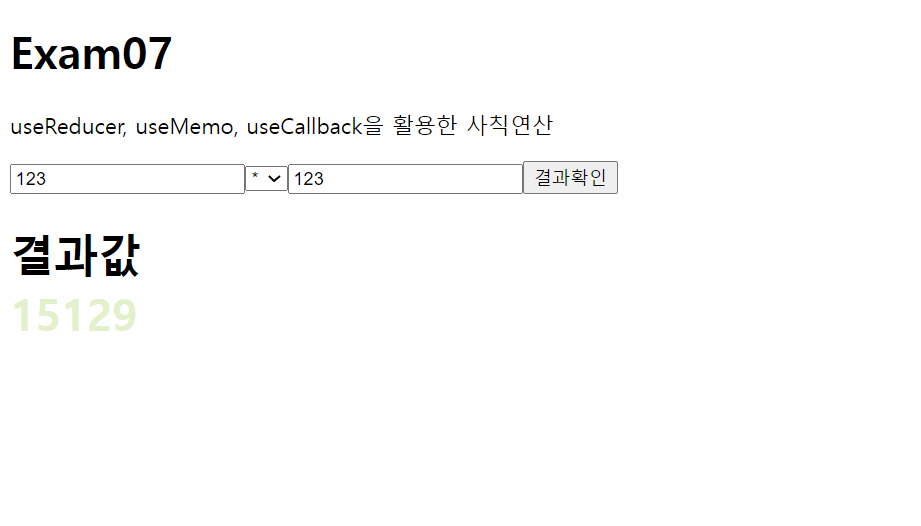

# 리액트 hook활용 사칙연산
> 2022.05.06 이승아

### 구현결과



```js
import React,{ useReducer, useMemo, useCallback, useRef } from "react";

/** 
 * @param{int} state = 상태값(useState의 state값과 동일)
 * @param{string}action = 어떤 동작을 하는지 구분 (a: 첫 번째 값, b: 두 번째 값, operation: 연산자)
 * @returns 새로운 값 
 */

const App=() => {
  //HTML 태그를 react 안에서 참조할 수 있는 변수를 useRef를 통해 생성
  const a = useRef();
  const b = useRef();
  const operation = useRef();
  const result = useRef();

  function getResultValue(state, action){
    switch(action.operation){   //operation의 연산기능을 동작하여 a와 b를 계산할 수 있음
      case '+':
        return Number (action.a) + Number (action.b);
      case '-':
        return Number (action.a) - Number (action.b);
      case '*':
        return Number (action.a) * Number (action.b);
      case '/':
        return Number (action.a) / Number (action.b);
      default:
        return 0; 
    }
  }

  //useReducer의 state 값(상태값, 상태값 갱신 함수)정의
  const [resultValue, setResultValue]= useReducer(getResultValue,'');

  //클릭 이벤트 --> a와 b가 숫자일 경우 선택한 연산자 실행.
  const onResultBtn = useCallback(e=>{
    setResultValue({
      a:Number(a.current.value),
      b:Number(b.current.value),
      operation: operation.current[operation.current.selectedIndex].value
    });
  },[]);

  React.useEffect(e => {
    result.current.innerHTML = resultValue;
    }, [resultValue]);

  // usMemo를 이용해 상태값이 변경됨을 감지하여 그 값이 짝수일 경우와 홀수일 경우 색상을 다르게 표현
  const changeColor = useMemo(()=>{
    return resultValue %2 ===0 ? '#FF9AA2' : '#E2f0cb'
  }, [resultValue]);

  return (
    <div>
      <h1>Exam07</h1>
      <p>useReducer, useMemo, useCallback을 활용한 사칙연산</p>

      <div>
        <input ref={a} type='text' />
        <select ref={operation}>
            <option value='+'>+</option>
            <option value='-'>-</option>
            <option value='*'>*</option>
            <option value='/'>/</option>
        </select>
        <input ref={b} type='text' />
        <button type="button" onClick={onResultBtn}>결과확인</button>
      </div>
      <h1>결과값<div style={{color:changeColor}} ref={result}></div></h1>
    </div>
  );
}

export default App;

```

