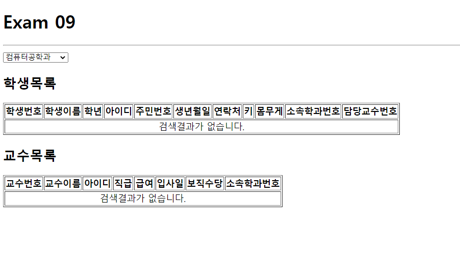
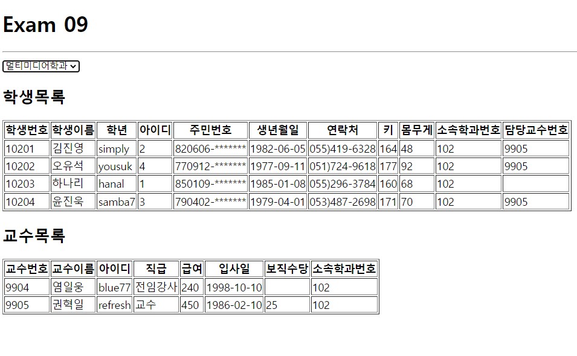
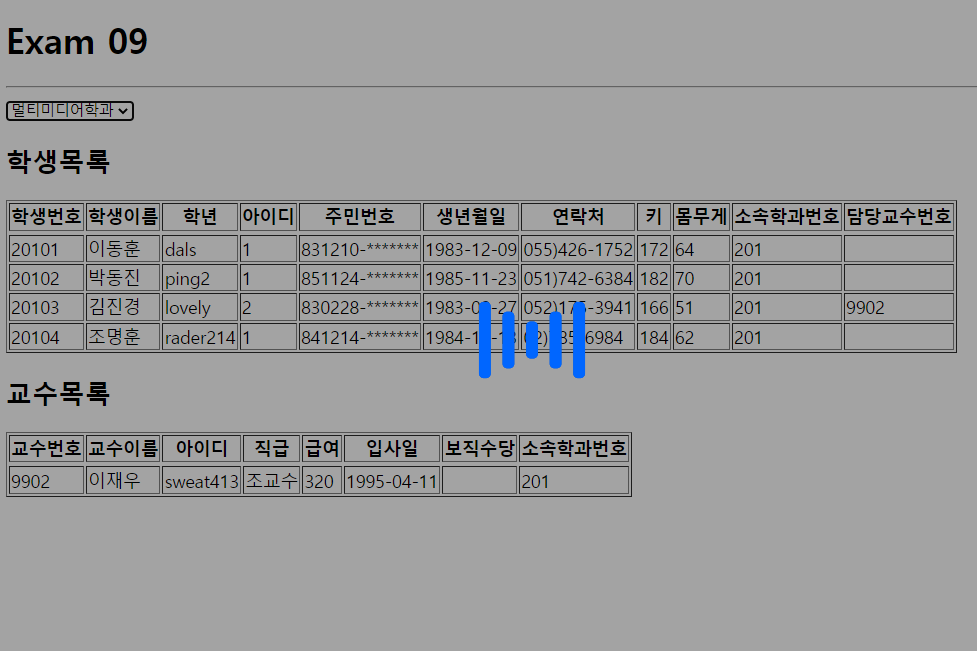
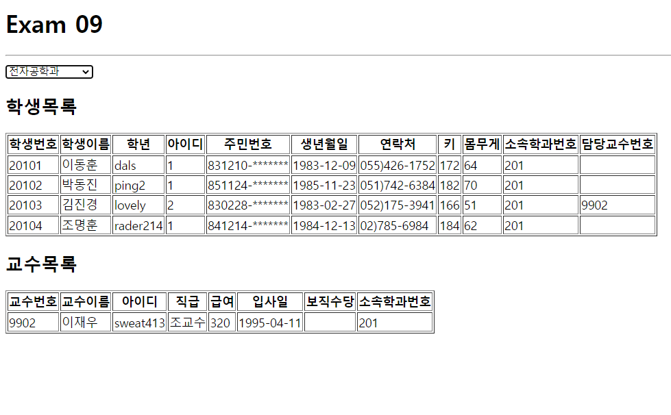
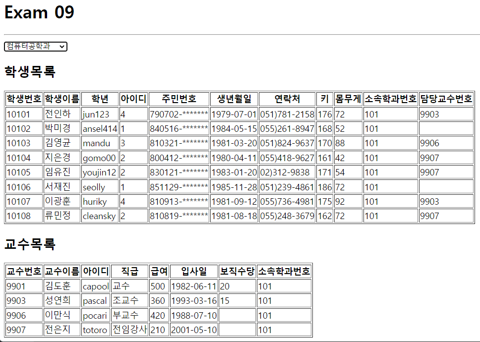
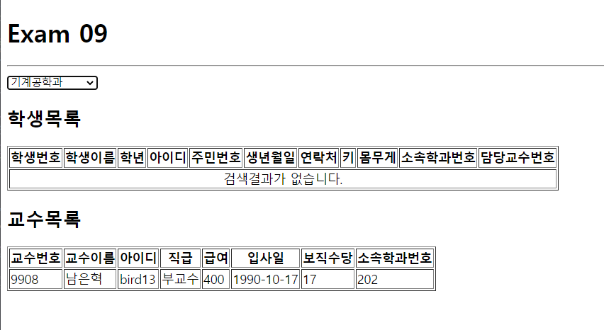

# 리액트 학생,교수 조회 예제
>2022.05.16 이승아


실행결과의 스크린 샷









#### index.js
```js
import React from 'react';
import ReactDOM from 'react-dom/client';
import App from './App';
import { BrowserRouter } from 'react-router-dom';


const root = ReactDOM.createRoot(document.getElementById('root'));
root.render(
  <React.StrictMode>
    <BrowserRouter>
      <App />
    </BrowserRouter>
  </React.StrictMode>
);

```

#### App.js
```js
import React, { useCallback, useEffect, useState } from 'react';
import axios from 'axios';
import Professor from './components/Professor';
import Spinner from './components/Spinner';
import Student from './components/Student';

const App = () => {
  const [loading, setLoading] = useState(false);
  const [department,setDepartment] =React.useState([]);
  const [deptno, setDeptno] = useState(-1); 

    useEffect(()=> {
      setLoading(true);
        (async()=>{
          try {
          const response = await axios.get('http://localhost:3001/department')
          setDepartment(response.data)
        }catch(error) {
        console.error(error);
        alert('서버와 연결되지 않음')
       }finally {
      setLoading(false);
        }
      })();
    },[])

    const onChange = useCallback((e)=>{
      setDeptno(e.currentTarget.value)
      },[])
    return (
      <div >
        <Spinner visible={loading}/>
        <h1>Exam 09</h1>
          <hr/>

            <select onChange={onChange} >
              {department.map((v,i)=> {
                return(
                  <option key={i} value={v.id}>{v.dname}</option>
                )
              })}
            </select>
            <h2>학생목록</h2>
            <Student props={deptno}/>
            <h2>교수목록</h2>
            <Professor props={deptno}/>
      </div>
    );
    };
    export default React.memo(App);

```

Student.js
```js
import React, { useEffect, useState } from 'react';
import axios from 'axios';
import Spinner from './Spinner';


const Student = ({props}) =>{
    //현재 ajax가 데이터 로딩중인지를 의미하는 상태값
    const [loading, setLoading] = useState(false);
    //화면에 표시할 상태값 (ajax 연동 결과로 받아올 json) -> 초기값을 빈 배열로 정의
    const [student, setStudent] = useState([]);


    /** 페이지가 처음 열렸을 때와 검색어가 변경되었을 때 실행할 hook */
    useEffect(()=>{
        //Ajax 로딩 시작을 알림
        setLoading (true);

        setTimeout(()=>{
            (async () =>{
                try{
                    const response = await axios.get(`http://localhost:3001/student?deptno=${props}`);

                    // 일반 상태값 업데이트
                    // setDepartment(response.data);
                    // 함수형 업데이트
                    setStudent(student => response.data);
                }catch(e){
                    console.error(e);
                    alert('Ajax 연동 실패');
                }finally{
                    //Ajax 로딩 종료를 알림
                    setLoading(false);
                }
            })();
        },500);
    },[props]);

  return (
    <table border='1'>
        <Spinner visible={loading}/>
        <thead>
            <tr>
                <th>학생번호</th>
                <th>학생이름</th>
                <th>학년</th>
                <th>아이디</th>
                <th>주민번호</th>
                <th>생년월일</th>
                <th>연락처</th>
                <th>키</th>
                <th>몸무게</th>
                <th>소속학과번호</th>
                <th>담당교수번호</th>
            </tr>
        </thead>
        <tbody>
        {student.length>0?(
        student.map((v, i) => {
            return(
                <tr key={v.id}>
                    <td>{v.id}</td>
                    <td>{v.name}</td>
                    <td>{v.userid}</td>
                    <td>{v.grade}</td>
                    <td>{v.idnum.substring(0,6)}-*******</td>
                    <td>{v.birthdate.substring(0,10)}</td>
                    <td>{v.tel}</td>
                    <td>{v.height}</td>
                    <td>{v.weight}</td>
                    <td>{v.deptno}</td>
                    <td>{v.profno}</td>
                </tr>
            );
        })  
            ):(
                <tr>
                    <td colSpan={11} align='center'>
                        검색결과가 없습니다.
                    </td>
                </tr>
            )}
        </tbody>
        </table>
  );
};

export default React.memo(Student);
```

#### Professor.js
```js
import React, { useEffect, useState } from 'react';
import axios from 'axios';
import Spinner from './Spinner';

const Professor = ({props}) => {
  const [loading, setLoading] = useState(false);
  //화면에 표시할 상태값 (ajax 연동 결과로 받아올 json) -> 초기값을 빈 배열로 정의
  const [professor, setProfessor] = useState([]);


  /** 페이지가 처음 열렸을 때와 검색어가 변경되었을 때 실행할 hook */
  useEffect(()=>{
      //Ajax 로딩 시작을 알림
      setLoading (true);

      setTimeout(()=>{
          (async () =>{
              try{
                  const response = await axios.get(`http://localhost:3001/professor?deptno=${props}`);

                  // 일반 상태값 업데이트
                  // setDepartment(response.data);
                  // 함수형 업데이트
                  setProfessor(professor => response.data);
              }catch(e){
                  console.error(e);
                  alert('Ajax 연동 실패');
              }finally{
                  //Ajax 로딩 종료를 알림
                  setLoading(false);
              }
          })();
      },500);
  },[props]);

  return (
      <table border={1}>
      <Spinner visible={loading}/>
          <thead>
              <tr>
                  <th>교수번호</th>
                  <th>교수이름</th>
                  <th>아이디</th>
                  <th>직급</th>
                  <th>급여</th>
                  <th>입사일</th>
                  <th>보직수당</th>
                  <th>소속학과번호</th>
              </tr>
          </thead>
          <tbody>
              {professor.length>0?(
              professor.map((v,i) =>{
                  return(
               <tr key={v.id}>
                  <td>{v.id}</td>
                  <td>{v.name}</td>
                  <td>{v.userid}</td>
                  <td>{v.position}</td>
                  <td>{v.sal}</td>
                  <td>{v.hiredate.substring(0,10)}</td>
                  <td>{v.comm}</td>
                  <td>{v.deptno}</td>
            
              </tr>
                  );
              })
            ):(
              <tr>
                <td colSpan={8} align='center'>
                    검색결과가 없습니다.
                </td>
              </tr>
            )}
          </tbody>
      </table>
  );
};

export default React.memo(Professor);
```