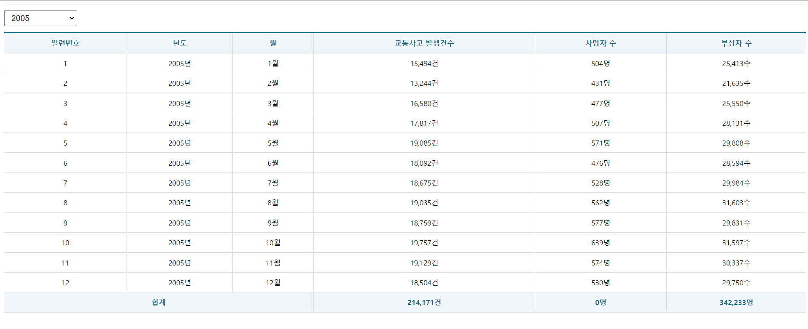

# 리액트 axios hook 예제
> 2022. 05.17 이승아

### APP.js
```js
import React from 'react'
import styled from 'styled-components';
import Spinner from './components/Spinner';
import Table from './components/Table';

/* Axios 기능 제공 hook */
import useAxios from 'axios-hooks';

/* 페이지 마운트 여부를 확인하기 위한 hook */
import useMounterRef from './hooks/useMounterRef';

 const SelectContainer = styled.div`
  position: sticky;
  top: 0;
  background-color: #fff;
  border-top: 1px solid #eee;
  border-bottom: 1px solid #eee;
  padding: 10px 0;
  margin: 0;

  select{
    margin-right: 15px;
    font-size: 16px;
    padding: 5px 10px;
  }
 `;

const App = () => {
  // 교통사고 데이터 목록을 Ajax로 가져온다.
  // --> 기본적으로 컴포넌트의 마운트와 동시에 자동 실행되어 응답결과를 data에 저장한다.
  const [{data, loading, error},refetch] = useAxios("http://localhost:3001/traffic_acc");
  /* 해당 년도 조회를 위한 상태값 함수 생성 */
  const [selectBox, setSelectBox] = React.useState('');
  // 이 컴포넌트가 화면에 마운트 되었는지를 확인하기 위한 hook
  const mountedRef = useMounterRef();
  /* 드롭다운 선택 변경시 호출되는 이벤트 */
  const onSelectChange = React.useCallback(e=>{
    e.preventDefault();
    
    //드롭다운 입력값 취득
    const current = e.target;
    const key = current.name;
    const value = current[current.selectedIndex].value;

    // 기존의 상태값을 그대로 복사한 상태에서
    // 드롭다운의 name 속성과 일치하는 key에 대한 value를 수정
    const newSelect ={...selectBox, [key]:value};

    //상태값 갱신
    setSelectBox(newSelect);

    //갱신된 상태값 확인
    console.log(newSelect);
    // hook함수 안에서 다른 상태값을 사용할 경우 해당 상태값을 모니터링 해야한다.
  },[selectBox]);

  /* selectBox 상태값이 변경되었을 때 실행될 hook */
  React.useEffect(()=>{
    // 컴퐇넌트가 화면 마운트 된 이후에만 동작하도록 한다.
    if(mountedRef.current){
      //상태값 중에서 빈값이 아닌 항목을 옮겨담는다.
      const params ={};
      for(const key in selectBox){
        if(selectBox[key]){
          params[key] = selectBox[key];
        }
      }
      //Ajax 재요청
      refetch({
        params: params
      });
    }
    // hook 함수 안에서 다른 상태값을 사용할 경우 해당 상태값을 모니터링 해야 한다.
  }, [mountedRef, refetch, selectBox]);

  /* 합계를 위한 변수 */
  let accidentSum = 0;
  let deathSum = 0;
  let injurySum = 0; 

  /* 에러가 발생시 에러 메세지 표시 */
  if(error){
    console.error(error);

    return(
      <div>
        <h1>Oops~!! {error.code}Error.</h1>
        <hr/>
        <p>{error.message}</p>
      </div>
    )
  }
  /* 메인 화면 */

  /* 테이블 만들기 */
  return (
    <div>
      {/* loading bar */}
      <Spinner visible={loading}/>
      {/* 검색 조건이 드롭다운 박스 */}
      <SelectContainer>
        <select name='year' onChange={onSelectChange}>
          <option value="">검색년도 선택</option>
          <option value="2005">2005</option>
          <option value="2006">2006</option>
          <option value="2007">2007</option>
          <option value="2008">2008</option>
          <option value="2009">2009</option>
          <option value="2010">2010</option>
          <option value="2011">2011</option>
          <option value="2012">2012</option>
          <option value="2013">2013</option>
          <option value="2014">2014</option>
          <option value="2015">2015</option>
        </select>
      </SelectContainer>
      
      <Table>
        <thead>
          <tr>
            <th>일련번호</th>
            <th>년도</th>
            <th>월</th>
            <th>교통사고 발생건수</th>
            <th>사망자 수</th>
            <th>부상자 수</th>
          </tr>
        </thead>
        <tbody>
          {/* 비구조 문법으로 data 불러와서 반문목 실행 */}
          {data && data.map(({
            id,year, month, accident, death, injury
          },i)=>{
              accidentSum += accident;
              deathSum += deathSum;
              injurySum += injury;
            return(
              <tr key={id}>
                <td>{id}</td>
                <td>{year}년</td>
                <td>{month}월</td>
                {/* 실시간 데이터이기 때문에  현재 시간을 기준으로 합계를 냄 */}
                <td>{accident.toLocaleString("ko-KR")}건</td>
                <td>{death.toLocaleString("ko-KR")}명</td>
                <td>{injury.toLocaleString("ko-KR")}수</td>
              </tr>
            );
          })}
        </tbody>
        <tfoot>
          <tr>
            <th colSpan="3">합계</th>
            <th>{accidentSum.toLocaleString('ko-KR')}건</th>
            <th>{deathSum.toLocaleString('ko-KR')}명</th>
            <th>{injurySum.toLocaleString('ko-KR')}명</th>
          </tr>
        </tfoot>
      </Table>
    </div>
  );
};

export default React.memo(App);
```

index.js
```js
import React from 'react';
import ReactDOM from 'react-dom/client';
import App from './App';
import { BrowserRouter } from 'react-router-dom';

const root = ReactDOM.createRoot(document.getElementById('root'));
root.render(
  <React.StrictMode>
    <BrowserRouter>
    <App />
    </BrowserRouter>
  </React.StrictMode>
);

```

### 파일구조 


### 구현결과


