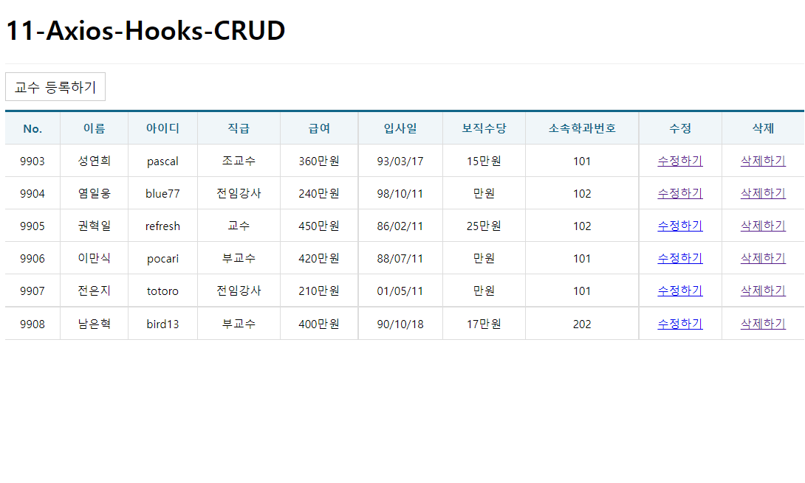
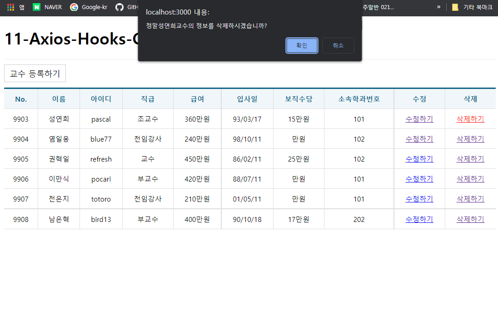
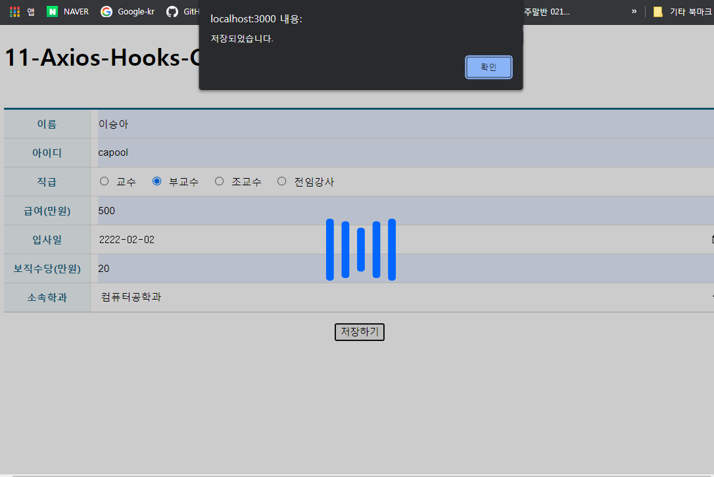
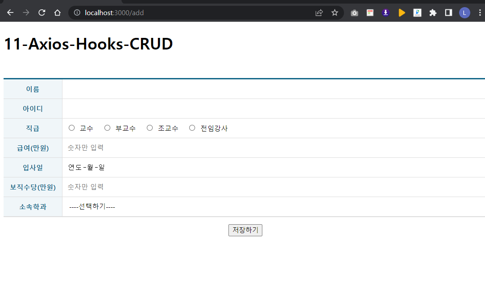
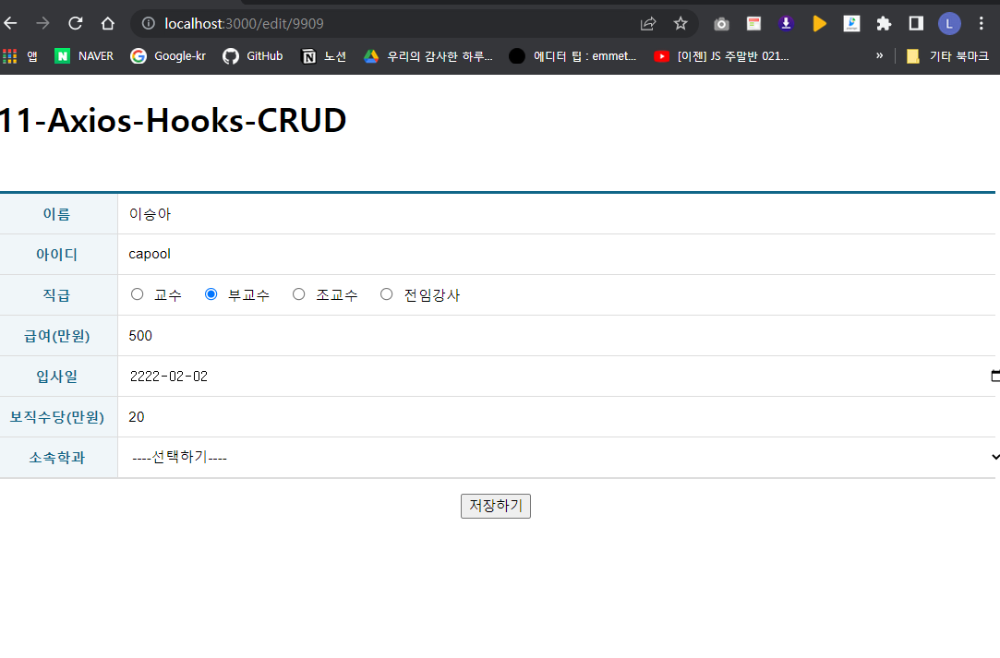
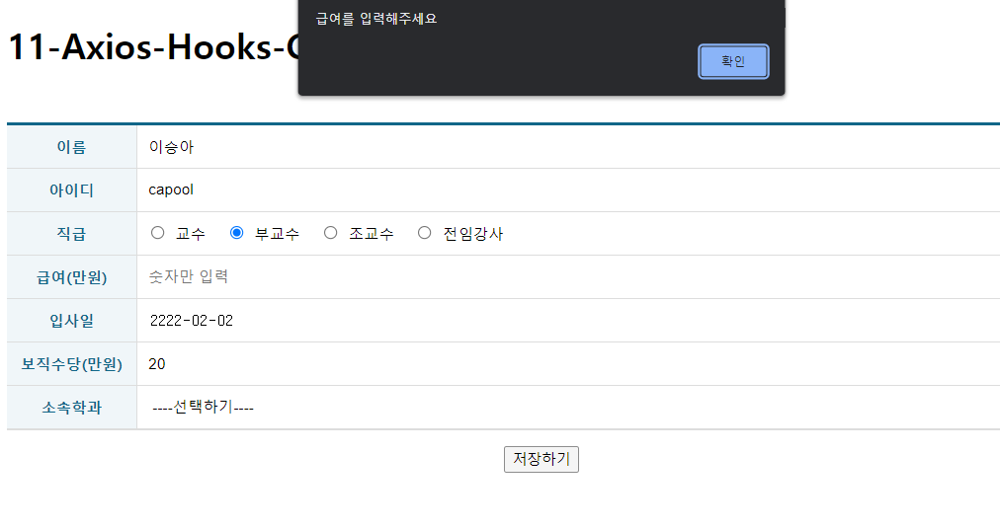
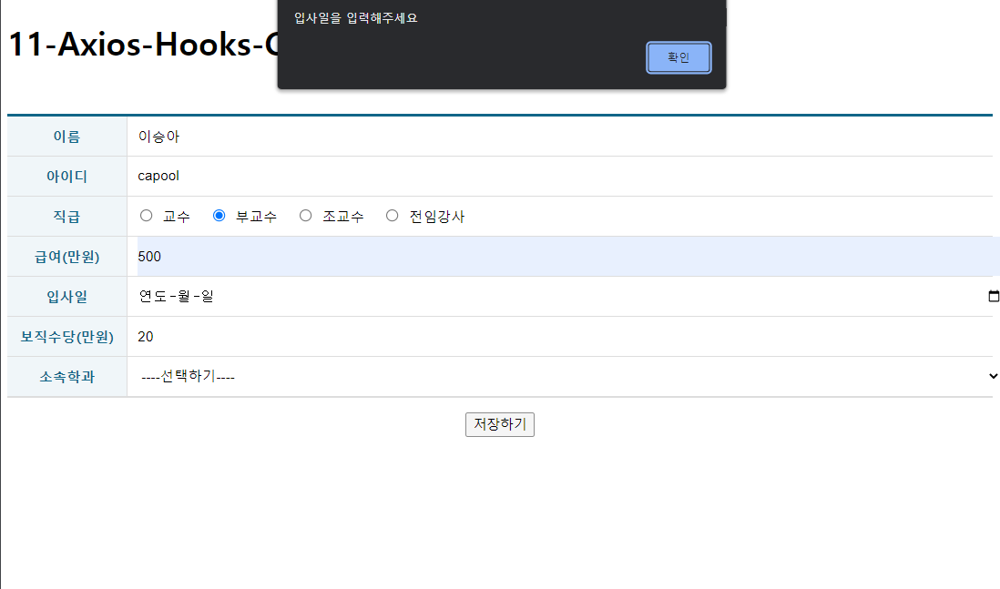
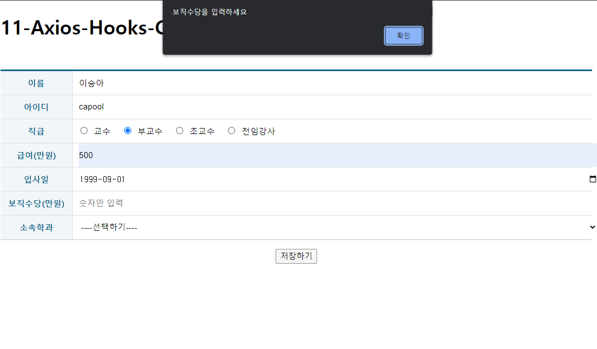
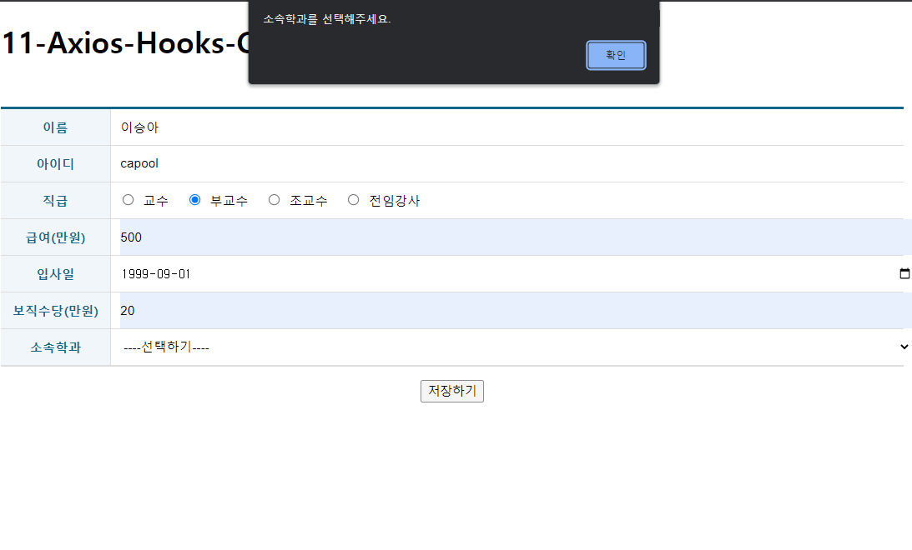
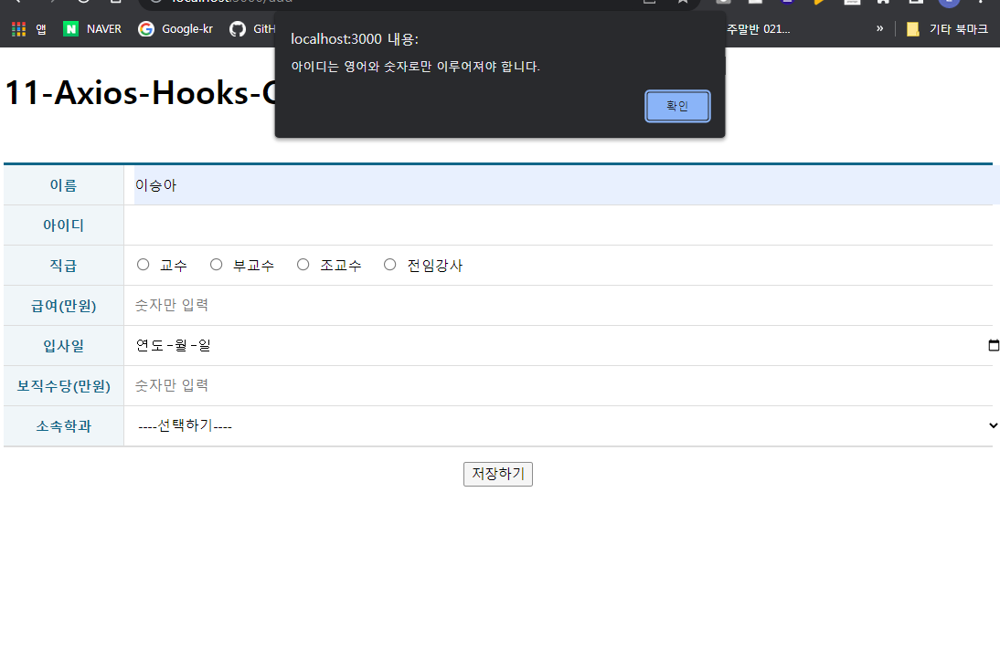

# 11-Axios-Hooks-CRUD 연습문제

> 2022.05.19 이승아

### 구현결과

##### 메인페이지


###### 삭제구현


###### 저장화면



###### 수정페이지


###### 정규식검사







###### APP.js
```js
import React from 'react'
import {Routes, Route } from "react-router-dom";

import ProfessorAdd from './pages/ProfessorAdd';
import ProfessorEdit from './pages/ProfessorEdit';
import ProfessorList from './pages/ProfessorList'

const App = () => {
  return (
    <div>
        <h1>11-Axios-Hooks-CRUD</h1>
        <Routes>
            <Route path="/" exapt={true} element={<ProfessorList/>}/>
            <Route path="/add" element={<ProfessorAdd/>}/>
            <Route path="/edit/:id" element={<ProfessorEdit/>}/>
            {/* 수정할 명령을 해야함으로 edit/:id 파라미터 걸어놓음 */}
        </Routes>
    </div>
  );
};

export default App;
```

###### index.js
```js
import React from 'react';
import ReactDOM from 'react-dom/client';
import App from './App';
import { BrowserRouter } from 'react-router-dom';

const root = ReactDOM.createRoot(document.getElementById('root'));
root.render(
  <React.StrictMode>
    <BrowserRouter>
      <App />
    </BrowserRouter>
  </React.StrictMode>
);
```

###### ProfessorEdit.js
```js
import React from 'react';
import useAxios from 'axios-hooks';
import styled from 'styled-components';
import { useNavigate, useParams } from 'react-router-dom';

import Spinner from '../components/Spinner';
import Table from '../components/Table';
import regexHelper from '../libs/RegexHelper';

const TableEx= styled(Table)`
    margin-top: 50px;
    margin-bottom: 15px;

    .inputWrapper{
        padding: 0;
        position: relative;
        text-align: left;

        .field{
            box-sizing: border-box;
            display: block;
            position: absolute;
            left: 10px;
            top: 0;
            width: 100%;
            height: 100%;
            border: 0;
            padding: 0;
            outline: none;
            font-size: 14px;
        }
        label{
            margin-left: 7px;
            margin-right: 10px;

            input{
                margin-right: 10px;
            }
        }
    }
`;

const ProfessorEdit = () => {
    /** 저장 완료 후 목록으로 되돌아가기 위한 페이지 강제 이동 함수 생성 */
    const navigate = useNavigate();
    const {id} = useParams();

    /** 학과설정을 위한 데이터 불러오기 */
    const [{data:department, loading:loading1 , error:error1}] = useAxios('http://localhost:3001/department');

    

    /** 백엔드에 데이터 저장을 위한 Ajax 요청 객체 생성 - 메뉴얼 전송 모드 */
    const [{data:professor, loading:loading2 , error:error2}, refetch] = useAxios(`http://localhost:3001/professor/${id}`);

   

    /** <form>의 submit 버튼이 눌러졌을 때 호출될 이벤트 핸들러 */
    const onSubmit = React.useCallback((e)=>{
        e.preventDefault();

        //이벤트가 발생한 폼 객체
        const current = e.target;
        
        //입력값 유효성 검사
        try{
            regexHelper.value(current.name, '이름을 입력하세요');
            

            regexHelper.kor(current.name, '이름은 한글로만 입력하세요');
            regexHelper.minLength(current.name, 2, '이름은 최소 글자 이상 입력해야 합니다.');
            regexHelper.maxLength(current.name, 20,'이름은 최대 20글자 미만으로 입력해야 합니다.');
            regexHelper.engNum(current.userid, '아이디는 영어와 숫자로만 이루어져야 합니다.');
            regexHelper.minLength(current.userid, 2, '아이디는 최소 글자 이상 입력해야 합니다.');
            regexHelper.maxLength(current.userid, 20,'아이디는 최대 20글자 미만으로 입력해야 합니다.');
            regexHelper.check(current.position, '직급을 선택해주세요.');
            regexHelper.checkMax(current.position,1, '직급은 한개만 선택이 가능합니다.');
            regexHelper.value(current.sal, '급여를 입력해주세요');
            regexHelper.num(current.sal, '급여는 숫자로만 입력하세요');
            regexHelper.value(current.hiredate, '입사일을 입력해주세요');
            regexHelper.value(current.comm, '보직수당을 입력하세요');
            regexHelper.num(current.comm, '보직수당은 숫자로만 입력하세요');
            regexHelper.value(current.deptno, '소속학과를 선택해주세요.');
        }catch (e) {
            window.alert(e.message);
            e.field.focus();
            return;
        }

        let json = null;
        (async () => {
            try{
                const response = await refetch({
                    data:{
                    name: current.name.value,
                    userid: current.userid.value,
                    position: current.position.value,
                    sal: parseInt(current.sal.value),
                    hiredate: current.hiredate.value,
                    comm: parseInt(current.comm.value),
                    deptno:parseInt(current.deptno.value)
                    }
                });
                json = response.data;
            }catch(e){
                console.error(e);
                window.alert(`[${e.response.status}] ${e.response.statusText}\n${e.message}`);
            }
            
            if(json !== null){
                window.alert('저장되었습니다.');
                navigate('/');
            }
        })();
    },[refetch,navigate]);

  return (
    <>
        <Spinner visible={loading1||loading2}/>

        {(error1||error2) ?(
            <div>
                <h1>에러가 났습니다. 원인은 {(error1||error2).code} Error 입니다.</h1>
                <hr/>
                <p>{(error1||error2).message}</p>
            </div>
        ):(
            professor &&(
        <form onSubmit={onSubmit}>
            <TableEx>
                <colgroup>
                <col width='120'/>
                <col/>
                </colgroup>
                <tbody>
                    <tr>
                    <th>이름</th>
                    <td className='inputWrapper'><input className='field' type='text' name='name' defaultValue={professor.name}/></td>
                    </tr>
                    <tr>
                    <th>아이디</th>
                    <td className='inputWrapper'><input className='field' type='text' name='userid' defaultValue={professor.userid}/></td>
                    </tr>
                    <tr>
                    <th>직급</th>
                    <td className='inputWrapper'>
                        <label><input type='radio' name="position" value="교수" defaultChecked={professor.position === '교수'}/>교수</label>
                        <label><input type='radio' name="position" value="부교수"defaultChecked={professor.position === '부교수'}/>부교수</label>
                        <label><input type='radio' name="position" value="조교수"defaultChecked={professor.position === '조교수'}/>조교수</label>
                        <label><input type='radio' name="position" value="전임강사defaultChecked={professor.position === '전임강사'}"/>전임강사</label>    
                    </td>
                    </tr>
                    <tr>
                    <th>급여(만원)</th>
                    <td className='inputWrapper'><input className='field' type='text' name='sal' placeholder='숫자만 입력' defaultValue={professor.sal}/></td>
                    </tr>
                    <tr>
                    <th>입사일</th>
                    <td className='inputWrapper'>
                       <input className='field' type='date' name='hiredate' defaultValue={professor.hiredate}/> 
                        
                    </td>
                    </tr>
                    <tr>
                    <th>보직수당(만원)</th>
                    <td className='inputWrapper'><input className='field' type='text' name='comm' placeholder='숫자만 입력' defaultValue={professor.comm}/></td>
                    </tr>
                    <tr>
                    <th>소속학과</th>
                    <td className='inputWrapper' defaultValue={professor.deptno}>
                        <select name='deptno' className='field'>
                        <option value="">----선택하기----</option>
                        {department && department.map((v,i)=>{
                         return(
                            <option key={i} value={v.id}>{v.dname}</option>    
                        )
                         })}
                        </select>    
                    </td>
                    </tr>
                    
                </tbody>
            </TableEx>
            <div style={{textAlign:'center'}}>
                         <button type='submit'>저장하기</button>
            </div>
        </form>
            )
         )}
    </>
  )
}

export default React.memo(ProfessorEdit);
```

###### ProfessorAdd.js
```js
import React from 'react';
import useAxios from 'axios-hooks';
import styled from 'styled-components';
import { useNavigate } from 'react-router-dom';

import Spinner from '../components/Spinner';
import Table from '../components/Table';
import regexHelper from '../libs/RegexHelper';


const TableEx= styled(Table)`
    margin-top: 50px;
    margin-bottom: 15px;

    .inputWrapper{
        padding: 0;
        position: relative;
        text-align: left;

        .field{
            box-sizing: border-box;
            display: block;
            position: absolute;
            left: 10px;
            top: 0;
            width: 100%;
            height: 100%;
            border: 0;
            padding: 0;
            outline: none;
            font-size: 14px;
        }
        label{
            margin-left: 7px;
            margin-right: 10px;

            input{
                margin-right: 10px;
            }
        }
    }
`;

const ProfessorAdd = () => {
    /** 저장 완료 후 목록으로 되돌아가기 위한 페이지 강제 이동 함수 생성 */
    const navigate = useNavigate();

    /** 학과설정을 위한 데이터 불러오기 */
    const [{data, loading:loc , error}] = useAxios("http://localhost:3001/department");

    

    /** 백엔드에 데이터 저장을 위한 Ajax 요청 객체 생성 - 메뉴얼 전송 모드 */
    const [{loading:professor2}, refetch] = useAxios({
        url: "http://localhost:3001/professor",
        method: 'POST'
    }, {manual: true});

   

    /** <form>의 submit 버튼이 눌러졌을 때 호출될 이벤트 핸들러 */
    const onSubmit = React.useCallback((e)=>{
        e.preventDefault();

        //이벤트가 발생한 폼 객체
        const current = e.target;
        
        //입력값 유효성 검사
        try{
            regexHelper.value(current.name, '이름을 입력하세요');
            

            regexHelper.kor(current.name, '이름은 한글로만 입력하세요');
            regexHelper.minLength(current.name, 2, '이름은 최소 글자 이상 입력해야 합니다.');
            regexHelper.maxLength(current.name, 20,'이름은 최대 20글자 미만으로 입력해야 합니다.');
            regexHelper.engNum(current.userid, '아이디는 영어와 숫자로만 이루어져야 합니다.');
            regexHelper.minLength(current.userid, 2, '아이디는 최소 글자 이상 입력해야 합니다.');
            regexHelper.maxLength(current.userid, 20,'아이디는 최대 20글자 미만으로 입력해야 합니다.');
            regexHelper.check(current.position, '직급을 선택해주세요.');
            regexHelper.checkMax(current.position,1, '직급은 한개만 선택이 가능합니다.');
            regexHelper.value(current.sal, '급여를 입력해주세요');
            regexHelper.num(current.sal, '급여는 숫자로만 입력하세요');
            regexHelper.value(current.hiredate, '입사일을 입력해주세요');
            regexHelper.value(current.comm, '보직수당을 입력하세요');
            regexHelper.num(current.comm, '보직수당은 숫자로만 입력하세요');
            regexHelper.value(current.deptno, '소속학과를 선택해주세요.');
        }catch (e) {
            window.alert(e.message);
            e.field.focus();
            return;
        }

        let json = null;
        (async () => {
            try{
                const response = await refetch({
                    data:{
                    name: current.name.value,
                    userid: current.userid.value,
                    position: current.position.value,
                    sal: parseInt(current.sal.value),
                    hiredate: current.hiredate.value,
                    comm: parseInt(current.comm.value),
                    deptno:parseInt(current.deptno.value)
                    }
                });
                json = response.data;
            }catch(e){
                console.error(e);
                window.alert(`[${e.response.status}] ${e.response.statusText}\n${e.message}`);
            }
            
            if(json !== null){
                window.alert('저장되었습니다.');
                navigate('/');
            }
        })();
    },[refetch,navigate]);

  return (
    <>
        <Spinner visible={professor2||loc}/>

        {error ?(
            <div>
                <h1>에러가 났습니다. 원인은 {error.code} Error 입니다.</h1>
                <hr/>
                <p>{error.message}</p>
            </div>
        ):(
        <form onSubmit={onSubmit}>
            <TableEx>
                <colgroup>
                <col width='120'/>
                <col/>
                </colgroup>
                <tbody>
                    <tr>
                    <th>이름</th>
                    <td className='inputWrapper'><input className='field' type='text' name='name'/></td>
                    </tr>
                    <tr>
                    <th>아이디</th>
                    <td className='inputWrapper'><input className='field' type='text' name='userid'/></td>
                    </tr>
                    <tr>
                    <th>직급</th>
                    <td className='inputWrapper'>
                        <label><input type='radio' name="position" value="교수"/>교수</label>
                        <label><input type='radio' name="position" value="부교수"/>부교수</label>
                        <label><input type='radio' name="position" value="조교수"/>조교수</label>
                        <label><input type='radio' name="position" value="전임강사"/>전임강사</label>    
                    </td>
                    </tr>
                    <tr>
                    <th>급여(만원)</th>
                    <td className='inputWrapper'><input className='field' type='text' name='sal' placeholder='숫자만 입력'/></td>
                    </tr>
                    <tr>
                    <th>입사일</th>
                    <td className='inputWrapper'>
                       <input className='field' type='date' name='hiredate'/> 
                        
                    </td>
                    </tr>
                    <tr>
                    <th>보직수당(만원)</th>
                    <td className='inputWrapper'><input className='field' type='text' name='comm' placeholder='숫자만 입력'/></td>
                    </tr>
                    <tr>
                    <th>소속학과</th>
                    <td className='inputWrapper'>
                        <select name='deptno' className='field'>
                        <option value="">----선택하기----</option>
                        {data && data.map((v,i)=>{
                         return(
                            <option key={i} value={v.id}>{v.dname}</option>    
                        )
                         })}
                        </select>    
                    </td>
                    </tr>
                    
                </tbody>
            </TableEx>
            <div style={{textAlign:'center'}}>
                         <button type='submit'>저장하기</button>
            </div>
        </form>
         )}
    </>
  )
}

export default React.memo(ProfessorAdd);
```

###### ProfessorList.js
```js
import React,{useState, useEffect} from 'react';
import useAxios from 'axios-hooks';
import styled from 'styled-components';
import { NavLink } from 'react-router-dom';
import dayjs from 'dayjs';

import Spinner from '../components/Spinner';
import Table from '../components/Table';

const LinkContainer =styled.div`
    position: sticky;
    top: 0;
    background-color: #fff;
    border-top: 1px solid #eee;
    border-bottom: 1px solid #eee;
    padding: 10px 0;
`;

const TopLink = styled(NavLink)`
    margin-right: 15px;
    display: inline-block;
    font-size: 16px;
    padding: 7px 10px 5px 10px;
    border: 1px solid #ccc;
    background-color: #fff;
    color: #000;
    text-decoration: none;
    &:hover{
        background-color: #06f2;
    }
`;

const ProfessorList = () => {

    /** 화면에 표시할 성적표 데이터를 저장하기 위한 상태 변수 */
    const[info,setInfo] = useState([]);

    /** 백엔드로부터 데이터 불러오기 - 자체 캐시가능 방지함 */
    const [{data, loading1, error}, refetch] = useAxios("http://localhost:3001/professor",{
        useCache:false
    });

    /** axios-hook에 의해 생성된 상태값인 data가 변경되었을 때(ajax 로딩이 완료되었을 때) 실행될 hook */
    useEffect(()=>{
        // ajax의 결과를 화면에 표시하기 위한 상태값에 복사한다.
        setInfo(data);
    },[data]);


    /** 백엔드로 부터 데이터 삭제하기 - 자체 캐시기능 방지, 삭제 버튼 이벤트에 의해 호출되어야 하므로 메뉴얼 실행 모드 */
    const [{loading2}, sendDelete] = useAxios({
        method:'DELETE'
    },{
        useCache:false,
        manual: true
    });

    /**삭제 버튼 클릭시 호출될 이벤트 핸들러 */
    const OnDeleteClick=(e)=>{
        e.preventDefault();

        // 이벤트가 발생한 대상을 가져옴 --> 삭제하기 링크
        const current = e.target;

        // 클릭된 링크에 숨겨져 있는 일련번호와 교수이름 가져오기
        const id = parseInt(current.dataset.id);
        const name = current.dataset.name;

        // 삭제 확인
        if(window.confirm(`정말${name}교수의 정보를 삭제하시겠습니까?`)){
            // 백엔드에 삭제 요쳥하기 -> 입력, 수정, 삭제는 async-await문법으로 처리해야 한다.
            (async()=>{
                let json = null;
                try{
                    const response = await sendDelete({
                        method:'DELETE',
                        url:`http://localhost:3001/professor/${id}`
                    });
                    json = response.data;
                }catch(e) {
                    console.error(e);
                    window.alert(`[${e.response.status}]${e.response.statusText}\n${e.message}`);
                }
                //삭제 결과가 정상이라면?
                if(json != null){
                    //화면에 출력중인 데이터에서 동일한 일련번호를 갖는 항목을 제회한 나머지를 추려낸다.
                    //-> 삭제된 항목 제거
                    setInfo(info => info.filter((v,i)=> v.id !== id));
                }
            })();
        }
    };

  return (
    <div>
        <Spinner visible={loading1||loading2}/>

        <LinkContainer>
            <TopLink to='add'>교수 등록하기</TopLink>
        </LinkContainer>    

        {error ?(
            <div>
                <h1>에러가 났습니다. 원인은 {error.code} Error 입니다.</h1>
                <hr/>
                <p>{error.message}</p>
            </div>
        ):(
            <Table>
                <thead>
                    <tr>
                        <th>No.</th>
                        <th>이름</th>
                        <th>아이디</th>
                        <th>직급</th>
                        <th>급여</th>
                        <th>입사일</th>
                        <th>보직수당</th>
                        <th>소속학과번호</th>
                        <th>수정</th>
                        <th>삭제</th>
                    </tr>
                </thead>
                <tbody>
                    {info && info.map (({id, name, userid, position, sal, hiredate, comm, deptno}, i)=>{
                        return(
                            <tr key={id}>
                                <td>{id}</td>
                                <td>{name}</td>
                                <td>{userid}</td>
                                <td>{position}</td>
                                <td>{sal}만원</td>
                                <td>{dayjs(hiredate).format('YY/MM/DD')}</td>
                                <td>{comm}만원</td>
                                <td>{deptno}</td>
                                <td>
                                    <NavLink to={`edit/${id}`}>수정하기</NavLink>
                                </td>
                                <td>
                                    <a href="#!" data-id={id} data-name={name}
                                        onClick={OnDeleteClick}>삭제하기</a>
                                </td>
                            </tr>
                        );
                    })}
                </tbody>
            </Table>
        )}
    </div>
  );
};

export default React.memo(ProfessorList);
```