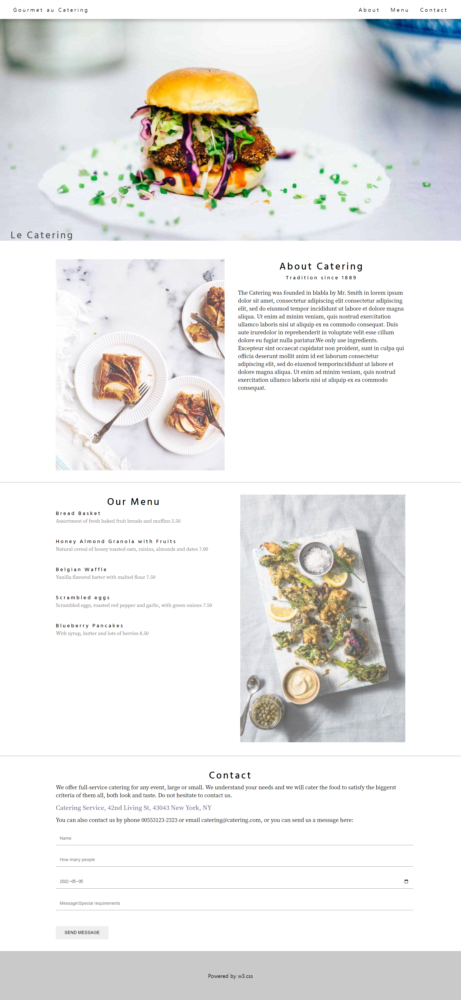

# 클론코딩01 -React
>2022.05.04_이승아

구현결과



### index.js

```js
import React from 'react';
import ReactDOM from 'react-dom/client';
import App from './App';
import Meta from './Meta';
import GlobalStyle from './GlobalStyle';


const root = ReactDOM.createRoot(document.getElementById('root'));
root.render(
  <React.StrictMode>
    <Meta/>
    <GlobalStyle/>
    <App />
  </React.StrictMode>
);

```

### App.js

```js
import React from 'react';
import Navbar from './components/Navbar';
import MainPhoto from './components/MainPhoto';
import Main from './pages/Main';
import Footer from './components/Footer';

const App = () => {
  return (
    <div>
      <Navbar/>
      <MainPhoto/>
      <Main/>
      <Footer/>
    </div>
  );
};

export default App;
```

### Meta.js

```js
/**
 * @filename: Meta.js
 * @description: <head>태그 내의 SEO 처리 및 기본 참조 리소스 명시
 * @author: 이승아
 */

/** 패키지 참조 */
// 기본 참조 객체
import React from 'react'
// SEO 처리 기능 패키지
import {Helmet, HelmetProvider} from "react-helmet-async"

/**
 * SEO 처리 컴포넌트
 * @param props
 * @returns{JSX.Element}
 */
const Meta = (props) => {
  return (
      <HelmetProvider>
          <Helmet>
              <meta charSet="utf-8"/>
              <meta name="description" content={props.description} />
              <meta name="keywords" content={props.keywords} />
              <meta naem="author" content={props.author} />
              <meta property="og:type" content="website" />
              <meta property="og:title" content={props.title} />
              <meta property="og:description" content={props.description}/>
              <meta property="og:url" content={props.url}/>

              <link rel="preconnect" href="https://fonts.googleapis.com"/>
              <link rel="preconnect" href="https://fonts.gstatic.com" crossorigin/>
              <link href="https://fonts.googleapis.com/css2?family=Hind+Siliguri:wght@300;400;500;600;700&family=Noto+Serif+KR:wght@200;300;400;600;700;900&display=swap" rel="stylesheet"/>
          </Helmet>
      </HelmetProvider>
  );
};

/** 
 * props에 대한 기본값 설정
 * @type {{keywords: string, author: string, description: string, title:string, url:string}}
 */
Meta.defaultProps ={
    title: 'Clone Coding 01',
    description: "React.js로 구현한 클론코딩01 페이지 입니다.",
    keywords: 'React,CloneCoding',
    //image: '기본이미지변수적용',
    url: window.location.href
};

export default Meta;
```

### GlobalStyle.js

```js
/** 
 * @fliename: GlobalStyles.js
 * @description: 전역으로 적용될 기본 스타일 시트.
 *                이 파일에서 정의한 class는 ReactJSX에서 className속성으로 참조해야 한다.
 * @author: 이승아
 */
/** 패키지 참조 */
import {createGlobalStyle} from 'styled-components';

/**
 * 
 * 전역 스타일 시트를 정의한 객체
 * @type {GlobalStyleComponent<{}, DefaultTheme>}
 */
const GlobalStyle = createGlobalStyle`
*{
  margin:0;
  padding:0;
}
  p{
    font-family: 'Noto Serif KR', serif;
  }
  h1,
  h4{
    font-family: 'Hind Siliguri', sans-serif;
  }
`;

export default GlobalStyle;
```


### About.js

```js
import React from 'react';
import styled from "styled-components";
import tableImg from "../assets/img/tablesetting2.jpg";

const AboutContainer = styled.article`
  display:flex;
  line-height:1.5;
  justify-content: space-between;
  img{
    max-height: 640px;
  }
  .information{
    width: 50%;
    padding-left: 40px;

    h1{
      text-align: center;
      font-weight: 500;
      letter-spacing: 4px;
      font-size:30px
  }
    h4{
      text-align: center;
      margin-bottom: 20px;
      font-weight: 500;
      letter-spacing: 4px
    }
    p{
      font-size: 16px;
    }
  }
`;
const About = () => {
  return (
    <AboutContainer className="article">
      
    <div className='information'>
      <h1>About Catering</h1>
        <h4>Tradition since 1889</h4>
          <p>The Catering was founded in blabla by Mr. Smith in lorem ipsum dolor sit amet, consectetur adipiscing elit consectetur adipiscing elit, sed do eiusmod tempor incididunt ut labore et dolore magna aliqua. Ut enim ad minim veniam, quis nostrud exercitation ullamco laboris nisi ut aliquip ex ea commodo consequat. Duis aute iruredolor in reprehenderit in voluptate velit esse cillum dolore eu fugiat nulla pariatur.We only use ingredients.</p>
          <p>Excepteur sint occaecat cupidatat non proident, sunt in culpa qui officia deserunt mollit anim id est laborum consectetur adipiscing elit, sed do eiusmod temporincididunt ut labore et dolore magna aliqua. Ut enim ad minim veniam, quis nostrud exercitation ullamco laboris nisi ut aliquip ex ea commodo consequat. </p>
    </div>
    </AboutContainer>
  )
}

export default About;
```

### Menu.js

```js
import React from 'react';
import styledComponents from 'styled-components';
import tableImg from '../assets/img/tablesetting.jpg';


const MenuContainer = styledComponents.div`
  display: flex;
  justify-content: space-between;
  line-height: 1.5;
  .text_Box:{
    width: 50%;
  }
  h1{
    text-align: center;
    font-weight: 500;
    letter-spacing: 4px;
    font-size:30px
}
  h4{
    font-weight: 500;
    letter-spacing: 4px;
  }
  .food_Info{
    color: gray;
    margin-bottom: 40px;
    font-size: 14px;
  }
`;
const Menu = () => {
  return (
    <MenuContainer className="article">
                <div className="text_Box">
                  <h1>Our Menu</h1>
                    <h4>Bread Basket</h4>
                        <p className='food_Info'>Assortment of fresh baked fruit breads and muffins 5.50</p>
                    <h4>Honey Almond Granola with Fruits</h4>  
                        <p className='food_Info'>Natural cereal of honey toasted oats, raisins, almonds and dates 7.00</p> 
                    <h4>Belgian Waffle</h4>    
                        <p className='food_Info'>Vanilla flavored batter with malted flour 7.50</p>
                    <h4>Scrambled eggs</h4>
                    <p className='food_Info'>Scrambled eggs, roasted red pepper and garlic, with green onions 7.50</p>
                    <h4>Blueberry Pancakes</h4>
                    <p className='food_Info'>With syrup, butter and lots of berries 8.50</p>
                </div>
                <div className='img_Box'>
                  
                </div>
    </MenuContainer>
  );
};

export default Menu;
```

### Main.js

```js
import React from 'react';
import About from './About';
import Menu from './Menu';
import Contact from './Contact';
import styledComponents from 'styled-components';

const MainContainer = styledComponents.article`
  .article{ 
    margin: 36px 169px;
    img{
    opacity:0.7;
    z-index:0
  }
}
`;
const Main = () => {
  return (
    <MainContainer>
      <About/>
      <hr/>
      <Menu/>
      <hr/>
      <Contact/>
    </MainContainer>
  );
};

export default Main;
```

### Contact.js

```js
import React from 'react';
import styled from 'styled-components';

const ContactContainer = styled.article`
  display: flex;
  flex-direction: column;
  line-height: 1.5;
  h1{
    text-align: center;
    font-weight: 500;
    letter-spacing: 4px;
    font-size:30px
}

  .address{
    margin: 12px 0;
    font-size: 18px;
    color: #70708f;
    font-weight:600;
  }
  input{
    display:block;
    width:100%;
    margin:24px 0;
    padding:12px;
    border:none;
    border-bottom: 1px solid gray;
  }
  button{
    width: 160px; 
    margin-top: 24px;
    padding: 12px;
    border: none;
    cursor: pointer;
  }
`;

const Contact = () => {
  const date = new Date().toISOString().slice(0,10);
  return (
    <ContactContainer className='article'>

      <h1>Contact</h1>
                <p>We offer full-service catering for any event, large or small. We understand your needs and we will cater the food to satisfy the biggerst criteria of them all, both look and taste. Do not hesitate to contact us.
                <p className='address'>Catering Service, 42nd Living St, 43043 New York, NY</p>
                   You can also contact us by phone 00553123-2323 or email catering@catering.com, or you can send us a message here:</p>
                <form action="submit">
                    <input type="text" placeholder="Name"/>
                    <input type="text" placeholder="How many people"/>
                    <input type="date" defaultValue={`${date}`}/>
                    <input type="text" placeholder="Message\Special requirements"/>
                    <button type="button" placeholder="SEND MESSAGE">SEND MESSAGE</button>
            </form>
    </ContactContainer>
  );
};

export default Contact;
```


### Navbar.js

```js
import React from 'react';
import styled from 'styled-components';


const NavContainer = styled.article`
  position: sticky;
  top: 0;
  padding: 6px 24px;
  display: flex;
  justify-content: space-between;
  align-items: center;
  text-align: center;
  background-color:#fff;
  letter-spacing: 4px;
  box-shadow: 5px 5px 10px 1px rgba(0,0,0,0.2);
  z-index:100;
  
  .brand,
  .menuBar{
    padding: 12px 16px;
    &:hover{
      background-color: #b3b3b39b;
    }
  }
`;
const Navbar = () => {
  return (
    <NavContainer>
      <span className='brand'>Gourmet au Catering</span>
      <span>
        <span className='menuBar'>About</span>
        <span className='menuBar'>Menu</span>
        <span className='menuBar'>Contact</span>
      </span>
    </NavContainer>
  );
};

export default Navbar;
```


### MainPhoto.js

```js
import React from 'react';
import styled from 'styled-components';


const NavContainer = styled.article`
  position: sticky;
  top: 0;
  padding: 6px 24px;
  display: flex;
  justify-content: space-between;
  align-items: center;
  text-align: center;
  background-color:#fff;
  letter-spacing: 4px;
  box-shadow: 5px 5px 10px 1px rgba(0,0,0,0.2);
  z-index:100;
  
  .brand,
  .menuBar{
    padding: 12px 16px;
    &:hover{
      background-color: #b3b3b39b;
    }
  }
`;
const Navbar = () => {
  return (
    <NavContainer>
      <span className='brand'>Gourmet au Catering</span>
      <span>
        <span className='menuBar'>About</span>
        <span className='menuBar'>Menu</span>
        <span className='menuBar'>Contact</span>
      </span>
    </NavContainer>
  );
};

export default Navbar;
```

### Footer.js

```js
import React from 'react';
import styledComponents from 'styled-components';

const FooterContainer = styledComponents.article`
  padding:64px;
  text-align: center;
  background-color: #c9c9c9;
`;

const Footer = () => {
  return (
    <FooterContainer>Powered by w3.css</FooterContainer>
  );
  };

export default Footer;
```