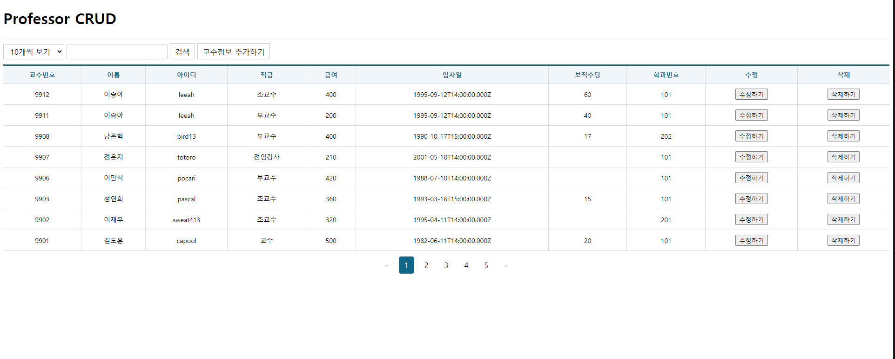
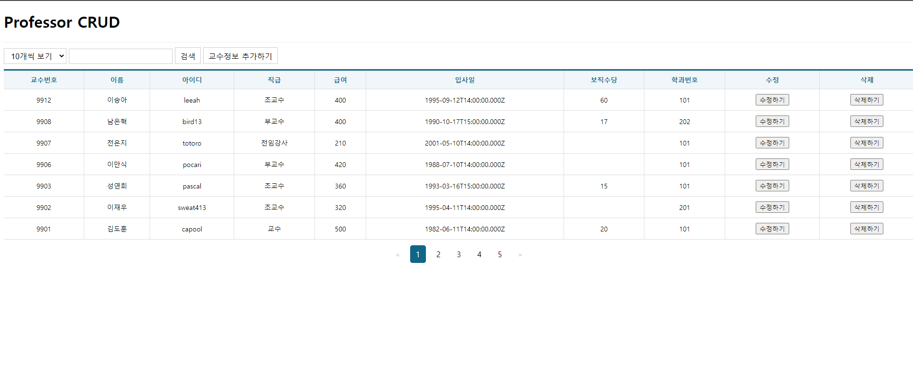
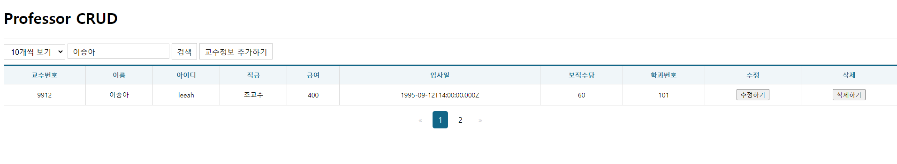
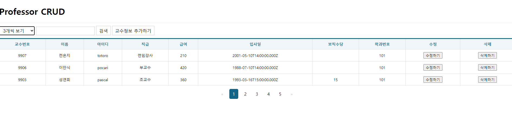
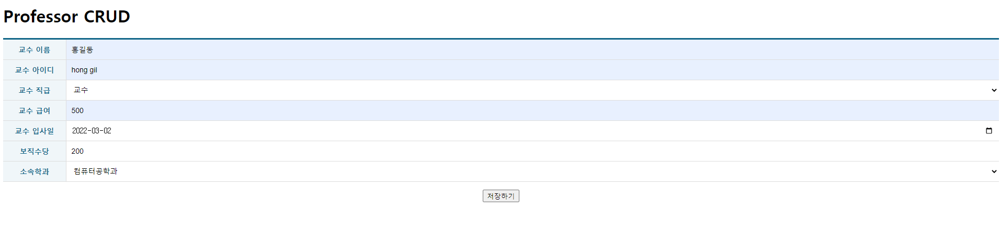
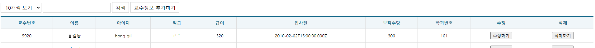
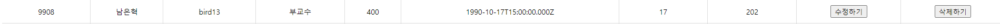
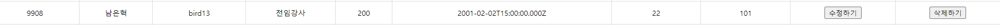
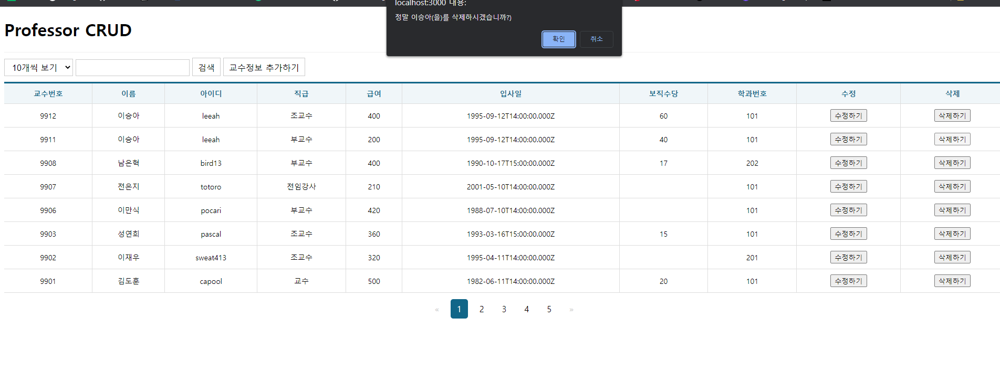

# 통합구현
>2022.07.21 이승아


### 문제1 페이지 번호와 키워드 검색 기능이 포함된 목록 조회 기능을 갖는 웹 페이지를 구현하고 이에 대한 소스코드와 실행 스크린샷을 제출하시오. Redux Slice, Page 및 관련된 컴포넌트들의 소스코드를 제시하여야 합니다.
교수목록 조회 스크린 샷

교수목록 조회 스크린 샷


### 문제2 단일 항목에 대한 상세 조회 기능을 갖는 웹 페이지를 구현하고 이에 대한 소스코드와 실행 스크린샷을 제출하시오. Redux Slice, Page 및 관련된 컴포넌트들의 소스코드를 제시하여야 합니다.
교수목록 조회 스크린 샷

교수목록 조회 스크린 샷

 
### 문제3 신규 데이터를 등록할 수 있는 기능을 갖는 웹 페이지를 구현하고 이에 대한 소스코드와 실행 스크린샷을 제출하시오. 관련된 참조키는 Redux가 아닌 hook을 사용하여 백엔드로부터 데이터를 받아온 후 Dropdown을 통해 선택할 수 있어야 합니다. Redux Slice, Page 및 관련된 컴포넌트들의 소스코드를 제시하여야 합니다.
교수목록 조회 스크린 샷

교수목록 조회 스크린 샷


### 문제4 데이터를 수정할 수 있는 기능을 갖는 웹 페이지를 구현하고 이에 대한 소스코드와 실행 스크린샷을 제출하시오. 관련된 참조키는 Redux가 아닌 hook을 사용하여 백엔드로부터 데이터를 받아온 후 Dropdown을 통해 선택할 수 있어야 합니다. Redux Slice, Page 및 관련된 컴포넌트들의 소스코드를 제시하여야 합니다.
교수목록 조회 스크린 샷

교수목록 조회 스크린 샷


### 문제5 목록 페이지의 삭제버튼을 통해 데이터를 삭제할 수 있는 기능을 갖는 웹 페이지를 구현하고 이에 대한 소스코드와 실행 스크린샷을 제출하시오. Redux Slice, Page 및 관련된 컴포넌트들의 소스코드를 제시하여야 합니다.
교수목록 조회 스크린 샷



### 소스 코드

App.jsx
```jsx
import React,{ memo } from 'react';
import {Routes, Route} from 'react-router-dom';

import ProfessorList from './pages/ProfessorList';
import ProfessorEdit from './pages/ProfessorEdit';
import ProfessorAdd from './pages/ProfessorAdd';

const App = memo(() =>{
    return (
      <div>
        <h1>Professor CRUD</h1>

        <Routes>
          <Route path='/' except={true} element={<ProfessorList/>} />
          <Route path='/professor_add' element={<ProfessorAdd/>} />
          {/* 수정을 할 때 어떤 값을 수정할지 식별하기 위해 path 파라미터로 넘겨야함 */}
          <Route path='/professor_edit/:profno'  element={<ProfessorEdit/>} />
        </Routes>
      </div>
  );
});

export default App;
```

index.jsx
```jsx
import React from 'react';
import ReactDOM from 'react-dom/client';

// test 완료 후, 다시 /를 빼서 App으로 변경해놓기
/**/
import App from './App';
/*/
import App from './Test';
/**/
//test를 위해 App의 경로를 Test로 수정해놓음

import { BrowserRouter } from 'react-router-dom';
import { Provider } from 'react-redux';
import store from './store';

const root = ReactDOM.createRoot(document.getElementById('root'));
root.render(
  <React.StrictMode>
    <Provider store={store}> {/* Provider로 감싸주면 상태값이 App을 통해 하위 컴포넌트로 전파됨 */}
      <BrowserRouter>
        <App />
      </BrowserRouter>
    </Provider>
  </React.StrictMode>
);
```

store.jsx
```jsx
import { configureStore} from "@reduxjs/toolkit";
import ProfessorSlice from "./slices/ProfessorSlice";

const store = configureStore({
    reducer:{
        ProfessorSlice:ProfessorSlice
    },
    middleware: (getDefaultMiddleware)=>getDefaultMiddleware({serializableCheck:false}),
    devTools: true
});

export default store;
```

professorSlice.jsx
```jsx
import {createSlice, createAsyncThunk} from "@reduxjs/toolkit"
import axios from 'axios';
import {pending, fulfilled, rejected}from '../Util';
import { cloneDeep } from "lodash";

const API_URL = 'http://localhost:3001/professor/';

/** 다중행 데이터 조회를 위한 비동기 함수 (게시판 목록조회) */
//DepartmentSlice안에 /getList를 만든다는 의미 
export const getList = createAsyncThunk("ProfessorSlice/getList", async(payload,{rejectWithValue})=>{
    let result = null;
    
    try{
        result = await axios.get(API_URL,{
        params:{
        query: payload?.query,
        page: payload?.page,
        rows: payload?.rows
        }
    });

  }catch(err) {
    result = rejectWithValue(err.response);
  }
  return result;
});

/** 단일행 데이터 조회를 위한 비동기 함수 (게시판 읽기 기능) */

export const getItem = createAsyncThunk("ProfessorSlice/getItem", async(payload,{rejectWithValue})=>{
        let result = null;
        try{
            result = await axios.get(`${API_URL}${payload?.profno}/`);
      }catch(err) {
        result = rejectWithValue(err.response);
      }
      return result;
});

/** 데이터 저장을 위한 비동기 함수 POST */
export const postItem = createAsyncThunk("ProfessorSlice/postItem", async(payload,{rejectWithValue})=>{
        let result = null;

        try{
            result = await axios.post(API_URL,{
                name: payload.name,
                userid: payload.userid,
                position: payload.position,
                sal: payload.sal,
                hiredate: payload.hiredate,
                comm: payload.comm,
                deptno:payload.deptno
            });
      }catch(err) {
        result = rejectWithValue(err.response);
      }
      return result;
});

/** 데이터 수정을 위한 비동기 함수 PUT */
export const putItem = createAsyncThunk("ProfessorSlice/putItem", async(payload,{rejectWithValue})=>{
        let result = null;
        try{
            result = await axios.put(`${API_URL}${payload.profno}/`,{
              name: payload.name,
              userid: payload.userid,
              position: payload.position,
              sal: payload.sal,
              hiredate: payload.hiredate,
              comm: payload.comm,
              deptno:payload.deptno
            });
      }catch(err) {
        result = rejectWithValue(err.response);
      }
      return result;
});

/** 데이터 삭제을 위한 비동기 함수 DELETE */
// dispatch(putItem({id:101})) --> 무엇을 지울지만 알려주면 된다.
export const deleteItem = createAsyncThunk("ProfessorSlice/deleteItem", async(payload,{rejectWithValue})=>{
        let result = null;

        try{
            result = await axios.delete(`${API_URL}${payload.profno}/`);
      }catch(err) {
        result = rejectWithValue(err.response);
      }
      return result;
});
const ProfessorSlice = createSlice({
  name: 'ProfessorSlice',
  initialState: {
    data: null,       
    loading: false, 
    error:null        
  },
  reducers: {},
  extraReducers: {
    /** 다중행 데이터 조회를 위한 액션 함수 */
    [getList.pending]: pending,
    [getList.fulfilled]: fulfilled,
    [getList.rejected]: rejected,

    /** 단일행 데이터 조회를 위한 액션 함수 */
    [getItem.pending]: pending,
    [getItem.fulfilled]: fulfilled,
    [getItem.rejected]: rejected,

  
        /** 데이터 저장을 위한 액션 함수 */
        [postItem.pending]: pending,
        [postItem.fulfilled]: (state, { meta, payload }) => {
            // 기존의 상태값을 복사한다.(원본이 JSON이므로 깊은 복사를 수행해야 한다)
            const data = cloneDeep(state.data);
            console.log(data);

            // 새로 저장된 결과를 기존 상태값 배열의 맨 앞에 추가한다.
            data.item.unshift(payload.data.item);

            // 기존의 상태값 배열에서 맨 마지막 항목은 삭제한다.
            data.item.pop();

            return {
                data: data,
                loading: false,
                error: null
            }
        },
    [postItem.rejected]: rejected,

    /** 데이터 수정을 위한 액션함수 */
    [putItem.pending]: pending,
    [putItem.fulfilled]: (state,{meta, payload})=>{
      //기존의 상태값을 복사한다. (원본이 JSON이므로 깊은 복사를 수행해야 한다.)
      const data = cloneDeep(state.data);
      console.log(data);

      // 기존의 데이터에서 수정이 요청된 항목의 위치를 검색한다.
      const index = data.item.findIndex(element => element.profno === parseInt(meta.arg.profno));
      console.log('index=' +index);

      // 검색이 되었다면 해당항목을 삭제한다.
      if (index !== undefined){
        data.item.splice(index,1, payload.data.item);
      }
      console.log(data)
      return{
        data: data,
        loading: false,
        error:null
      }
    },
    [putItem.rejected]: rejected,

    [deleteItem.pending]: pending,
    [deleteItem.fulfilled]: (state,{meta, payload})=>{
      //기존의 상태값을 복사한다. (원본이 JSON이므로 깊은 복사를 수행해야 한다.)
      const data = cloneDeep(state.data);
      console.log(data);

      // 기존의 데이터에서 삭제가 요청된 항목의 위치를 검색한다.
      const index = data.item.findIndex(element => element.profno === parseInt(meta.arg.profno));
      console.log('index=' +index);

      // 검색이 되었다면 해당항목을 삭제한다.
      if (index !== undefined){
        data.item.splice(index,1);
      }
      console.log(data)
      return{
        data: data,
        loading: false,
        error:null
      }
    },
    [deleteItem.rejected]: rejected,

  },
});

export default ProfessorSlice.reducer;
```

professorList.jsx
```jsx
import React, { memo, useCallback, useRef } from 'react';
import styled from 'styled-components';
import { NavLink, useNavigate } from 'react-router-dom';
import { useQueryString } from '../hooks/useQueryString';

import Spinner from '../components/Spinner';
import ErrorView from '../components/ErrorView';
import Table from '../components/Table';

import { useSelector, useDispatch } from 'react-redux';
import { getList, deleteItem } from '../slices/ProfessorSlice';

// 입력 컨트롤들을 포함하는 박스
const ControlContainer = styled.form`
    position: sticky;
    top: 0;
    background-color: #fff;
    border-top: 1px solid #eee;
    border-bottom: 1px solid #eee;
    padding: 10px 0;

    .controll {
        margin-right: 5px;
        display: inline-block;
        font-size: 16px;
        padding: 7px 10px 5px 10px;
        border: 1px solid #ccc;
    }

    .clickable {
        background-color: #fff;
        color: #000;
        text-decoration: none;
        cursor: pointer;
        
        &:hover {
        background-color: #06f2;
        }

        &:active {
            transform: scale(0.9, 0.9);
        }
    }
`;

// 페이지 번호
const Pagenation = styled.ul`
    list-style: none;
    padding: 0;
    margin: 20px 0;
    display: flex;
    justify-content: center;

    a {
        color: black;
        padding: 8px 12px;
        text-decoration: none;
        transition: background-color .3s;
        margin: 0 5px;

        &.current-page {
            background-color: #116688;
            color: white;
            border-radius: 5px;
        }

        &.disabled {
            color: #ccc;
            cursor: not-allowed;
        }

        &:hover:not(.current-page) {
            background-color: #ddd;
            border-radius: 5px;
        }
    }
`;

const ProfessorList = memo(() => {
    /** 리덕스 관련 초기화 */
    const dispatch = useDispatch();
    const { data, loading, error } = useSelector((state) => state.ProfessorSlice);

    /** 페이지 강제 이동을 처리하기 위한 navigate함수 생성 */
    const navigate = useNavigate();

    /** QueryString 문자열 얻기 */
    // ex) http://localhost:3000?query=풀스택&rows=10&page=3
    const { query, rows, page } = useQueryString({
        query: '',
        rows: 10,
        page: 1
    });

    /** 목록수 드롭다운에 접근할 참조변수 */
    const refRowsDropdown = useRef();

    /** 입력요소에 접근할 참조변수 */
    const refTextInput = useRef();

    /** 최초 마운트 혹은 QueryString이 변경될 때 마다 hook -> 리덕스를 통해 목록을 조회한다. */
    React.useEffect(() => {
        dispatch(getList({
            query: query,
            rows: rows,
            page: page
        }));

        refRowsDropdown.current.value = rows;
        refTextInput.current.value = query;
    }, [dispatch, query, rows, page]);

    /** 검색 이벤트 */
    const onSearchSubmit = useCallback(e => {
        e.preventDefault();
        const dropdown = refRowsDropdown.current;
        const input = refTextInput.current;
        navigate(`/?query=${input.value}&rows=${dropdown.value}`);
    }, [navigate]);

    /** 수정 버튼 클릭 이벤트 처리 --> 수정 페이지로 이동. 수정 대상에 대한 id를 path파라미터로 전달함. */
    const onEditClick = useCallback(e => {
        e.preventDefault();
        const current = e.target;
        const profno = current.dataset.profno;
        navigate(`/professor_edit/${profno}`);
    }, [navigate]);

    /** 삭제 버튼 클릭 이벤트 처리 --> 리덕스를 통해 삭제 처리 --> data값이 갱신되므로 화면에 자동 반영된다. */
    const onDeleteClick = useCallback(e => {
        e.preventDefault();

        const current = e.target;

        if (window.confirm(`정말 ${current.dataset.name}(을)를 삭제하시겠습니까?)`)) {
            dispatch(deleteItem({
                profno: current.dataset.profno
            }));
        }
    }, [dispatch]);

    return (
        <div>
            <Spinner visible={loading} />

            <ControlContainer onSubmit={onSearchSubmit}>
                <select name="rows" className="controll" onChange={onSearchSubmit} ref={refRowsDropdown}>
                    <option value="3">3개씩 보기</option>
                    <option value="5">5개씩 보기</option>
                    <option value="10">10개씩 보기</option>
                </select>
                <input type="text" className="controll" ref={refTextInput} />
                <button type="submit" className="controll clickable">검색</button>
                <NavLink to="professor_add" className="controll clickable">교수정보 추가하기</NavLink>
            </ControlContainer>

            {error ? (
                <ErrorView error={error} />
            ) : data && (
                <>
                    <Table>
                        <thead>
                            <tr>
                                <th>교수번호</th>
                                <th>이름</th>
                                <th>아이디</th>
                                <th>직급</th>
                                <th>급여</th>
                                <th>입사일</th>
                                <th>보직수당</th>
                                <th>학과번호</th>
                                <th>수정</th>
                                <th>삭제</th>
                            </tr>
                        </thead>
                        <tbody>
                            {data.item.length > 0 ? (
                                data.item.map((item, index) => {
                                    return (
                                        <tr key={item.profno}>
                                            {/* 데이터를 텍스트로 출력 */}
                                            <td>{item.profno}</td>
                                            <td>{item.name}</td>
                                            <td>{item.userid}</td>
                                            <td>{item.position}</td>
                                            <td>{item.sal}</td>
                                            <td>{item.hiredate}</td>
                                            <td>{item.comm}</td>
                                            <td>{item.deptno}</td>
                                            <td>
                                                <button type='button' data-profno={item.profno} onClick={onEditClick}>
                                                    수정하기
                                                </button>
                                            </td>
                                            <td>
                                                <button type='button' data-profno={item.profno} data-name={item.name} onClick={onDeleteClick}>
                                                    삭제하기
                                                </button>
                                            </td>
                                        </tr>
                                    );
                                })
                            ) : (
                                <tr>
                                    <td colSpan='5' align='center'>
                                        검색결과가 없습니다.
                                    </td>
                                </tr>
                            )}
                        </tbody>
                    </Table>

                    {data && (
                        <Pagenation>
                            {data.pagenation.prevGroupLastPage > 0 ? (
                                <li><NavLink to={`/?query=${query}&rows=${rows}&page=${data.pagenation.prevGroupLastPage}`}>&laquo;</NavLink></li>
                            ) : (
                                <li><NavLink to="#" className='disabled'>&laquo;</NavLink></li>
                            )}

                            {(() => {
                                const li = [];
                                const start = data.pagenation.groupStart;
                                const end = data.pagenation.groupEnd + 1;
                                for (let i = start; i < end; i++) {
                                    if (i === data.pagenation.nowPage) {
                                        li.push(<li key={i}><NavLink to="#" className='current-page'>{i}</NavLink></li>)
                                    } else {
                                        li.push(<li key={i}><NavLink to={`/?query=${query}&rows=${rows}&page=${i}`}>{i}</NavLink></li>);
                                    }
                                }

                                return li;
                            })()}

                            {data.pagenation.nextGroupFirstPage > 0 ? (
                                <li><NavLink to={`/?query=${query}&rows=${rows}&page=${data.pagenation.nextGroupFirstPage}`}>&raquo;</NavLink></li>
                            ) : (
                                <li><NavLink to="#" className='disabled'>&raquo;</NavLink></li>
                            )}
                        </Pagenation>
                    )}

                </>
            )}
        </div>
    );
});

export default ProfessorList;
```

professorAdd.jsx
```js
import React, { memo } from 'react';
import { useNavigate } from 'react-router-dom';
import Spinner from '../components/Spinner';
import ErrorView from '../components/ErrorView';
import TableEx from '../components/TableEx';
import regexHelper from '../libs/RegexHelper';
import { useSelector, useDispatch } from 'react-redux';
import {postItem} from '../slices/ProfessorSlice';
import useAxios from 'axios-hooks';

const ProfessorAdd = memo(() => {
    const navigate = useNavigate();
    const dispatch = useDispatch();
    const {loading, error} = useSelector((state) => state.ProfessorSlice);


    /** 학과설정을 위한 데이터 불러오기 */
    const [{data}] = useAxios("http://localhost:3002/department");

    /** <form>의 submit 버튼이 눌러졌을 때 호출될 이벤트 핸들러 */
    const onSubmit = React.useCallback((e) => {
        e.preventDefault();

        // 이벤트가 발생한 폼 객체
        const current = e.target;

        // 입력값에 대한 유효성 검사
        try {
            regexHelper.value(current.name, '교수 이름이 없습니다.');

            regexHelper.value(current.userid, '교수 아이디가 없습니다.');
            regexHelper.minLength(current.userid, 4, '교수 아이디는 최소 4글자 이상 입력해야 합니다.');
            regexHelper.maxLength(current.userid, 10, '교수 아이디는 최대 10글자 까지 입력 가능합니다.');

            regexHelper.value(current.position, '교수 직급을 선택해주세요.');

            regexHelper.value(current.sal, '교수 급여가 없습니다.');

            regexHelper.value(current.hiredate, '교수 입사일을 선택해주세요.');

            regexHelper.value(current.comm, '교수 보직수당 없습니다.');

            regexHelper.value(current.deptno, '부서번호가 없습니다.');
        } catch (e) {
            window.alert(e.message);
            e.field.focus();
            return;
        }

        // 리덕스를 통한 데이터 저장 요청. --> 처리가 완료된 후 목록 페이지로 강제 이동한다.
        dispatch(postItem({
            name: current.name.value,
            userid: current.userid.value,
            position: current.position.value,
            sal: current.sal.value,
            hiredate: current.hiredate.value,
            comm: current.comm.value,
            deptno: current.deptno.value
        })).then(() => {
            navigate("/");
        });
    }, [dispatch, navigate]);

    return (
        <>
            <Spinner visible={loading} />
            
            {error ? (
                <ErrorView error={error} />
            ) : (
                <form onSubmit={onSubmit}>
                    <TableEx>
                        <colgroup>
                            <col width="120" />
                            <col />
                        </colgroup>
                        <tbody>
                        <tr>
                            <th>교수 이름</th>
                            <td className='inputWrapper'><input className='field' type="text" name="name" /></td>
                        </tr>
                        <tr>
                            <th>교수 아이디</th>
                            <td className='inputWrapper'><input className='field' type="text" name="userid" /></td>
                        </tr>
                        <tr>
                            <th>교수 직급</th>
                            <td className='inputWrapper'>
                                <select name="position" className='field'>
                                    <option value="">선택안함</option>
                                    <option value="교수">교수</option>
                                    <option value="조교수">조교수</option>
                                    <option value="부교수">부교수</option>
                                    <option value="전임강사">전임강사</option>
                                </select>
                            </td>
                        </tr>
                        <tr>
                            <th>교수 급여</th>
                            <td className='inputWrapper'><input className='field' type="text" name="sal" /></td>
                        </tr>
                        <tr>
                        <th>교수 입사일</th>
                        <td className='inputWrapper'>
                        <input className='field' type='date' name='hiredate'/></td>
                        </tr>
                        <tr>
                            <th>보직수당</th>
                            <td className='inputWrapper'><input className='field' type="text" name="comm" /></td>
                        </tr>
                        <tr>
                            <th>소속학과</th>
                            <td className='inputWrapper'>
                                <select name='deptno' className='field'>
                                    <option value="">----선택하기----</option>
                                    {data && data.map((v,i)=>{
                                    return(
                                        <option key={i} value={v.id}>{v.dname}</option>    
                                    )
                                    })}
                                </select>    
                            </td>
                        </tr>
                        </tbody>
                    </TableEx>

                    <div style={{ textAlign: 'center' }}>
                        <button type='submit'>저장하기</button>
                    </div>
                </form>
            )}
        </>
    );
});

export default ProfessorAdd;
```

professorEdit.jsx
```js
import React, { memo, useEffect, useState } from 'react';
import { useParams, useNavigate} from 'react-router-dom';
import useAxios from 'axios-hooks';
// button을 이용해서 NavLink로 이동하는데, useNavigate로 강제 이동하기
// App.js에 있는 :id는 path파라미터 받아오기 위한 useParams를 사용

import Spinner from '../components/Spinner';
import ErrorView from '../components/ErrorView';
import TableEx from '../components/TableEx';

import regexHelper from '../libs/RegexHelper';

import { useSelector, useDispatch } from 'react-redux';
//데이터 조회, 수정 기능
import {putItem} from '../slices/ProfessorSlice';


const ProfessorEdit = memo(() =>{
  /** Path 파라미터에 포함된 id값 획득하기 */
  const {profno} = useParams();

  /** 데이터 수정 후 목록 페이지로 강제 이동하기 위한 함수 생성 */
  const navigate = useNavigate();

    /** 학과설정을 위한 데이터 불러오기 */
    const [{data:department}] = useAxios("http://localhost:3002/department");

  /** 리덕스 초기화 */
  const dispatch = useDispatch();
  const {data, loading, error} = useSelector((state)=>state.ProfessorSlice); 
  const [ origin, setOrigin ] = useState({
    name: '',
    userid: '',
    position: '',
    sal:'',
    hiredate:'',
    comm:''
  });

  /** 페이지가 열림과 동시에 id값에 대한 데이터를 조회하여 리덕스 상태값에 반영한다. */
  useEffect(()=>{
    const index = data.item.findIndex(e=> e.profno === parseInt(profno));

    setOrigin({
      name: data.item[index].name,
      userid: data.item[index].userid,
      position: data.item[index].position,
      sal: data.item[index].sal,
      hiredate: data.item[index].hiredate,
      comm: data.item[index].comm,
      deptno: data.item[index].deptno,
    })
  },[data, profno]);

  /**<form>의 submit 버튼이 눌러졌을 때 호출될 이벤트 핸들러 */
  const onSubmit = React.useCallback((e)=>{
    e.preventDefault();

    // 이벤트가 발생한 폼 객체
    const current = e.target;
    //입력값에 대한 유효성 검사
    try{
      regexHelper.value(current.name, '교수 이름이 없습니다.');

      regexHelper.value(current.userid, '교수 아이디가 없습니다.');
      regexHelper.minLength(current.userid, 4, '학과이름은 최소 4글자 이상 입력해야 합니다.');
      regexHelper.maxLength(current.userid, 10, '학과이름은 최대 10글자 까지 입력 가능합니다.');

      regexHelper.value(current.position, '교수 직급을 선택해주세요.');

      regexHelper.value(current.sal, '교수 급여가 없습니다.');

      regexHelper.value(current.hiredate, '교수 입사일을 선택해주세요.');

      regexHelper.value(current.comm, '교수 보직수당 없습니다.');

      regexHelper.value(current.deptno, '부서번호가 없습니다.');
    }catch(e){
      window.alert(e.message);
      e.field.focus();
      return;
    }

    // 리덕스(Ajax처리)를 통한 상태값 갱신 --> 처리가 완료된 후 목록 페이지로 강제 이동한다.
    // 비동기 처리이기 때문에 리덕스의 함수를 dispatch한 다음에 그에 대한 후속 처리를 한다면 
    // 리덕스 자체가 promise객체이기 때문에 then을 사용해야한다
    dispatch(putItem({
      // id는 path파라미터로 받아놓은 값이 있기 때문에 그냥 사용해도 됨
      profno:profno,
      name: current.name.value,
      userid: current.userid.value,
      position: current.position.value,
      sal: current.sal.value,
      hiredate: current.hiredate.value,
      comm: current.comm.value,
      deptno: current.deptno.value
    })).then(()=>{    // then 함수를 처리하고 콜백을 넣어야함
      navigate("/");
    });
  },[dispatch, profno, navigate]);


    return (
      <>
        <Spinner visible={loading}/>

        {error?(
          <ErrorView error={error}/>
        ) : (
          /* form 태그를 눌렀을 때 실행될 이벤트 핸들러 */
          <form onSubmit={onSubmit}>
             <TableEx>
            <colgroup>
              <col width="120"/>
              <col/>
            </colgroup>
            <tbody>
              <tr>
                <th>교수 이름</th>
                <td className='inputWrapper'><input className='field' type="text" 
                name="name" defaultValue={origin.name} /></td>
                {/* 비동기 처리로 화면에 먼저 출력이 될 수 있음으로 data가 있는지 확인하고 data가 있다면 name을 실행 */}
              </tr>
              <tr>
                <th>교수 아이디</th>
                <td className='inputWrapper'><input className='field' type="text" 
                name="userid" defaultValue={origin.userid} /></td>
                {/* 비동기 처리로 화면에 먼저 출력이 될 수 있음으로 data가 있는지 확인하고 data가 있다면 userid을 실행 */}
              </tr>
              <tr>
                <th>교수 직급</th>
                  <td className='inputWrapper' defaultValue={origin.position} >
                      <select name="position" className='field'>
                          <option value="">선택안함</option>
                          <option value="교수">교수</option>
                          <option value="조교수">조교수</option>
                          <option value="부교수">부교수</option>
                          <option value="전임강사">전임강사</option>
                      </select>
                  </td>
                {/* 비동기 처리로 화면에 먼저 출력이 될 수 있음으로 data가 있는지 확인하고 data가 있다면 position을 실행 */}
              </tr>
              <tr>
                <th>교수 급여</th>
                <td className='inputWrapper'><input className='field' type="text" 
                name="sal" defaultValue={origin.sal} /></td>
                {/* 비동기 처리로 화면에 먼저 출력이 될 수 있음으로 data가 있는지 확인하고 data가 있다면 sal을 실행 */}
              </tr>
              <tr>
                <th>교수 입사일</th>
                <td className='inputWrapper'>
                <input className='field' type='date' name='hiredate' defaultValue={origin.hiredate}/> 
                </td>
                {/* 비동기 처리로 화면에 먼저 출력이 될 수 있음으로 data가 있는지 확인하고 data가 있다면 hiredate을 실행 */}
              </tr>
              <tr>
                <th>보직수당</th>
                <td className='inputWrapper'><input className='field' type="text" 
                name="comm" defaultValue={origin.comm} /></td>
                {/* 비동기 처리로 화면에 먼저 출력이 될 수 있음으로 data가 있는지 확인하고 data가 있다면 comm을 실행 */}
              </tr>
              <tr>
                  <th>소속학과</th>
                  <td className='inputWrapper'>
                      <select name='deptno' className='field'>
                          <option value="">----선택하기----</option>
                          {department && department.map((v,i)=>{
                          return(
                              <option key={i} value={v.id}>{v.dname}</option>    
                          )
                          })}
                      </select>    
                  </td>
              </tr>
            </tbody>
          </TableEx>
          <div style={{textAlign: 'center'}}>
            <button type='submit'>수정하기</button>
          </div>
          </form>
        )}
      </>
  );
});

export default ProfessorEdit;
```