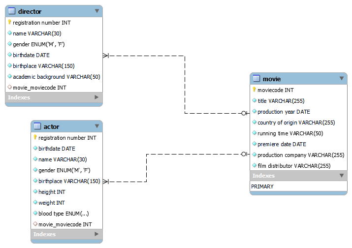
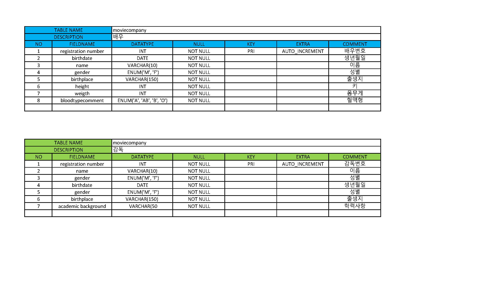
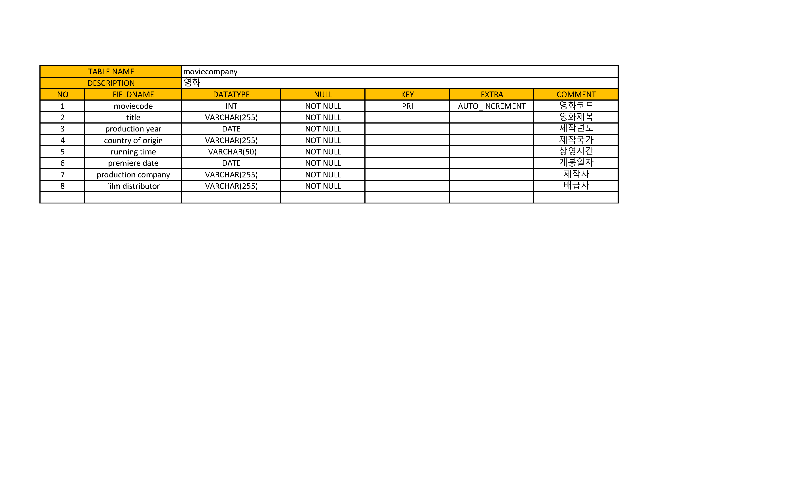

# SQL응용

### 1.위 영화 관리 시스템의 ERD를 작성하고 그 결과 이미지를 제출하시오. 테이블 이름과 컬럼 이름은 직접 영문으로 정의해야 합니다

실행결과의 스크린 샷


### 2.문제 1의 ERD에 대한 물리 저장소를 생성하기 위한 DDL을 작성하시오.

```sql
/* 배우 */
CREATE TABLE `actor` (
 `registration number` INT NOT NULL AUTO_INCREMENT comment `배우번호`,
 `birthdate` DATE NOT NULL comment`생년월일`,
 `name`    VARCHAR(10) NOT NULL comment`이름`,
 `gender`   ENUM('M', 'F') NOT NULL comment`성별`,
 `birthplace` VARCHAR(150) NOT NULL comment`출생지`,
 `height`   INT NOT NULL comment`키`,
 `weigth`    INT NOT NULL comment`몸무게`,
 `bloodtype`    ENUM('A', 'AB', 'B', 'O') NOT NULL  comment`혈액형`,
  PRIMARY KEY(`registration number`)
) ENGINE=MYISAM CHARSET=utf8 comment`영화 배우 리스트를 위한 데이터 베이스`;

/* 감독 */
CREATE TABLE `director` (
 `registration number` INT NOT NULL AUTO_INCREMENT comment `감독번호`,
 `name`    VARCHAR(10) NOT NULL comment`이름`,
 `gender`   ENUM('M', 'F') NOT NULL comment`성별`,
`birthdate` DATE NOT NULL comment`생년월일`,
 `birthplace` VARCHAR(150) NOT NULL comment`출생지`,
`academic background` VARCHAR(50) NOT NULL comment`학력사항`,
  PRIMARY KEY(`registration number`)
) ENGINE=MYISAM CHARSET=utf8 comment`영화 감독 리스트를 위한 데이터 베이스`;

/* 영화 */
CREATE TABLE `movie` (
 `moviecode` INT NOT NULL AUTO_INCREMENT comment `영화코드`,
 `title` VARCHAR(255) NOT NULL comment`영화제목`,
 `production year` DATE NOT NULL comment`제작년도`,
 `country of origin`  VARCHAR(255) NOT NULL comment`제작국가`,
 `running time` VARCHAR(50) NOT NULL comment`상영시간`,
 `premiere date`   DATE NOT NULL comment`개봉일자`,
 `production company` VARCHAR(255) NOT NULL comment`제작사`,
 `film distributor` VARCHAR(255) NOT NULL  comment`배급사`,
  PRIMARY KEY(`moviecode`)
) ENGINE=MYISAM CHARSET=utf8 comment`(주)영화광의 국내에서 상영․유통되는 영화 컨텐츠에 대한 종합적인 정보 관리를 위한 데이터베이스 시스템`;

```

### 3. 문제 1의 ERD에 대한 테이블 명세서를 작성하시오. 작성 양식은 수업시간에 소개한 표 형식을 기본으로 하되 본인이 양식을 재구성 해도 좋습니다.

실행결과의 스크린 샷


실행결과의 스크린 샷



### 4. 문제 1의 스키마를 참조하여 다음 정보를 출력하기 위한 SQL문을 작성하시오.

#### 4-1 2020년에 제작된 영화의 제목, 제작국가, 상영시간, 제작사를 출력하시오.
```sql
Select title, country of origin,  running time, production company, production year 
from movie 
where data_format(production year, '%Y')=2020;
```
#### 4-2 현재 날짜를 기준으로 최근 3년 안에 제작된 영화의 제목, 제작국가, 개봉일, 제작사, 배급사를 출력하시오.
```sql
SELECT title, country of origin, premiere date, production company, film distributor 
FROM movie
WHERE production year
BETWEEN '2019-06-28  00:00:00' AND '2022-06-28 00:00:00';
```

#### 4-3 이름이 ‘명감독’인 감독이 촬영한 영화의 제목을 출력하시오.
```sql
select m.title 
from movie m 
inner join director d 
on m.moviecode = d.movie_moviecode 
where d.name='명감독';
```

#### 4-4 감독이 직접 배우로 출현한 영화의 제목과, 제작국가, 상영시간을 출력하시오.
```sql
SELECT m.title, m.country of origin, m.running time,
FROM movie m actior a
INNER JOIN director d ON m.moviecode = a.movie_moviecode
WHERE a.name=(SELECT name FROM director WHERE name IN ('문소리','양익준'));
```