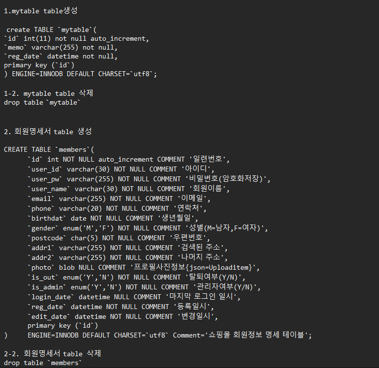
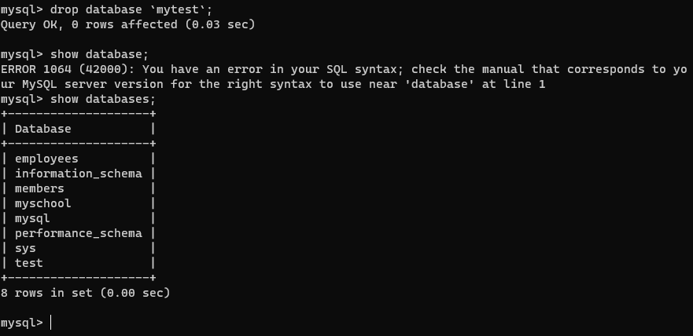
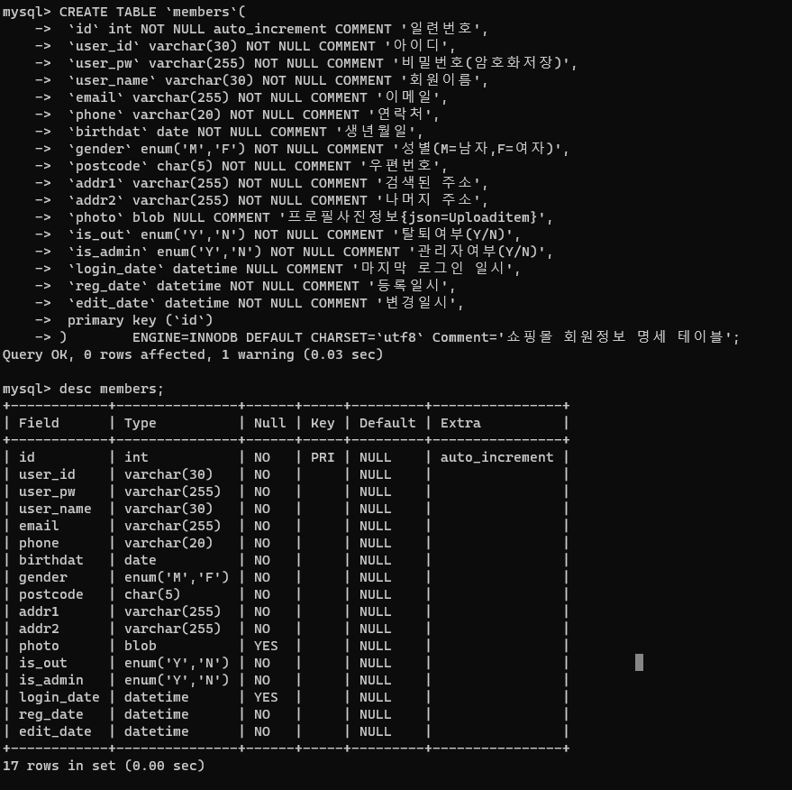

# MYSQL 회원테이블

> 2022.06.21 이승아

### 회원명세서 데이터베이스 생성

```js
create database `members` default charset `utf8`;
```
### 회원명세서 테이블 생성

```js
CREATE TABLE `members`(
	`id` int NOT NULL auto_increment COMMENT '일련번호',
	`user_id` varchar(30) NOT NULL COMMENT '아이디',
	`user_pw` varchar(255) NOT NULL COMMENT '비밀번호(암호화저장)',
	`user_name` varchar(30) NOT NULL COMMENT '회원이름',
	`email` varchar(255) NOT NULL COMMENT '이메일',
	`phone` varchar(20) NOT NULL COMMENT '연락처',
	`birthdat` date NOT NULL COMMENT '생년월일',
	`gender` enum('M','F') NOT NULL COMMENT '성별(M=남자,F=여자)',
	`postcode` char(5) NOT NULL COMMENT '우편번호',
	`addr1` varchar(255) NOT NULL COMMENT '검색된 주소',
	`addr2` varchar(255) NOT NULL COMMENT '나머지 주소',
	`photo` blob NULL COMMENT '프로필사진정보{json=Uploaditem}',
	`is_out` enum('Y','N') NOT NULL COMMENT '탈퇴여부(Y/N)',
	`is_admin` enum('Y','N') NOT NULL COMMENT '관리자여부(Y/N)',
	`login_date` datetime NULL COMMENT '마지막 로그인 일시',
	`reg_date` datetime NOT NULL COMMENT '등록일시',
	`edit_date` datetime NOT NULL COMMENT '변경일시',
	primary key (`id`)
)	ENGINE=INNODB DEFAULT CHARSET=`utf8` Comment='쇼핑몰 회원정보 명세 테이블';
```

### 회원명세서 테이블 삭제
```js
drop table `members`;
```
스크린 샷



