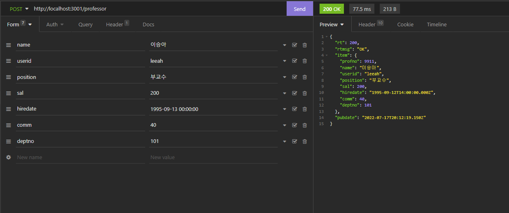
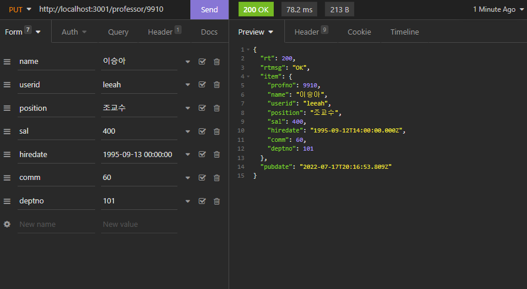
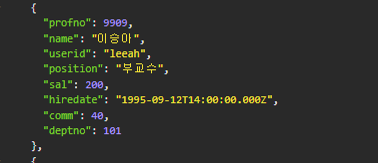
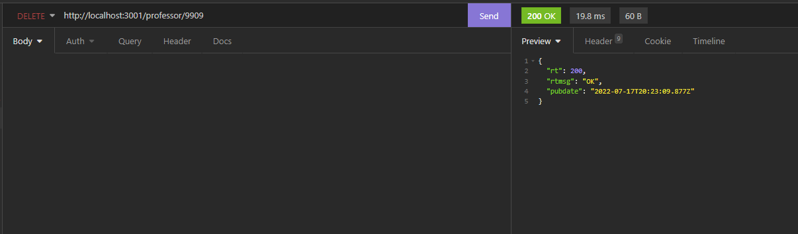
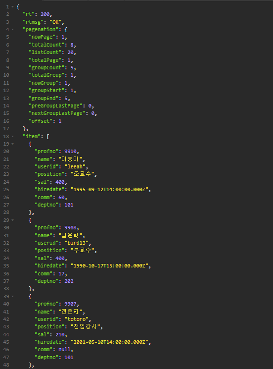
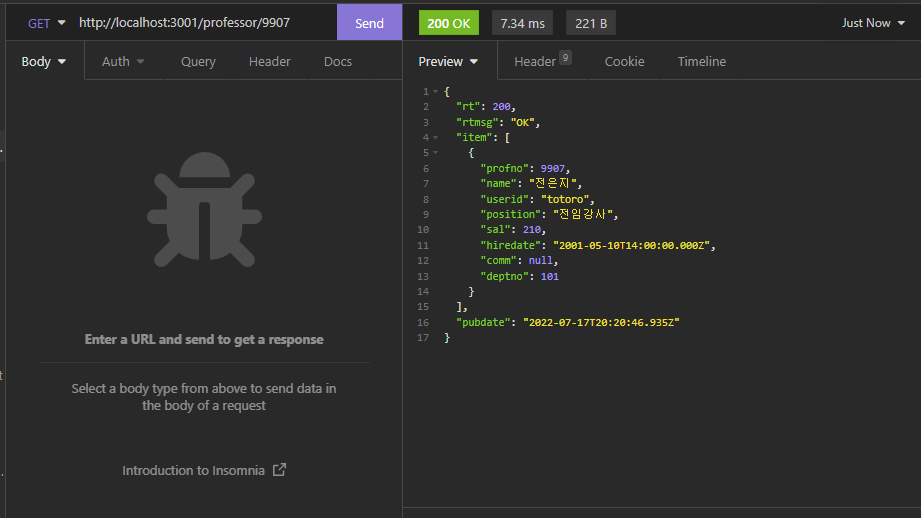
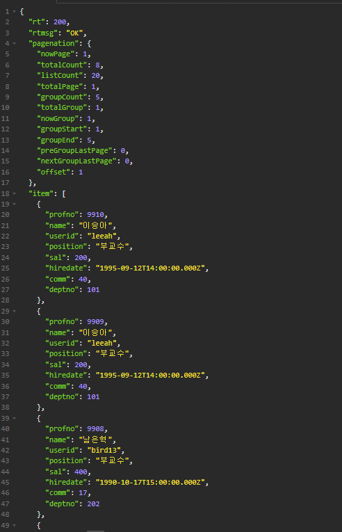
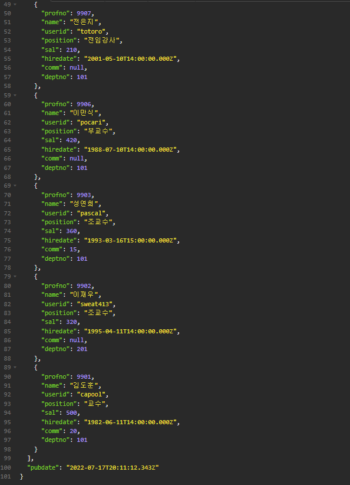

# Nodejs 
>2022.07.16 이승아

### 1.교수의 데이터를 생성하기 위한 API를 구현하고 작성한 SQL Mapper, Service Layer, Controller의 소스코드를 제시하고 Insomnia로 테스트한 실행결과를 제출하시오.
교수 데이터 생성 스크린 샷


### 2.교수의 데이터를 수정하기 위한 API를 구현하고 작성한 SQL Mapper, Service Layer, Controller의 소스코드를 제시하고 Insomnia로 테스트한 실행결과를 제출하시오.
교수 데이터 수정 스크린 샷



### 3.교수의 데이터를 삭제하기 위한 API를 구현하고 작성한 SQL Mapper, Service Layer, Controller의 소스코드를 제시하고 Insomnia로 테스트한 실행결과를 제출하시오.
교수 데이터 삭제 스크린 샷



### 4.한명의 교수의 데이터를 조회하기 위한 API를 구현하고 작성한 SQL Mapper, Service Layer,Controller의 소스코드를 제시하고 Insomnia로 테스트한 실행결과를 제출하시오.
한명의 교수 데이터 조회 스크린 샷


### 5.교수목록을 조회하기 위한 API를 구현하고 작성한 SQL Mapper, Service Layer, Controller의 소스코드를 제시하고 Insomnia로 테스트한 실행결과를 제출하시오.
교수목록 조회 스크린 샷



### app
```js
/**
 * @filename    : app.js
 * @author      : 이승아 (leeah0913@gmail.com)
 * @description : 교수테이블을 위한 app
 */

/*----------------------------------------------------------
 | 1) 모듈참조
 -----------------------------------------------------------*/
/** 직접 구현한 모듈  */
import logger from './helper/LogHelper.js';
import { myip, urlFormat } from './helper/UtilHelper.js';
import WebHelper from './helper/WebHelper.js'
import DBPool from './helper/DBPool.js';

/** 내장모듈 */
import url from 'url';
import path from 'path';
/** 설치가 필요한 모듈 */
import dotenv from "dotenv";
import express from 'express'; // Express 본체
import useragent from 'express-useragent'; // 클라이언트의 정보를 조회할 수 있는 기능
import serveStatic from 'serve-static'; // 특정 폴더의 파일을 URL로 노출시킴
import serveFavicon from 'serve-favicon'; // favicon 처리
import bodyParser from 'body-parser'; // POST 파라미터 처
import methodOverride from 'method-override'; // PUT 파라미터 처리
import cookieParser from 'cookie-parser'; // Cookie 처리
import expressSession from 'express-session'; // Session 처리
import cors from 'cors';    //cors 패키지 참조
/** 예외처리 관련 클래스 */
import PageNotFoundException from './exceptions/PageNotFoundException.js'
import ProfessorController from './controllers/ProfessorController.js';
/** URL을 라우팅하는 모듈 참조*/


/*---------------------------------`-------------------------
 | 2) Express 객체 생성
 -----------------------------------------------------------*/
// 여기서 생성한 app 객체의 use() 함수를 사용해서
// 각종 외부 기능, 설정 내용, URL을 계속해서 확장하는 형태로 구현이 진행된다.
const app = express();

// 프로젝트 폴더 위치
const __dirname = path.resolve();

// 설정 파일 내용 가져오기
dotenv.config({ path: path.join(__dirname, "../config.env") });

/*----------------------------------------------------------
 | 3) 클라이언트의 접속시 초기화
 -----------------------------------------------------------*/
/** app 객체에 UserAgent 모듈을 탑재 */
// --> Express객체(app)에 추가되는 확장 기능들을 Express에서는 미들웨어라고 부른다.
// --> UserAgent 모듈은 초기화 콜백함수에 전달되는 req, res객체를 확장하기 때문에 다른 모듈들보다 먼저 설정되어야 한다.
app.use(useragent.express());

// 클라이언트의 접속을 감지
app.use((req, res, next) => {
    logger.debug('클라이언트가 접속했습니다.');

    // 클라이언트가 접속한 시간
    const beginTime = Date.now();

    // 클라이언트의 IP주소(출처: 스택오버플로우)
    const ip = req.headers['x-forwarded-for'] || req.connection.remoteAddress || req.socket.remoteAddress || req.connection.socket.remoteAddress;


    // 클라이언트의 디바이스 정보 기록 (UserAgent 사용)
    logger.debug(`[client] ${ip} / ${req.useragent.os} / ${req.useragent.browser} (${req.useragent.version}) / ${req.useragent.platform}`);

    // 클라이언트가 요청한 페이지 URL
    // 콜백함수에 전달되는 req 파라미터는 클라이언트가 요청한 URL의 각 부분을 변수로 담고 있다.
    const current_url = urlFormat({
        protocol: req.protocol, // ex) http://
        host: req.get('host'), // ex) 172.16.141.1
        port: req.port, // ex) 3000
        pathname: req.originalUrl, // ex) /page1.html
    });

    logger.debug(`[${req.method}] ${decodeURIComponent(current_url)}`);

    // 클라이언트의 접속이 종료된 경우의 이벤트 --> 모든 응답의 전송이 완료된 경우
    res.on('finish', () => {
        // 접속 종료시간
        const endTime = Date.now();

        // 이번 접속에서 클라이언트가 머문 시간 = 백엔드가 실행하는게 걸린 시간
        const time = endTime - beginTime;
        logger.debug(`클라이언트의 접속이 종료되었습니다. ::: [runtime] ${time}ms`);
        logger.debug('--------------------------------------------------');
    });

    // 이 콜백함수를 종료하고 요청 URL에 연결된 기능으로 제어를 넘김
    next();
});
    // Ctrl+C를 눌렀을때의 이벤트
    process.on('SIGINT', () => {
    process.exit();
    });
    // 프로그램이 종료될 때의 이벤트
    process.on('exit', () => {
    DBPool.close();
    logger.info('-------- Server is close -------');
    });

/*----------------------------------------------------------
 | 4) Express 객체의 추가 설정
 -----------------------------------------------------------*/
app.use(cors());

app.use(bodyParser.urlencoded({ extended: true }));
app.use(bodyParser.text()); // TEXT형식의 파라미터 수신 가능.
app.use(bodyParser.json()); // JSON형식의 파라미터 수신 가능.
app.use(methodOverride('X-HTTP-Method')); // Microsoft
app.use(methodOverride('X-HTTP-Method-Override')); // Google/GData
app.use(methodOverride('X-Method-Override')); // IBM
app.use(methodOverride('_method')); // HTML form
app.use(cookieParser(process.env.COOKIE_ENCRYPT_KEY));

app.use(expressSession({
    secret: process.env.SESSION_ENCRYPT_KEY, 
    resave: false,
    saveUninitialized: false,
    // store: sessionStore
    }));
app.use('/', serveStatic(process.env.PUBLIC_PATH));
app.use(process.env.UPLOAD_URL, serveStatic(process.env.UPLOAD_DIR));
app.use(process.env.THUMB_URL, serveStatic(process.env.THUMB_DIR));
app.use(serveFavicon(process.env.FAVICON_PATH));
app.use(WebHelper());


/*----------------------------------------------------------
 | 5) 각 URL별 백엔드 기능 정의
 -----------------------------------------------------------*/
app.use(ProfessorController());

/** 컨트롤러에서 에러 발생 시 `next(에러객체)`를 호출했을 때 동잘할 처리 */
app.use((err, req, res, next) => res.sendError(err));

/** 앞에서 정의하지 않은 기타 URL에 대한 일괄처리 (무조건 맨 마지막에 정의해야 함) */
app.use("*", (req, res, next)=>res.sendError(new PageNotFoundException()));
/*----------------------------------------------------------
 | 6) 설정한 내용을 기반으로 서버 구동 시작
 -----------------------------------------------------------*/
const ip = myip();
console.log(ip);

app.listen(process.env.PORT, () => {
    logger.debug('--------------------------------------------------');
    logger.debug('|              Start Express Server              |');
    logger.debug('--------------------------------------------------');

    ip.forEach((v, i) => {
        logger.debug(`server address => http://${v}:${process.env.PORT}`);
    });

    logger.debug('--------------------------------------------------');
});
```

### ProfessorMapper
```xml
<?xml version="1.0" encoding="UTF-8"?>
<!-- 
@filename    : professorMapper.xml
@author      : 이승아 (leeah0913@gmail.com)
@description : 교수 조회를 위한 기능 정의
-->
<!DOCTYPE mapper PUBLIC "-//mybatis.org//DTD Mapper 3.0//EN" 
"http://mybatis.org/dtd/mybatis-3-mapper.dtd">

<mapper namespace="ProfessorMapper">

<!-- 단일행 조회를 위한 기능 정의 -->
<select id="selectItem">
    SELECT profno, name, userid, position, sal, hiredate, comm, deptno FROM professor WHERE profno=#{profno}
</select>

<!-- 다중행 조회를 위한 기능 정의 -->
<select id="selectList">
    SELECT profno, name, userid, position, sal, hiredate, comm, deptno FROM professor

    <where>
        <if test="name != null and name != ''">
            name LIKE concat('%', #{name}, '%')
        </if>
    </where>
    ORDER BY profno DESC    

    <!-- 페이지 구현을 위한 LIMIT절 추가 -->
    <if test="listCount > 0">
        LIMIT ${offset}, ${listCount}
    </if>
    </select>
    
<!-- 교수데이터 생성 -->
<insert id="insertItem">
    INSERT INTO professor (name, userid, position, sal, hiredate, comm, deptno) VALUES (#{name}, #{userid}, #{position}, #{sal}, #{hiredate}, #{comm}, #{deptno});
</insert>

<!-- 데이터 저장을 위한 기능 정의 -->
<insert id="insertItem">
    INSERT INTO professor (name, userid, position, sal, hiredate, comm, deptno) VALUES (#{name}, #{userid}, #{position}, #{sal}, #{hiredate}, #{comm}, #{deptno});
</insert>

<!-- 데이터 삭제를 위한 기능 정의 -->
<delete id="deleteItem">
    DELETE FROM professor WHERE profno=#{profno}
</delete>

<!-- 데이터 갱신을 위한 기능 정의 -->
<update id="updateItem">
    UPDATE professor SET name=#{name}, userid=#{userid}, position=#{position}, sal=#{sal}, hiredate=#{hiredate}, comm=#{comm}, deptno=#{deptno}
    WHERE profno=#{profno};
</update>

<!-- 데이터 수 조회하기  -->
<select id="selectCountAll">
    SELECT COUNT(*) AS cnt FROM professor

    <where>
        <if test="name != null and name != ''">
            name LIKE concat('%', #{name}, '%')
        </if>
    </where>
</select>
</mapper>
```

### StudentMapper
```xml
<?xml version="1.0" encoding="UTF-8"?>
<!-- 
@filename    : StudentMapper.xml
@author      : 이승아 (leeah0913@gmail.com)
@description : 특정 교수에 속한 학생 일괄 삭제
-->
<!DOCTYPE mapper PUBLIC "-//mybatis.org//DTD Mapper 3.0//EN" 
    "http://mybatis.org/dtd/mybatis-3-mapper.dtd">

<mapper namespace="StudentMapper">

    <!-- 특정 교수에 속한 학생 일괄 삭제 -->
    <delete id="deleteItemByProfno">
        DELETE FROM student WHERE profno=#{profno};
    </delete>

</mapper>
```

### ProfessorController
```js
/**
 * @filename    : ProfessorController.js
 * @author      : 이승아 (leeah0913@gmail.com)
 * @description : 교수테이블을 위한 Controller
 */
import express from 'express';
import logger from '../helper/LogHelper.js';
import regexHelper from '../helper/RegexHelper.js';
import { pagenation } from '../helper/UtilHelper.js';
import BadRequestException from '../exceptions/BadRequestException.js';
import professorService from '../services/ProfessorService.js';

const ProfessorController = () => {
    const url = "/professor";
    const router = express.Router();

    /** 전체 목록 조회 --> Read(SELECT) */
    router.get(url, async (req, res, next) => {
        // 검색 파라미터
        const query = req.get('query');

        // 페이지 번호 파라미터 (기본값은 1)
        const page = req.get('page', 1);
        // 한 페이지에 보여질 목록 수 받기 (기본값은 10)
        const rows = req.get('rows', 10);

        const params = {};
        if(query){
            params.name = query;
        }

        // 데이터 조회
        let json = null;
        let pageInfo = null;

        try {
            // 전체 데이터 수 얻기
            const totalCount = await professorService.getCount(params);
            pageInfo = pagenation(totalCount, page, rows);

            params.offset = pageInfo.offset;
            params.listCount = pageInfo.listCount;
            json = await professorService.getList(params);
        } catch (err) {
            return next(err);
        }

        res.sendResult({pagenation: pageInfo, item: json});
    });

    /** 단일행 조회 --> Read(SELECT) */
    router.get(`${url}/:profno`, async (req, res, next) => {
        // 파라미터 받기
        const profno = req.get('profno');

        // 파라미터 유효성검사
        try {
            regexHelper.value(profno, '교수번호가 없습니다.');
            regexHelper.num(profno, '교수번호가 잘못되었습니다.');
        } catch (err) {
            return next(err);
        }

        // 데이터 조회
        let json = null;

        try{
            json = await professorService.getItem({
                profno: profno
            });
        }catch (err) {
            return next(err);
        }
        res.sendResult({item: json});
    });


    /** 데이터 추가 --> CREATE(INSERT) */
    router.post(url, async (req, res, next) => {
        // 파라미터 받기
        const name = req.post('name');
        const userid = req.post('userid');
        const position = req.post('position');
        const sal = req.post('sal');
        const hiredate = req.post('hiredate');
        const comm = req.post('comm');
        const deptno = req.post('deptno');

        // 파라미터 유효성검사
        try {
            regexHelper.value(name, '교수 이름이 없습니다.');
            regexHelper.value(userid, '교수 아이디가 없습니다.');
            regexHelper.value(position, '교수 직급이 없습니다.');
            regexHelper.value(sal, '교수 급여가 없습니다.');
            regexHelper.value(hiredate, '교수 입사일이 없습니다.');
            regexHelper.value(comm, '교수 보직수당 없습니다.');
            regexHelper.value(deptno, '부서번호가 없습니다.');
        } catch (err) {
            return next(err);
        }

        // 데이터 조회
        let json = null;

        try{
            json = await professorService.addItem({
                name: name,
                userid: userid,
                position: position,
                sal: sal,
                hiredate: hiredate,
                comm: comm,
                deptno: deptno
            });
        }catch (err) {
            return next(err);
        }
        res.sendResult({item: json});
    });


    /** 데이터 수정 --> Update(update) */
    router.put(`${url}/:profno`, async (req, res, next) => {
        // 파라미터 받기
        const profno = req.get('profno');
        const name = req.put('name');
        const userid = req.put('userid');
        const position = req.put('position');
        const sal = req.put('sal');
        const hiredate = req.put('hiredate');
        const comm = req.put('comm');
        const deptno = req.put('deptno');

        // 파라미터 유효성검사
        try {
            regexHelper.value(profno, '교수번호가 없습니다.');
            regexHelper.num(profno, '교수번호가 잘못되었습니다.');
            regexHelper.value(name, '교수 이름이 없습니다.');
            regexHelper.value(userid, '교수 아이디가 없습니다.');
            regexHelper.value(position, '교수 직급이 없습니다.');
            regexHelper.value(sal, '교수 급여가 없습니다.');
            regexHelper.value(hiredate, '교수 입사일이 없습니다.');
            regexHelper.value(comm, '교수 보직수당 없습니다.');
            regexHelper.value(deptno, '부서번호가 없습니다.');
        } catch (err) {
            return next(err);
        }

        // 데이터 조회
        let json = null;

        try{
            json = await professorService.editItem({
                profno: profno,
                name: name,
                userid: userid,
                position: position,
                sal: sal,
                hiredate: hiredate,
                comm: comm,
                deptno: deptno
            });
        }catch (err) {
            return next(err);
        }
        res.sendResult({item: json});
    });


    /** 데이터 삭제 --> Delete(DELETE) */
    router.delete(`${url}/:profno`, async (req, res, next) => {
        // 파라미터 받기
        const profno = req.get('profno');

        // 파라미터 유효성검사
        try {
            regexHelper.value(profno, '교수번호가 없습니다.');
            regexHelper.num(profno, '교수번호가 잘못되었습니다.');
        } catch (err) {
            return next(err);
        }

        // 데이터 조회
        let json = null;

        try{
            json = await professorService.deleteItem({
                profno: profno
            });
        }catch (err) {
            return next(err);
        }
        res.sendResult({item: json});
    });


    return router;
};

export default ProfessorController;
```

### ProfessorService
```js
/**
 * @filename    : ProfessorService.js
 * @author      : 이승아 (leeah0913@gmail.com)
 * @description : 교수테이블을 입력, 수정, 삭제, 조회
 */
import mybatisMapper from 'mybatis-mapper';
import DBPool from '../helper/DBPool.js';
import RuntimeException from '../exceptions/RuntimeException.js';

class ProfessorService {

    /** 생성자 - Mapper파일을 로드한다 */
    constructor() {
        mybatisMapper.createMapper([
            './mappers/ProfessorMapper.xml',
            './mappers/StudentMapper.xml'
        ]);
    }
  
    /** 목록 데이터를 조회한다 */
    async getList(params) {
        let dbcon = null;
        let data = null;

        try {
            dbcon = await DBPool.getConnection();

            let sql = mybatisMapper.getStatement('ProfessorMapper','selectList', params);
            let [result] = await dbcon.query(sql);

            if(result.length === 0){
                throw new RuntimeException('조회된 데이터가 없습니다.');
            }
            data = result;
        } catch (err) {
            throw err;
        } finally {
            if (dbcon) { dbcon.release(); }
        }
        return data;
    }

    /** 단일 데이터를 조회한다 */
    async getItem(params) {
        let dbcon = null;
        let data = null;

        try {
            dbcon = await DBPool.getConnection();

            let sql = mybatisMapper.getStatement('ProfessorMapper','selectItem', params);
            let [result] = await dbcon.query(sql);

            if(result.length === 0){
                throw new RuntimeException('조회된 데이터가 없습니다.');
            }
            data = result;
        } catch (err) {
            throw err;
        } finally {
            if (dbcon) { dbcon.release(); }
        }
        return data;
    }

    /** 데이터를 추가하고 추가된 결과를 조회하여 리턴한다. */
    async addItem(params) {
        let dbcon = null;
        let data = null;
        try {
            dbcon = await DBPool.getConnection();

            let sql = mybatisMapper.getStatement('ProfessorMapper','insertItem', params);
            let [{insertId, affectedRows}] = await dbcon.query(sql);

            if(affectedRows === 0){
                throw new RuntimeException('조회된 데이터가 없습니다.');
            }


            sql = mybatisMapper.getStatement('ProfessorMapper', 'selectItem', {profno: insertId});
            let [result] = await dbcon.query(sql);

            if(result.length === 0){
                throw new RuntimeException('저장된 데이터를 조회할 수 없습니다.');
            }
            data = result[0];
        } catch (err) {
            throw err;
        } finally {
            if (dbcon) { dbcon.release(); }
        }
        return data;
    }

    /** 데이터를 수정하고 수정된 결과를 조회하여 리턴한다. */
    async editItem(params) {
        let dbcon = null;
        let data = null;

        try {
            dbcon = await DBPool.getConnection();

            let sql = mybatisMapper.getStatement('ProfessorMapper', 'updateItem', params);
            let [{affectedRows}] = await dbcon.query(sql);

            if (affectedRows === 0) {
                throw new RuntimeException('저장된 데이터가 없습니다.');
            }


            sql = mybatisMapper.getStatement('ProfessorMapper', 'selectItem', {profno: params.profno});
            let [result] = await dbcon.query(sql);

            if(result.length === 0){
                throw new RuntimeException('저장된 데이터를 조회할 수 없습니다.');
            }

            data = result[0];
        } catch (err) {
            throw err;
        } finally {
            if (dbcon) { dbcon.release(); }
        }
            return data;
    }

    /** 데이터를 삭제한다. */
    async deleteItem(params) {
        let dbcon = null;

        try {
            dbcon = await DBPool.getConnection();

            let sql = mybatisMapper.getStatement('StudentMapper', 'deleteItemByProfno', params);
            let [{affectedRows}] = await dbcon.query(sql);

            sql = mybatisMapper.getStatement('ProfessorMapper', 'deleteItem', params);
            [{affectedRows}] = await dbcon.query(sql);

            if(affectedRows === 0){
                throw new RuntimeException('삭제된 데이터가 없습니다.');
            }
        } catch (err) {
            throw err;
        } finally {
            if (dbcon) { dbcon.release(); }
        }
    }

    /** 전체 데이터 수 조회 */
    async getCount(params){
        let dbcon = null;
        let cnt = 0;

        try{
            dbcon = await DBPool.getConnection();

            let sql = mybatisMapper.getStatement('ProfessorMapper', 'selectCountAll', params);
            let [result] = await dbcon.query(sql);

            if(result.length > 0){
                cnt = result[0].cnt;
            }
        }catch (err) {
            throw err;
        }finally{
            if(dbcon) {dbcon.release();}
        }
        return cnt;
    }
}
export default new ProfessorService();
```