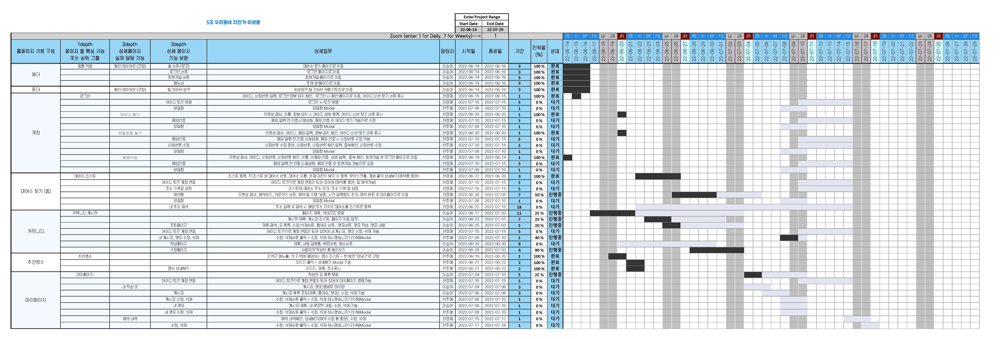

# [포폴]요구사항 확인
>2022.06.30 이승아

### 1. 준비중인 신규 서비스가 Web을 기반을 하는 시스템이라고 할 때 어떠한 Frontend Backend 와 시스템이 각각 어떤 기술들을 활용하여 구현되어야 하는지 나열하고 각 기술의 용도를 설명하는 다이어그램을 작성하시오.

#### HTML,CSS,Javasript

#### React, Redux

#### MySQL, Nodejs

### 2. 필요한 기능들에 대한 요구사항을 정의하고 그 결과를 MindMap으로 작성하시오

#### MindMap

### 3. 정의된 요구사항을 Page Depth에 따라 나열하고 필요한 세부 기능들을 설명하는 요구사항 명세서를 WBS Gantt Chart 포함된 형태로 작성하시오.

#### 요구사항 정의서

